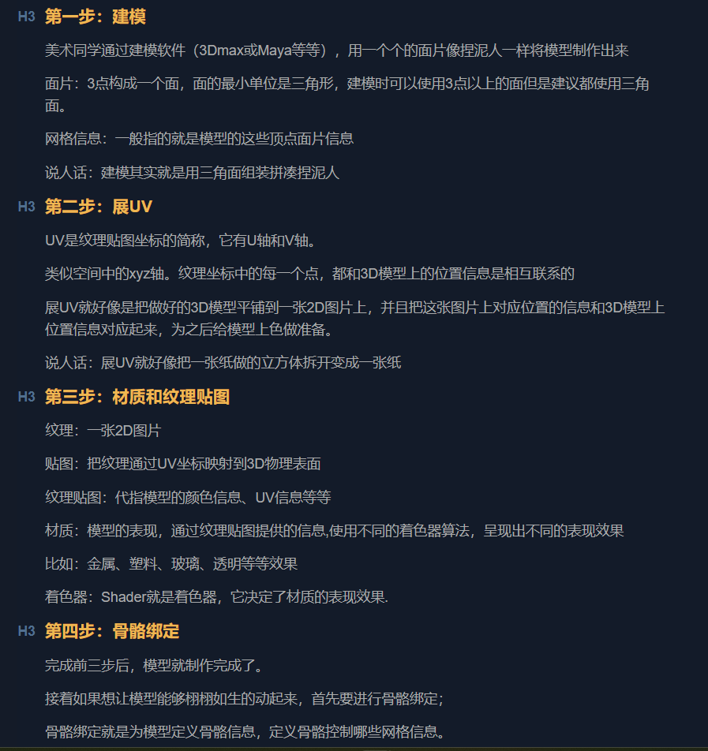

# 【唐老狮】Unity Shader开发入门

# 任务1-1：渲染管线概述

## 前提

Unity中的渲染管线和图形学中的渲染管线基本上指的是相同的概念，但是具体实现和细节方面可能存在一些差异。
Unity的渲染管线建立在图形学的基础上，但是它具有自己的实现和拓展。提供了一个高度可配置和可拓展的框架，允许开发者根据需求自定义渲染流程。

我们之后讲解的渲染管线相关知识主要针对Unity中的实现。

## 什么是渲染管线？

渲染管线（渲染流水线)

它是`计算机图形学`中用于将`三维场景`转换为最终`屏幕所见图像`的过程。它是由`一系列的阶段和操作`组成的，每个阶段都负责执行特定的任务，逐步处理输入的集合数据和纹理信息，最终生成可视化图像的过程。

说人话：渲染管线（流水线)就是将数据分阶段的变为屏幕图像的过程。

## 渲染管线当中的数据指的是什么？

渲染管线（流水线)的概念是：==数据分阶段的变为屏幕图像的过程==。

这里的数据指的是:

1. 顶点数据:模型的顶点坐标、法线向量、纹理坐标等等
2. 纹理数据:纹理贴图等
3. 光照数据:光照参数、光源信息等

等等Unity场景上相关的数据

### 模型制作过程

## 渲染管线中的分阶段指的是什么?

渲染管线（流水线)的概念是：将数据分阶段的变为屏幕图像的过程。

这里的分阶段指的是:

渲染管线分为3个阶段：应用阶段——>几何阶段——>光栅化阶段

在每一个阶段都会对数据进行处理

最终目的就是在屏幕上让我们看见最终的图像

## 总结

渲染管线（流水线）就是将数据分阶段的变为屏幕图像的过程

其中

数据就是我们在游戏场景中放置的模型、光源、摄像机等等内容的数据

阶段就是渲染管线中的三个阶段：应用阶段——>几何阶段——>光栅化阶段

通过这三个阶段对数据的处理，最终我们就能够在屏幕上看见最终的图像

> 注意:不同的渲染管线和图形API可能会有不同的术语和具体实现细节
>
> [Unity渲染流程（渲染管线）（渲染流水线）_珞珈大胖强TURBO的博客-CSDN博客](https://blog.csdn.net/weixin_44739495/article/details/116406208)

