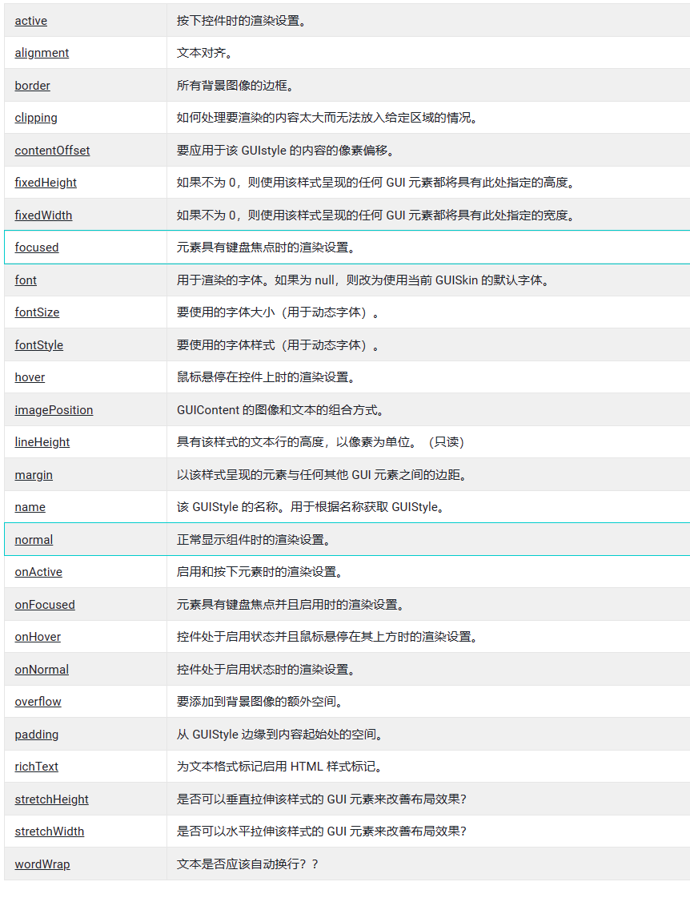
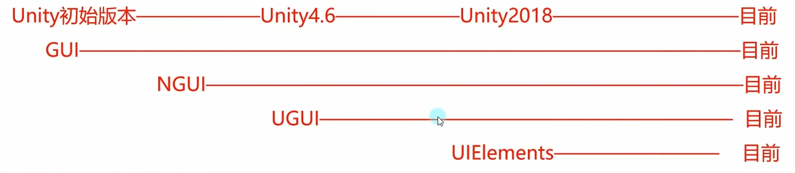
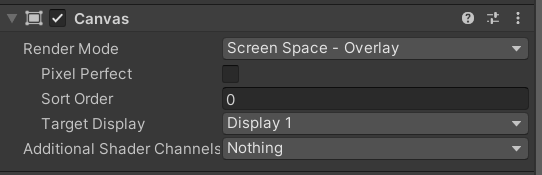
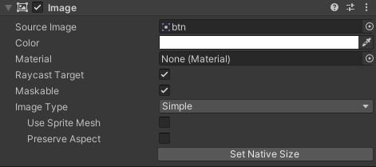

# 【唐老狮】Unity中的UI系统

# 【唐老狮】Unity中的UI系统之GUI

# 任务1：GUI概述

## 什么是UI系统

UI是User Interface(用户界面)的简称

用户界面就是游戏中的登录，注册，背包，人物等等功能面板，游戏中最多的逻辑功能就是和UI相关的功能

Unity中的UI系统可以理解为：Unity提供给我们制作UI功能的手段。

## UI系统的重要性

UI是游戏中最重要的部分，不管是2D游戏还是3D游戏。

几乎所有游戏功能都和UI有关系所以它是极其重要的知识点。

UI开发几乎会伴随你的整个游戏开发生涯。

## Unity中UI系统系列—第一部分

Unity现有UI系统：GUI、NGUI、UGUI、FairyGUI等。

## 主要学习方式

理论 + 习题 + 实践

理论：语法知识

习题：基于知识点的针对性习题

实践：基于知识点的小项目实践

## 主要学习内容

基本控件使用、复合控件使用、对GUI进行封装；

让其使用更方便，让其可以分辨率自适应；

提前感受高级UI系统的工作原理。

## 学习建议

UI系统的主要学习内容

1. UI控件的使用
2. UI控件的事件响应
3. UI的分辨率自适应

# 任务2：工作原理和主要作用 知识点

## 知识点一 GUI是什么

全称：即时模式游戏用户交互界面（IMGUI）

在Unity中一般简称为GUI

它是一个==代码驱动==的UI系统

## 知识点二 GUI的主要作用

1. 作为程序员的==调试工具==，创建==游戏内调试工具==
2. 为脚本组件创建自定义检视面板
3. 创建新的编辑器窗口和工具以拓展Unity本身（一般用作内置游戏工具）

注意：不要用它为玩家制作UI功能

## 知识点三 GUI的工作原理

在继承MonoBehaviour的脚本中的特殊函数里，调用GUI提供的方法（OnGUI），类似==生命周期函数==。

```C#
private void OnGUI()
{
    //在其中书写 GUI相关代码 即可显示GUI内容
}
```

注意：

1. 它==每帧执行==，相当于是用于专门绘制GUI界面的函数
2.  一般只在其中执行GUI相关界面绘制和操作逻辑
3. 该函数，在OnDisable之前 ，LateUpdate之后执行
4. 只要是继承Mono的脚本 都可以在OnGUI中绘制GUI

# 任务3：重要参数及文本和按钮 知识点

## 知识点一 GUI 控件绘制的共同点

> GUI控件就是一些静态函数
>
> [UnityEngine.GUI - Unity 脚本 API](https://docs.unity.cn/cn/2020.3/ScriptReference/GUI.html)
>
> [UnityEngine.Rect - Unity 脚本 API](https://docs.unity.cn/cn/2020.3/ScriptReference/Rect.html)
>
> [UnityEngine.Texture - Unity 脚本 API](https://docs.unity.cn/cn/2020.3/ScriptReference/Texture.html)
>
> [UnityEngine.GUIContent - Unity 脚本 API](https://docs.unity.cn/cn/2020.3/ScriptReference/GUIContent.html)
>
> [UnityEngine.GUIStyle - Unity 脚本 API](https://docs.unity.cn/cn/2020.3/ScriptReference/GUIStyle.html)

1. GUI 控件都是GUI公共类中提供的静态函数，直接调用即可。
2. GUI 控件的参数都大同小异。
   1. 位置参数：Rect（矩形）参数  x y位置； w h尺寸
   2. 显示文本：string参数
   3. 图片信息：Texture（材质，图片）参数
   4. 综合信息：GUIContent参数
   5. 自定义样式：GUIStyle参数
3. 每一种控件都有多种重载，都是各个参数的排列组合。必备的参数内容是位置信息和显示信息。

注意：在GUI当中，原点（0，0）为屏幕左上角

## 知识点二 文本控件

> [GUI-Label - Unity 脚本 API](https://docs.unity.cn/cn/2020.3/ScriptReference/GUI.Label.html)
>
> 在屏幕上创建一个文本或纹理标签。
>
> 标签不与用户交互，不捕捉鼠标点击操作，并始终以正常样式呈现。若要创建对用户输入提供视觉响应的控件，请使用 [Box](https://docs.unity.cn/cn/2020.3/ScriptReference/GUI.Box.html) 控件。

[GUI](https://docs.unity.cn/cn/2020.3/ScriptReference/GUI.html).Label

基本使用，可以在屏幕上显示文字或者图片（Texture材质）

> 注意，Label显示的图片，始终会保持图片的宽高比，并按比例缩放。

```C#
GUI.Label(new Rect(0, 0, 100, 20), "Panzi", style);
GUI.Label(rect, tex);
```

综合使用

> [UnityEngine.GUIContent - Unity 脚本 API](https://docs.unity.cn/cn/2020.3/ScriptReference/GUIContent.html)

```c#
GUI.Label(rect1, content);
```

可以获取当前鼠标或者键盘选中的GUI控件 对应的 tooltip信息

```C#
Debug.Log(GUI.tooltip);
```

自定义样式。

> [UnityEngine.GUIStyle - Unity 脚本 API](https://docs.unity.cn/cn/2020.3/ScriptReference/GUIStyle.html)

```C#
public GUIStyle style;
```



## 知识点三 按钮控件

### 普通按钮

在按钮范围内，按下鼠标再抬起鼠标，才算一次点击，才会返回true。

```C#
if (GUI.Button(btnRect, btnContent, btnStyle))
{
    //处理我们按钮点击的逻辑
    Debug.Log("按钮被点击");
}
```

### 长按按钮

只要在长按按钮范围内，按下鼠标，就会一直返回true。

```C#
if( GUI.RepeatButton(btnRect, btnContent) )
{
    Debug.Log("长按按钮被点击");
}
```

## 练习题

请用GUI制作一个游戏开始界面，上面有开始游戏，退出游戏，设置等等按钮选项，点击开始游戏可以切换到游戏场景。

```C#
using System.Collections;
using System.Collections.Generic;
using UnityEngine;
using UnityEngine.SceneManagement;
//**********************************
//创建人：
//功能说明：
//**********************************
public class Lesson2_P : MonoBehaviour
{
    public string startGame;
    public string quitGame;
    public string settings;
    public Rect startRect;
    public Rect quitRect;
    public Rect setRect;

    // Start is called before the first frame update
    void Start()
    {
        startGame = "开始游戏";
        quitGame = "退出游戏";
        settings = "设置";
        startRect = new Rect(Screen.width / 2, Screen.height / 2 - 20, 100, 20);
        quitRect = new Rect(Screen.width / 2, Screen.height / 2, 100, 20);
        setRect = new Rect(Screen.width / 2, Screen.height / 2 + 20, 100, 20);

    }
    private void OnGUI()
    {
        if (GUI.Button(startRect, startGame))
        {
            SceneManager.LoadScene("Game");
        }
        GUI.Button(setRect, settings);
        if (GUI.Button(quitRect, quitGame))
        {
            Application.Quit();
        }
    }
}
```


# 任务5：多选框和单选框 知识点

> [GUI-Toggle - Unity 脚本 API](https://docs.unity.cn/cn/2020.3/ScriptReference/GUI.Toggle.html)

## 知识点一 多选框

### 普通样式

第二个参数：是否勾选。

返回一个bool，表示当前是否勾选。

```C#
isSel = GUI.Toggle(new Rect(0, 0, 100, 30), isSel, "效果开关");
```

### 自定义样式 显示问题

要修改多选框的显示区域，要在Style当中修改固定宽高 fixedWidth和fixedHeight，如不修改，则使用rect宽高。

要让文字偏移，需要在Style当中修改padding。

```C#
isSel2 = GUI.Toggle(new Rect(0, 40, 100, 30), isSel2, "音效开关", style);
```

## 知识点二 单选框

单选框是基于，多选框的实现

需要使用一个变量，标识选项，并达到单选的效果。

```C#
if(GUI.Toggle(new Rect(0, 100, 100, 30), nowSelIndex == 1, "选项一"))
{
    nowSelIndex = 1;
}
if(GUI.Toggle(new Rect(0, 140, 100, 30), nowSelIndex == 2, "选项二"))
{
    nowSelIndex = 2;
}
if(GUI.Toggle(new Rect(0, 180, 100, 30), nowSelIndex == 3, "选项三"))
{
    nowSelIndex = 3;
}
```

## 练习题

在上一知识点练习题基础上制作一个游戏设置面板，上面有背景音乐的开关和音效的开关

并且点击开始界面的设置面板可以打开设置面板。

SettingPanel.cs

```C#
using System.Collections;
using System.Collections.Generic;
using UnityEngine;
using UnityEngine.UIElements;
//**********************************
//创建人：
//功能说明：
//**********************************
public class SettingPanel : MonoBehaviour
{
    public static SettingPanel Instance
    {
        get => instance;
    }
    private static SettingPanel instance;
    

    public Rect toggleMusicRect;
    public Rect toggleSoundRect;
    public Rect closeBtnRect;

    public Texture2D closeBtnTex;

    private bool isSelMusic = true;
    private bool isSelSound = true;

    public GUIStyle btnStyle;

    private void Awake()
    {
        instance = this;
        HideMe();

        toggleMusicRect = new Rect(Screen.width / 2, Screen.height / 2, 100, 20);
        toggleSoundRect = new Rect(Screen.width / 2, Screen.height / 2 + 20, 100, 20);
        closeBtnRect = new Rect(Screen.width - closeBtnTex.width, 0, closeBtnTex.width, closeBtnTex.height);
        btnStyle.normal.background = closeBtnTex;
        btnStyle.onNormal.background = closeBtnTex;

        print(closeBtnTex.width);
        print(closeBtnTex.height);
    }

    void Start()
    {
        
    }

    private void OnGUI()
    {
        
        isSelMusic = GUI.Toggle(toggleMusicRect, isSelMusic, "音效开关");
        isSelSound = GUI.Toggle(toggleSoundRect, isSelSound, "音乐开关");


        if (GUI.Button(closeBtnRect, "", btnStyle))
        {
            HideMe();
            BeginPanel.ShowMe();
        }
    }

    public static void ShowMe()
    {
        instance.gameObject.SetActive(true);
    }

    public static void HideMe()
    {
        instance.gameObject.SetActive(false);
    }
}
```

BeginPanel.cs

```C#
using System.Collections;
using System.Collections.Generic;
using UnityEditor;
using UnityEngine;
using UnityEngine.SceneManagement;
//**********************************
//创建人：
//功能说明：
//**********************************
public class BeginPanel : MonoBehaviour
{
    public string startGame;
    public string quitGame;
    public string settings;
    public Rect startRect;
    public Rect quitRect;
    public Rect setRect;

    public static BeginPanel instance;

    private void Awake()
    {
        instance = this;
    }

    // Start is called before the first frame update
    void Start()
    {
        startGame = "开始游戏";
        quitGame = "退出游戏";
        settings = "设置";
        startRect = new Rect(Screen.width / 2, Screen.height / 2 - 20, 100, 20);
        quitRect = new Rect(Screen.width / 2, Screen.height / 2, 100, 20);
        setRect = new Rect(Screen.width / 2, Screen.height / 2 + 20, 100, 20);

    }
    private void OnGUI()
    {
        if (GUI.Button(startRect, startGame))
        {
            SceneManager.LoadScene("Game");
        }
        if (GUI.Button(setRect, settings))
        {
            SettingPanel.ShowMe();
            HideMe();
        }
        if (GUI.Button(quitRect, quitGame))
        {
            Application.Quit();
        }
    }

    public static void ShowMe()
    {
        instance.gameObject.SetActive(true);
    }

    public static void HideMe()
    {
        instance.gameObject.SetActive(false);
    }
}
```

# 任务7：输入框和拖动条 知识点

> [GUI-TextField - Unity 脚本 API](https://docs.unity.cn/cn/2020.3/ScriptReference/GUI.TextField.html)

注意：

保存输入内容的string需要==初始化==，不然可能会报错！

因为有时候需要替换这个字符串当中的内容，如果刚开始就为空（这个空是指null，不是指空字符串），将会导致直接报错。

## 知识点一 输入框

TextField：输入框

重要参数，一个是显示内容string；另一个是，最大输入字符串的长度

其他参数和其他空间一样，比如Stytle和Content啥的。

返回值：返回一个string，表示当前输入的字符串。

### 普通输入

```C#
inputStr = GUI.TextField(new Rect(screenHeight / 2, screenHeight / 2, 100, 50), inputStr);
```

### 密码输入

PasswordField：密码输入框

返回值：返回一个string，表示当前输入的字符串。

```C#
//maskChar就是用什么代替密码
public static string PasswordField(Rect position, string password, char maskChar);
inputPsw = GUI.PasswordField(new Rect(100, 100, 100, 50), inputPsw, '*');
```


## 知识点二 拖动条

### 水平拖动条

==HorizontalSlider==：水平拖动条，最多可以设置三个Style，因为一个拖动条是由三个其他控件组成的。

value：当前拖动条的值；leftValue：最小值；rightValue：最大值。

返回值：返回一个float，表示当前拖动的比例

```C#
public static float HorizontalSlider(Rect position, float value, float leftValue, float rightValue);
nowValue = GUI.HorizontalSlider(new Rect(20, 20, 100, 50), nowValue, 0, 100);
```

### 竖直拖动条

==VerticalSlider==：水平拖动条，最多可以设置三个Style，因为一个拖动条是由三个其他控件组成的。

value：当前拖动条的值；leftValue：最小值；rightValue：最大值。

返回值：返回一个float，表示当前拖动的比例

```C#
public static float VerticalSlider(Rect position, float value, float topValue, float bottomValue);
nowValue = GUI.VerticalSlider(new Rect(0, 150, 50, 100), nowValue, 0, 1);
```

## 练习题

### 第一题

请在上一知识点的练习题基础上，在置面板中加入拖动条控制条控制音乐大小。

```C#
//Awake
musicSliderRect = new Rect(Screen.width / 2 + 50, Screen.height / 2 + 5, 100, 20);
soundSliderRect = new Rect(Screen.width / 2 + 50, Screen.height / 2 + 25, 100, 20);

//OnGUI
musicVolume = GUI.HorizontalSlider(musicSliderRect, musicVolume, 0, 100);
soundVolume = GUI.HorizontalSlider(soundSliderRect, soundVolume, 0, 100);
```

### 第二题

请在之前的基础上制作一个登陆面板；

有用户名输入和密码输入有进入游戏和返回上一级按钮；

点击开始界面中的开始游戏后进入登陆面板；

输入的用户名为admin密码为8888才能切换场景。

```C#
using System.Collections;
using System.Collections.Generic;
using UnityEngine;
using UnityEngine.Rendering;
using UnityEngine.SceneManagement;
//**********************************
//创建人：
//功能说明：
//**********************************
public class LoginPanel : MonoBehaviour
{
    public static LoginPanel Instance => instance;
    private static LoginPanel instance;

    public string userName = "";
    public string password = "";

    public Rect loginBtnRect;
    public Rect returnBtnRect;
    public GUIContent loginBtnContent;
    public GUIContent returnBtnContent;

    private void Awake()
    {
        instance = this;
        loginBtnRect = new Rect(Screen.width / 2 - 50, Screen.height / 2 + 40, 100, 20);
        loginBtnContent.text = "登录";
        returnBtnRect = new Rect(Screen.width / 2 + 50, Screen.height / 2 + 40, 100, 20);
        returnBtnContent.text = "返回";

        Hide();
    }

    private void OnGUI()
    {
        userName = GUI.TextField(new Rect(Screen.width / 2, Screen.height / 2, 100, 20), userName);
        password = GUI.PasswordField(new Rect(Screen.width / 2, Screen.height / 2 + 20, 100, 20), password, '*');
        if (GUI.Button(loginBtnRect, loginBtnContent))
        {
            if (userName == "admin" && password == "8888")
            {
                SceneManager.LoadScene("Game");
            }
            else
            {
                userName = "账号或密码错误";
                password = "账号或密码错误";
            }
        }
        if (GUI.Button(returnBtnRect, returnBtnContent))
        {
            Hide();
            BeginPanel.ShowMe();
        }
    }
    public static void Show()
    {
        instance.gameObject.SetActive(true);
    }
    public static void Hide()
    {
        instance.gameObject.SetActive(false);
    }
}
```

# 任务9：图片绘制和框 知识点

## 知识点一 图片绘制

==GUI.DrawTexture==

```C#
public static void DrawTexture(Rect position, Texture image, ScaleMode scaleMode, bool alphaBlend);
GUI.DrawTexture(texRect, tex);
GUI.DrawTexture(texRect, tex, scaleMode, alpha, aspect);
```

参数：

1. ScaleMode
   1. ScaleToFit（默认）：会自动根据宽高比进行计算，不会拉变形，会一直保持图片完全显示的状态。
   2. ScaleAndCrop：也会通过宽高比来计算图片，但是会进行裁剪。
   3. StretchToFill：始终填充满你传入的，Rect范围。
2. alpha是用来控制图片是否开启透明通道的。
3. imageAspect：自定义宽高比，如果不填默认为0，就会使用图片原始宽高 。

## 知识点二 框绘制

==GUI.Box==

绘制一个指定大小的矩形。

```C#
 GUI.Box(texRect, "Panzi");
```

## 练习题

为之前的各个面板加上背景图片

```C#
GUI.DrawTexture(new Rect(0, 0, Screen.width, Screen.height), backgroundTex);
```


# 任务11：工具栏和选择网格 知识点


## 知识点一 工具栏

> [GUI-Toolbar - Unity 脚本 API](https://docs.unity.cn/cn/2020.3/ScriptReference/GUI.Toolbar.html)

==GUI.Toolbar==：将texts当中的字符串以选项的方式并排显示在一行当中。

selected：当前选择的选项

texts：选项显示的内容

返回一个int，为当前选择的选项所在的下标。

```C#
public static int Toolbar(Rect position, int selected, string[] texts);
toolbarIndex = GUI.Toolbar(new Rect(0, 0, 200, 30), toolbarIndex, toolbarInfos);
```

## 知识点二 按钮网格

> [GUI-SelectionGrid - Unity 脚本 API](https://docs.unity.cn/cn/2020.3/ScriptReference/GUI.SelectionGrid.html)

==GUI.SelectionGrid==：创建一个按钮网格，显示内容为texts字符串数组当中的内容

xCount：一行显示几个按钮，如果为1，则一行显示一个。

返回一个int，为当前选择的选项所在的下标。

```C#
public static int SelectionGrid(Rect position, int selected, string[] texts, int xCount)
```

## 练习题

制作三个页签，选择不同的页签将在下方显示不同的信息。

```C#
toolbarIndex = GUI.Toolbar(new Rect(0, 0, 300, 50), toolbarIndex, toolbarInfos);
GUI.Label(new Rect(0, 75, 100, 50), toolbarInfos[toolbarIndex]);
```

# 任务13：滚动列表和分组 知识点

## 知识点一 分组

==GUI.BeginGroup==：开始一个组。必须与 [EndGroup](https://docs.unity.cn/cn/2020.3/ScriptReference/GUI.EndGroup.html) 调用配对使用。

==UI.EndGroup==：结束一个组。

用于批量控制控件位置，可以理解为 包裹着的控件加了一个父对象，可以通过控制分组来控制包裹控件的位置。

```C#
GUI.BeginGroup(groupRect);
GUI.Button(new Rect(0, 0, 100, 50), "按钮");	//这个Button将被groupRect限制大小和位置
GUI.EndGroup();
```

## 知识点二 滚动列表

==GUI.BeginScrollView==：在 GUI 内开始一个滚动视图。

==GUI.EndScrollView==：结束滚动列表。

```C#
public static Vector2 BeginScrollView(Rect position, Vector2 scrollPosition, Rect viewRect, bool alwaysShowHorizontal, bool alwaysShowVertical)
```

position：用于确定区域大小的矩形

scrollPosition：水平和垂直两个滚动条当前的位置。

viewRect：包裹内容区域的大小。

alwaysShowHorizontal：是否一直显示水平滚动条（false则只有viewRect.width大于position.width时才显示）。

alwaysShowVertical：是否一直显示垂直滚动条（false则只有viewRect.height垂直大于position.height时才显示）

返回值：返回一个Vector2，表示当前两个滚动条的位置。

对于在滚动列表当中的内容，ScrollView也将限制他们的位置和大小。

```C#
scrollViewNowRect = GUI.BeginScrollView(scrollViewRect, scrollViewNowRect, scrollViewShowRect);

GUI.Toolbar(new Rect(0, 0, 300, 50), 0, strs);
GUI.Toolbar(new Rect(0, 60, 300, 50), 0, strs);
GUI.Toolbar(new Rect(0, 120, 300, 50), 0, strs);
GUI.Toolbar(new Rect(0, 180, 300, 50), 0, strs);

GUI.EndScrollView();      
```

## 练习题

制作一个滚动视图，外部有一个字符串数组，通过在Inspector修改这个字符串数组数量，会在滚动视图内部动态的创建label依次显示内容。

```C#
using System.Collections;
using System.Collections.Generic;
using UnityEngine;
//**********************************
//创建人：
//功能说明：
//**********************************
public class Lesson7_P : MonoBehaviour
{
    public string[] strs;
    public Rect position;
    public Vector2 scrollPosition;
    public Rect viewRect;

    // Start is called before the first frame update
    void Start()
    {
        position = new Rect(0, 0, 200, 200);
        viewRect = new Rect(0, 0, 300, 300);
    }
    
    private void OnGUI()
    {
        scrollPosition = GUI.BeginScrollView(position, scrollPosition, viewRect);
        Rect newPos = position;
        for (int i = 0; i < strs.Length; ++i)
        {
            newPos.y = newPos.y + 20;
            GUI.Label(newPos, strs[i]);
        }
        GUI.EndGroup();
    }
}
```

# 任务15：窗口 知识点

## 知识点一 窗口

> [GUI-Window - Unity 脚本 API](https://docs.unity.cn/cn/2020.3/ScriptReference/GUI.Window.html)

==GUI.Window==创建一个弹出窗口。

```C#
public static Rect Window(int id, Rect clientRect, WindowFunction func, string text);
```

id：窗口唯一的id

clientRect：窗口大小位置

func：窗口的委托，委托函数内仍然可以使用GUI控件。

text：窗口名

```C#
//第一个参数 id 是窗口的唯一ID 不要和别的窗口重复
//委托参数 是用于 绘制窗口用的函数 传入即可
GUI.Window(1, new Rect(100, 100, 200, 150), DrawWindow, "测试窗口");
//DrawWindow为一个函数
```

id对于我们来说有一个重要作用，除了区分不同窗口，还可以在一个函数中去处理多个窗口的逻辑，并通过id去区分他们。

## 知识点二 模态窗口

模态窗口，可以让其他控件不再有用。你可以理解为该窗口在最上层，其它按钮都点击不到了，只能点击该窗口上控件。

> [GUI-ModalWindow - Unity 脚本 API](https://docs.unity.cn/cn/2020.3/ScriptReference/GUI.ModalWindow.html)

```C#
public static Rect ModalWindow(int id, Rect clientRect, WindowFunction func, string text);
GUI.ModalWindow(3, new Rect(300, 100, 200, 150), DrawWindow, "模态窗口");
```

## 知识点三 拖动窗口

```C#
public static Rect Window(int id, Rect clientRect, WindowFunction func, string text);
```

使用返回值，配合委托函数内调用==DragWindow==函数，实现拖动窗口。

该API，写在窗口函数中，可以让窗口被拖动。

传入Rect参数的重载作用：是决定窗口中哪一部分位置，可以被拖动；默认不填，就是无参重载，默认窗口的所有位置都能被拖动。

```C#
public static void DragWindow();

public static void DragWindow(Rect position);
```

DrawWindow

```C#
private void DrawWindow(int id)
{
    switch (id)
    {
        case 1:
            GUI.Button(new Rect(0, 30, 30, 20), "1");
            break;
        case 2:
            GUI.Button(new Rect(0, 30, 30, 20), "2");
            break;
        case 3:
            GUI.Button(new Rect(0, 30, 30, 20), "3");
            break;
        case 4:
            //该API 写在窗口函数中调用 可以让窗口被拖动
            //传入Rect参数的重载 作用
            //是决定窗口中哪一部分位置 可以被拖动
            //默认不填 就是无参重载 默认窗口的所有位置都能被拖动
            GUI.DragWindow(new Rect(0,0,1000,20));
            break;
    }   
}
```

## 练习题

在之前制作的开始界面中，点击退出游戏按钮，弹出一个模态窗口，让玩家确定是否退出(退出，取消)，点击取消后关闭窗口，点击退出后退出游戏。

```C#
using System.Collections;
using System.Collections.Generic;
using UnityEngine;
//**********************************
//创建人：
//功能说明：
//**********************************
public class QuitCheckPanel : MonoBehaviour
{
    public static QuitCheckPanel Instance => instance;
    private static QuitCheckPanel instance;

    public Rect btn1Rect;
    public Rect btn2Rect;

    // Start is called before the first frame update
    private void Awake()
    {
        instance = this;
        Hide();
    }

    void Start()
    {
        
    }

    private void OnGUI()
    {
        GUI.ModalWindow(1, new Rect(Screen.width / 2 - 200, Screen.height / 2 - 100, 400, 200), QuitCheck, "确定要退出吗？");
        GUI.Button(new Rect(Screen.width / 2, Screen.height / 2, 200, 100), "确定");
    }

    private void QuitCheck(int id)
    {
        if (GUI.Button(btn1Rect, "确定")) {
            Application.Quit();
        }
        if (GUI.Button(btn2Rect, "取消"))
        {
            Hide();
            BeginPanel.ShowMe();
        }
    }

    public void Show()
    {
        instance.gameObject.SetActive(true);
    }

    public void Hide()
    {
        instance.gameObject.SetActive(false);
    }
}
```

# 任务17：自定义皮肤样式 知识点

> [UnityEngine.GUI - Unity 脚本 API](https://docs.unity.cn/cn/2020.3/ScriptReference/GUI.html)
>
> 本期主要是一些GUI的静态变量。

## 知识点一 全局颜色

全局的着色颜色，影响背景和文本颜色。

```C#
GUI.color = Color.red;
```

文本着色颜色会和全局颜色相乘。

```C#
GUI.contentColor = Color.yellow;
GUI.Button(new Rect(0, 0, 100, 30), "测试按钮");
```

背景元素着色颜色，会和全局颜色相乘。

```C#
GUI.backgroundColor = Color.red;
GUI.Label(new Rect(0, 50, 100, 30), "测试按钮");
GUI.color = Color.white;
GUI.Button(new Rect(0, 100, 100, 30), "测试按钮", style);
```

## 知识点二 整体皮肤样式

> [UnityEngine.GUISkin - Unity 脚本 API](https://docs.unity.cn/cn/2020.3/ScriptReference/GUISkin.html)

==GUISkin==：定义 GUI 的外观和行为。可以在Project窗口创建GUISkin，其实就是每个控件的Style。

它可以帮助我们整套的设置，定义样式。相对单个控件设置Style要方便一些

```C#
public GUIStyle style;
public GUISkin skin;
```

虽然设置了皮肤，但是绘制时，如果使用GUIStyle参数，皮肤就没有了。

```C#
GUI.skin = skin;
//虽然设置了皮肤 但是绘制时 如果使用GUIStyle参数 皮肤就没有
GUI.Button(new Rect(0, 0, 100, 30), "测试按钮");

GUI.skin = null;
GUI.Button(new Rect(0, 50, 100, 30), "测试按钮2");
```

# 任务18：GUILayout自动布局

## 知识点一 GUILayout 自动布局

> [UnityEngine.GUILayout - Unity 脚本 API](https://docs.unity.cn/cn/2020.3/ScriptReference/GUILayout.html)
>
> GUILayout 类是 Unity GUI 的接口，并且具有自动布局功能

使用GUILayout创建各种控件，创建的单个控件将会自动布局，创建时无法指定Rect。

如果需要指定位置，可以==配合GUI使用==，或者使用==BeginArea，EndArea==

主要用于进行编辑器开发，如果用它来做游戏UI不太合适。

默认垂直布局，居中对齐，0，0开始

```C#
GUILayout.Button("123");
GUILayout.Button("22222");
GUILayout.Button("1244444443");
```

### 设置布局方式

水平

```C#
GUILayout.BeginHorizontal();
...
GUILayout.EndHorizontal();
```

垂直

```C#
GUILayout.BeginVertical();
...
GUILayout.EndVertical();
```

### GUILayout.BeginArea，EndArea

设定一个区域，可以指定Rect和其他样式

```C#
//从100，100开始，大小为500 * 200，水平布局
GUILayout.BeginArea(new Rect(100, 100, 500, 200));

GUILayout.BeginHorizontal();
GUILayout.Button("123");
GUILayout.Button("22222");
GUILayout.Button("1244444443");
GUILayout.EndHorizontal();

GUILayout.EndArea();
```

## 知识点二 GUILayoutOption 布局选项

我们可以在使用控件时传入==GUILayoutOption==来控制控件的布局。

```C#
GUILayout.Button("111111", GUILayout.Height(50));
```

### 布局选项

> [UnityEngine.GUILayout - Unity 脚本 API](https://docs.unity.cn/cn/2020.3/ScriptReference/GUILayout.html)

下面这些静态函数将返回GUILayoutOption，可以作为使用控件的第二个参数，来控制控件的布局。

```C#
//控件的固定宽高
GUILayout.Width(300);
GUILayout.Height(200);
//允许控件的最小宽高
GUILayout.MinWidth(50);
GUILayout.MinHeight(50);
//允许控件的最大宽高
GUILayout.MaxWidth(100);
GUILayout.MaxHeight(100);
//允许或禁止水平拓展
GUILayout.ExpandWidth(true);//允许
GUILayout.ExpandHeight(false);//禁止
GUILayout.ExpandHeight(true);//允许
GUILayout.ExpandHeight(false);//禁止
```

# 任务19：总结

## 学习的主要内容

各种控件，控件事件监听，自定义样式。

## 优点

简单快捷、代码控制

## 缺点

重复工作量繁多，控件绘制相关代码很多

最大缺点：必须运行时才能去查看结果，不支持分辨率自适应。

一般不会用它来做游戏UI。

# 任务20：必备知识点——编辑器模式下执行脚本

> [UnityEngine.ExecuteAlways - Unity 脚本 API](https://docs.unity.cn/cn/2020.3/ScriptReference/ExecuteAlways.html)

想让脚本在编辑模式下执行，只需要为类添加==ExcuteAlways==特性即可

```C#
[ExecuteAlways]
public class UIText : MonoBehaviour {
	private void Update()
	{
		print("Execute Always");
	}
}
```

# ------------------------------------------

# 【唐老狮】Unity中的UI系统之NGUI

# 注意：本渣渣由于时间问题，放弃了NGUI的学习，除了DrawCall视频，从任务6就没看了


## 任务1：NGUI 课程概述

## Unity中UI系统系列一第二部分

- GUI
- NGUI
- UGUI
- FairyGUl

## NGUI是什么

NGUl全称：下一代用户界面(Next-Gen UI)，它是第三方提供的Unity付费插件，专门用于制作Unity中游戏UI的第三方工具。

相对于GUI它更适用于制作游戏UI功能，更方便使用，性能和效率更高。

Unity插件：是一种基于Unity规范编写出来的程序，主要用于拓展功能，简单理解就是别人基于Unity写好的某种功能代码，我们可以直接用来处理特定的游戏逻辑

## NGUI发展史



Unity最初放本~Unity4.6版本

Unity官方只提供了GUI用于游戏UI的开发，所以更为高级和方便的NGUI是做UI的不二选择

Unity4.6版本以后，Unity官方招募NGUI作者加入Unity，协助Unity开发出UGUI系统用于游戏UI功能开发。

由于UGUI刚推出后功能不够完善，所以经历了较长的过渡期，几乎到Unity5的时代才开始正式全面普及。

## 为什么要学NGUI

技术更新虽然快，但是商业项目追求稳定性，不是说老的东西就不好。

很多公司的老项目，或者是在老项目上的迭代项目，都会选择在老技术的基础上进行开发，所以NGUI虽然老，但是它稳定也没什么问题，目前还是有不少公司在使用它，学习它可以提升你的就业竞争力。

我们应该如何选择学习哪种UI系统来做游戏?

小孩子才做选择，成年人都要。当我们学习完我们的UI系统四部曲后再来总结如何选择性使用它们。

## 再次强调U系统的重要性

UI是游戏中最重要的部分，不管是2D游戏还是3D游戏，几乎所有游戏功能都和UI有关系。

所以它是极其重要的知识点，UI开发几乎会伴随你的整个游戏开发生涯。

## 主要学习方式

理论+习题＋实践

理论：语法知识

习题：基于知识点的针对性习题

实践：基于知识点的小项目实践

## 主要学习内容

- 基本控件使用
- 复合控件使用
- 一些特殊功能的使用
- 使用NGUI进行功能开发


## 三大基础组件

## 任务3：Root组件 (UIRoot)

## 知识点一 必备知识——分辨率概念

### 1.分辨率

屏幕宽高两个方向的像素点
比如1920 * 1080
宽1920个像素
高1080个像素

### 2.像素

像素即px，是画面中最小的点(单位色块)

### 3.屏幕尺寸

屏幕对角线长度

### 4.屏幕比例

PC显示器

- 1920:1080 = 16:9

苹果手机

- iPhone7,8：1334 * 750 = 16:9
- iPhone 7,8 Plus：1920 * 1080 = 16:9
- iPhoneX：2436 * 1125 = 19.5:9
- iPhone12: 2532 * 1170 = 19.5:9

目前市面上设备分辨率比例传统的有：

- 4:3(ipad)
- 16:10
- 16:9(老手机 、电脑显示器)
- 18:9（去掉留海屏幕）
- 19.5:9（ 新款手机）
- 19.9:9

### 5.dpi

像素密度，单位面积上有多少个像素点，一般指一英寸有多少个像素点。

## 知识点二 Root是用来干啥的

Root是用于分辨率自适应的根对象，可以设置基本分辨率,相当于设置UI显示区域，并且管理所有UI控件的分辨率自适应。

可以简单理解，它管理一个UI画布，所有的UI都是显示在这个画布上的。

它会管理UI画布和不同屏幕分辨率的适应关系。

## 知识点三 Root相关参数

### ScalingStyle 缩放模式

### Flexible 灵活模式

在该模式下，UI都是以像素为基础，100像素的物体无论在多少分辨率上都是100像素。

这就意味着，100像素在分辨率低的屏幕上可能显示正常，但是在高分辨率上就会显得很小。

- Minimum Height：屏幕高小于该值时，开始按比例缩放
- Maximum Height：屏幕高大于改值时，开始按比例缩放
- Shrink Portrait UI：竖屏时，按宽度来适配
- Adjust by DPI：使用dpi做适配计算，建议勾选

### Constrained 约束模式

该模式下，屏幕按尺寸比例来适配，不管实际屏幕有多大，NGUI都会通过合适的缩放来适配屏幕。

这样在高分辨率上显示的UI就会被放大保持原有大小，但有可能会模糊，好处是各设备看到的UI和屏幕比例是一样的。

- Content Width：按照该宽度值适配屏幕，制作资源时的默认分辨率宽
- Content Height：按照该高度值适配屏幕，制作资源时的默认分辨率高
- Fit表示以那个值做适配
  - 勾选Width：屏幕比例变化时，按照宽度来适配（宽度始终不变）
    - 这个宽度始终不变，是指ui所占的宽度比例，始终不变，会在改变宽度的时候进行自动缩放
    - 会在改变高度的时候进行始终保持ui宽度固定。
  - 勾选Height：屏幕比例变化时，按照高度来适配（高度始终不变）
    - 这个高度始终不变，是指ui所占的高度比例，始终不变，会在改变宽度的时候进行自动缩放
    - 会在改变宽度的时候进行始终保持ui高度固定。
  - 两个都勾选：不会被裁剪，但是有黑边，当适配宽高比大于实际宽高比时，就会按照宽度适配，
    反之按照高度适配。
  - 如果两个都不勾选：始终保证屏幕被UI填充满，不会有黑边，可能会被裁剪。

### Constrained On Mobiles 约束在移动平台

上两种模式的综合体

在PC和Mac等桌面设备上用Flexible模式

在移动设备上用Constrained模式

## 总结

1. Flexible 适用于可以手动拖窗口改变分辨率的设备 比如pc端

2. Constrained 适用于移动设备
   因为移动设备都是全屏应用，不会频繁改变分辨率，只用适配不同分辨率的设备。

   横屏勾选 高 fit ，竖屏 勾选 宽 fit，一般就可以比较好的进行分辨率适应了 。
   需要注意的是背景图，一定要考虑 极限 宽高比来出，最大宽高比  19.9:9

3. Constrained On Mobiles 是上面两者的综合体，适用于多平台发布的游戏和应用

## 任务4：Panel组件 (UIPanel)

## 知识点一 Panel用来干啥

1. 管理一个UI面板的渲染顺序
2. 管理一个UI面板上的所有子控件

它是用于让UI元素能够被渲染的关键组件，一般情况下一个面板，就需要一个UIPanel，所有的UI元素会依托在离自己最近的Panel下。

## 知识点二 Panel参数相关

### 重要参数

1. Alpha：控制所有子UI元素的透明度
2. Depth：控制该Panel的层级，层级高的后渲染会把层级低的先渲染的遮挡住。
   1. 注意：不同Panel需要显示层级不同，不然可能显示出错
3. Clipping：裁剪
   1. None：不处理，正常
   2. Texture Mask：根据图片信息进行遮罩，比如人物头像
   3. Soft Clip：自己定范围裁剪，比如拖动框
   4. Constrain But Dont Clip：约束但不剪裁，不裁剪画面，只限制响应范围
4. Sorting Layer：排序层，配合UnitySortingLayer使用

### Advanced Options

渲染相关高级选项

1. Render Q：渲染队列
2. Sort Order：排序
3. Normals：是否需要灯光着色器
4. UV2：是否用于自定义着色器效果
5. Shadow Mode：阴影模式
6. Cull：元素组件拖动时提出
7. Visible：检查元素组件是否离开屏幕
8. Padding：边界内容
9. Offset：抵消偏移位置
10. Static：检查子元素是否会移动
11. Panel Tool：是否显示面板工具

## 总结

1. 没有Panel父对象，UI控件看不到
2. Panel一般用于管理面板，控制层级
3. Panel可以有多个，一般一个Panel管理一个面板

## 任务5：EventSystem组件 (UICamera)

## 知识点一 EventSystem是用来干啥的

主要作用是让摄像机渲染出来的物体，能够接收到NGUI的输入事件，大部分设置不需要我们去修改。

有了它，我们通过鼠标、触碰、键盘、控制器、操作UI响应玩家的输入。

## 知识点二 相关参数

### Event Type

事件类型：决定了脚本如何对鼠标和触屏事件进行响应。

- UI模式，那么他们处理事件的方式是根据组件的深度
- world模式，那么则会根据距离离主摄像机的远近来进行响应排序

2D和3D的区别是，碰撞器是用3D碰撞器还是2D碰撞器。

### Events go to

事件通过刚体还是碰撞盒传递

### Process Events In

事件更新进度在Update中还是LateUpdate中，一般不改，默认在Update中

### Event Mask

决定哪个游戏对象层级将会接受事件

### Debug

是否开启调试模式

如果开启，可以帮助你在点击时，判断当前和鼠标事件交互的是什么对象，能在Scene窗口看到信息。

### Command Click

苹果电脑上是否用Command按键模拟右键操作

### Allow Multi Touch

是否支持多点触碰

### Auto Hide Cursor

当游戏有控制器或者其他输入设备时，是否自动隐藏光标

### Sticky Tooltip

是否使用tooltip（鼠标浮动到UI上出现的提示信息），一般根据需求自定义。

### Long Press Tooltip

是否长按出提示

### Tooltip Delay

停留多久出现tip

### Raycast Range

射线长度，一般不修改

### EventSources

接收的事件来源

1. Mouse：鼠标
2. Touch：触摸
3. Keyboard：键盘
4. Controller：控制器

### Thresholds

调整鼠标事件的点击、拖、轻拍等行为。

1. Mouse Drag
2. Mouse Click
3. Touch Drag
4. Touch Tap

## 任务6：图集制作

## 知识点一 图集用来干啥

NGUI中的最小图片控件，Sprite要使用图集中的图片进行显示。

图集，就是把很多单独的小图，合并为一张大图，合并后的大图就是图集。

目的：提高渲染性能

## 知识点二 打开图集制作工具

1. 方法一：Project右键打开
2. 方法二：上方工具栏NGUI——Open——Atlas Maker

### 图集工具参数

1. Padding：图片间像素间隔
2. Trim Alpha：移除图片多余空白空间
3. PMA Shader：预乘透明通道
4. Unity Packer：自定义打包器
5. Truecolor：强制ARGB32纹理
6. Auto-upgrade：自动更新，用精灵替换纹理
7. Force Square：如果启用，将强制方形图集纹理，长宽都为2的n次方
8. Pre-processor：预处理器

## 知识点三 新建图集

在图集工具中创建

图集关键文件有3个

1. 图集文件（.asset）
2. 图集材质（.mat)
3. 图集图片（.png）

图集文件其实就是一个配置文件，以左下角为中心，记录每一个小图片在这张大图片的位置和名字。

注意：一般来说，大图是不使用图集的，图集是将小图集合在一起。

## 知识点四 修改删除图集元素

在图集工具中操作，增删改

## 练习题

将给定的资源制作成图集。

# 任务28：DrawCall 知识点

## 知识点一 DrawCall的概念

字面理解，`DrawCall` 就是`绘制呼叫`的意思
表示 CPU（中央处理器）通知GPU（图形处理器-显卡）

DrawCall 概念，就是CPU(处理器)准备好渲染数据（顶点，纹理，法线，Shader等等）后
告知GPU(图形处理器-显卡)，开始渲染（将命令放入命令缓冲区）的命令。
简单来说：一次DrawCall就是 CPU准备好渲染数据通知 GPU渲染的这个过程。

如果游戏中DrawCall数量较高会影响CPU的效率，最直接的感受就是游戏会卡顿

举例说明：以拷贝文件来进行类比
假设我们创建10000个小文件，每个文件大小为1kb，然后把这些文件拷贝到另一个文件夹中
你会发现，即使这些文件加起来不超过10MB，但是拷贝花费的时间是很长的
如果我们单独创建1个10MB的文件拷贝到另一个文件夹，基本可以瞬间拷贝完毕

为什么会这样呢？
因为每一个文件赋值动作都需要很多额外的操作，比如分配内存，创建数据等等
这些操作就会带来一些额外的性能开销
简单理解：文件越多额外开销就越大

渲染过程和上面的例子很类似，每次DrawCall，CPU都需要准备很多数据发送给GPU
那么如果DrawCall越多那么额外开销就越大，其实GPU的渲染效率是很强大的，往往影响渲染效率的
都是因为CPU提交命令的速度
如果DrawCall 太多CPU就会把大量时间花在提交DrawCall上 造成CPU过载，游戏卡顿

## 知识点二 如何降低DrawCall数量

在UI层面上
小图合大图——>即多个小DrawCall变一次大DrawCall

## 知识点三 制作UI时降低DrawCall的技巧

1. 通过NGUI Panel上提供的DrawCall查看工具
2. 注意不同图集之间的层级关系
3. 注意Label的层级关系

# ----------------------------------------

# 【唐老狮】Unity中的UI系统之UGUI

# 任务1：UGUI 概述

## UGUI是什么

UGUI是Unity引擎内自带的UI系统官方称之为: Unity Ul

是目前Unity商业游戏开发中使用最广泛的UI系统开发解决方案它是基于Unity游戏对象的UI系统，只能用来做游戏UI功能不能用于开发Unity编辑器中内置的用户界面。

## 为什么要学UGUI

UlElements、Unity UI (UGgI) 、IMGUI (GUI）是Unity官方提供的UI系统

|            | 运行时开发UI | 运行时游戏UI | Unity Editor |
| ---------- | ------------ | ------------ | ------------ |
| UIElements | 待定         | 待定         | T            |
| UnityUI    | T            | T            | 不可用       |
| IMGUI      | 用于调试     | 不推荐       | T            |

$\textcolor{OrangeRed}{UGUI是目前市面上最流行的Unity游戏UI开发方案，大部分的商业游戏公司都是使用UGUI进行开发的。}$

所以它相对GUl和NGUI来说，更加的重要，所以我们必须学习掌握他们，它是就业==必备技能==

## 再次强调U系统的重要性

UI是游戏中最重要的部分。

不管是2D游戏还是3D游戏几乎所有游戏功能都和UI有关系所以它是极其重要的知识点

UI开发几乎会伴随你的整个游戏开发生涯

## 主要学习方式

理论+习题＋实践

- 理论:语法知识
- 习题:基于知识点的针对性习题
- 实践:基于知识点的小项目实践

## 主要学习内容

- 基本控件使用
- 复合控件使用
- 一些特殊功能的使用
- 使用UGUI进行功能开发

# UGUI基础

# 六大基础组件

# 任务2：六大基础组件概述

## 主要学习内容

1. 如何在Unity中使用UGUI
2. 六大基础组件在哪里
3. 六大基础组件概述

## 如何在Unity中使用UGUI

直接在Hierarchy窗口中右键选择UI，UI中所有内容都是UGUI相关控件

## 六大基础组件在哪里

Canvas对象上依附的:

- Canvas
- Canvas Scaler
- Graphic Raycaster
- RectTransform

EventSystem对象上依附的:

- EventSystem
- Standalone Input Module

## 六大组件概述

Canvas对象上依附的:

- Canvas：画布组件，主要用于渲染UI控件
- Canvas Scaler：画布分辨率自适应组件，主要用于分辨率自适应
- Graphic Raycaster：射线事件交互组件，主要用于控制射线响应相关
- RectTransform：对象位置锚点控制组件，主要用于控制位置和对其方式

EventSystem对象上依附的:

- EventSystem
- Standalone Input Module
- 玩家输入事件响应系统和独立输入模块组件，主要用于监听玩家操作

## 总结

1. 如何在Unity中使用UGUI——无需引入内容，直接右键使用
2. 六大基础组件在哪里——Canvas对象和EventSystem对象上
3. 六大基础组件概述——六大组件分别有什么作用

# 任务3：Canvas——渲染模式的控制

## Canvas组件用来干啥

Canvas的意思是画布。

它是UGUI中所有UI元素能够被显示的根本，它主要负责渲染自己的所有U子对象。

如果UI控件对象不是Canvas的子对象，那么控件将不能被渲染。

我们可以通过修改Canvas组件上的参数修改渲染方式。

## 场景中可以有多个Canvas对象

可以分别管理不同画布的渲染方式，分辨率适应方式等等参数

如果没有特殊需求，一般情况场景上一个Canvas即可

## Canvas的三种渲染方式

- Screen Space - Overlay：屏幕空间，覆盖模式，UI始终在前，常用于2D游戏
- Screen Space - Camera：屏幕空间，摄像机模式，3D物体可以显示在UI之前
- World Space：世界空间，3D模式

### Screen Space - Overlay



覆盖模式，UI始终显示在场景内容前方

- Pixel Perfect：是否开启无锯齿精确渲染（性能换效果）
- SortOrder：排序层编号（用于控制多个Canvas时的渲染先后顺序）
- TargetDisplay：目标设备（在哪个显示设备上显示）
- Additional Shader Channels：其他着色器通道，决定着色器可以读取哪些数据

### Screen Space - Camera

摄像机模式，3D物体可以显示在UI之前（常用）

一般来说，我们不使用主摄像机作为RenderCamera，而是使用一个单独的Camera，方便管理UI的显示。

并且这个Camera需要设置为DepthOnly

- RenderCamera：用于渲染UI的摄像机（如果不设置将类似于覆盖模式）
- Plane Distance：UI平面在摄像机前方的距离，类似整体Z轴的感觉
- Sorting Layer：所在排序层
- Order in Layer：排序层的序号

### World Space

3D模式，可以把UI对象像3D物体一样处理，常用于VR或者AR

一般来说，我们需要通过主摄像机与场景当中物体直接交互，所以Event Camera一般为主摄像机。

- Event Camera：用于处理UI事件的摄像机（如果不设置，不能正常注册UI事件）

## 总结

1. Canvas组件用来干啥 — 画布组件，用于渲染显示UI控件，UI控件必须作为子对象

2. 场景中可以有多个Canvas对象 — 不同的渲染和分辨率适应方式（不常用）

3. Canvas组件的3种渲染方式

   - 覆盖模式：UI始终显示在最前面

   - 摄像机模式：3D物体可以显示在UI之前

   - 3D模式：用于制作3DUI，在VR和AR中常用，游戏中的3D UI效果才使用

# 任务4：CanvasScaler——必备知识

## CanvasScaler是什么

CanvasScaler意思是画布缩放控制器
它是用于分辨率自适应的组件

它主要负责在不同分辨率下UI控件大小自适应
它并==不负责位置==，位置由之后的RectTransform组件负责

它主要提供了三种用于分辨率自适应的模式
我们可以选择符合我们项目需求的方式进行分辨率自适应

## CanvasScaler学前准备

### 屏幕分辨率：

Game窗口中的Stats统计数据窗口，看到的当前“屏幕”（Screen）分辨率，会参与分辨率自适应的计算

### 画布大小和缩放系数：

选中Canvas对象后，在RectTransform组件中看到的宽高（Width、Height）和缩放（Scale）。

无论缩放模式是什么，这个公式都是如此。

$\textcolor{OrangeRed}{宽高*缩放系数 = 屏幕分辨率}$

### Reference Resolution:

Canvas Scaler组件下的 `Reference Resolution` （参考分辨率）
是在缩放模式的宽高模式中出现的参数，参与分辨率自适应的计算。

### 汇总

- 屏幕分辨率——当前设备的分辨率，编辑器下Game窗口中可以查看到
- 参考分辨率——在其中一种适配模式中出现的关键参数，参与分辨率自适应的计算
- 画布宽高和缩放系数——分辨率自适应会改变的参数，通过屏幕分辨率和参考分辨率计算而来

分辨率大小自适应——通过一定的算法以屏幕分辨率和参考分辨率参与计算得出缩放系数，该结果会影响所有UI控件的缩放大小。

### 必须理解

分辨率大小自适应主要就是通过不同的算法计算出一个缩放系数
用该系数去缩放所有UI控件
让其在不同分辨率下达到一个较为理想的显示效果

说人话：屏幕大的时候，按钮大，屏幕小的时候，按钮小

## CanvasScaler的三种适配模式

- Constant Pixel Size（恒定像素模式）：无论屏幕大小如何，UI始终保持相同像素大小
- Scale With Screen Size（缩放模式，常用）：根据屏幕尺寸进行缩放，随着屏幕尺寸放大缩小
- Constant Physical Size（恒定物理模式）：无论屏幕大小和分辨率如何，UI元素始终保持相同物理大小

## 总结

1. CanvasScaler组件用来干啥

   分辨率大小自适应

2. CanvasScaler组件学前准备

   画布尺寸和缩放、屏幕分辨率、参考分辨率

3. CanvasScaler的三种适配方式

   - 恒定像素模式
   - 缩放模式
   - 恒定物理模式

# 任务5：CanvasScaler——恒定像素模式

## 知识回顾

1. CanvasScaler组件用来干啥

   分辨率大小自适应

2. CanvasScaler组件学前准备

   画布尺寸和缩放、屏幕分辨率、参考分辨率

3. CanvasScaler的三种适配方式

   - 恒定像素模式
   - 缩放模式
   - 恒定物理模式

### CanvasScaler的三种适配模式

- Constant Pixel Size（恒定像素模式）：无论屏幕大小如何，UI始终保持相同像素大小
- Scale With Screen Size（缩放模式）：根据屏幕尺寸进行缩放，随着屏幕尺寸放大缩小
- Constant Physical Size（恒定物理模式）：无论屏幕大小和分辨率如何，UI元素始终保持相同物理大小

## 模式一：恒定像素模式

## Constant Pixel Size

- Scale Factor：缩放系数，按此系数缩放画布中的所有UI元素

- Reference Pixels Per Unit：

  单位参考像素，多少像素对应Unity中的一个单位（默认一个单位（一米）为100像素）

  图片设置中的Pixels Per Unit设置，会和该参数一起参与计算

## 恒定像素模式计算公式

$\textcolor{OrangeRed}{UI原始尺寸 }$ = 图片大小（像素）/ (Pixels Per Unit / Reference Pixels Per Unit)

比如一个图片的Width是98，Pixels Per Unit = 100，Reference Pixels Per Unit = 100

那么它的 `Native Size Width` = 98 / 100 / 100 = 98

Pixels Per Unit：导入Sprite，选择模式为Sprite，就会显示。

## 总结

恒定像素模式
它不会让UI控件进行分辨率大小自适应
会让UI控件始终保持设置的尺寸大小显示

一般在进行游戏开发极少使用这种模式
除非通过代码计算来设置缩放系数

# 任务6：CanvasScaler——缩放模式

## 知识回顾

### 恒定像素模式

它不会让UI控件进行分辨率大小自适应
会让UI控件始终保持设置的尺寸大小显示
可以通过缩放系数参数设置UI控件的缩放大小

一般在进行游戏开发极少使用这种模式
除非通过代码计算来设置缩放系数

## 模式二：缩放模式

Scale With Screen Size（缩放模式）：根据屏幕尺寸进行缩放，随着屏幕尺寸变化来放大缩小

## Scale With Screen Size

按屏幕大小缩放的模式（简称：缩放模式）

- Reference Resolution：参考分辨率（美术同学出图的标准分辨率）。

  缩放模式下的所有匹配模式都会基于参考分辨率进行自适应计算

  填写分辨率的标准：根据产品定位，选择市面上最常用的分辨率出图。

- Screen Match Mode：屏幕匹配模式，当前屏幕分辨率宽高比不适应参考分辨率时，用于分辨率大小自适应的匹配模式

## 缩放模式中的三种匹配方式

1. Expand：水平或垂直拓展画布区域，会根据宽高比的变化来放大缩小画布，可能有黑边
2. Shrink：水平或垂直裁剪画布区域，会根据宽高比的变化来放大缩小画布，可能会裁剪
3. Match Width Or Height：以宽高或者二者的平均值作为参考来缩放画布区域

### Expand

拓展匹配

将Canvas Size进行宽或高扩大，让他高于参考分辨率

计算公式：
缩放系数 = Mathf.Min(屏幕宽/参考分辨率宽，屏幕高/参考分辨率高);
画布尺寸 = 屏幕尺寸 / 缩放系数

表现效果：最大程度的缩小UI元素，保留UI控件所有细节，可能会留黑边

将Canvas Size进行宽或高扩大，让他高于参考分辨率。

### Expand拓展模式举例说明

计算公式：

缩放系数 = Mathf.Min(800/1920，600/1080) = Mathf.Min(0.41667，0.5555) ≈ 0.41667

画布尺寸 =（800,600） / 0.41667 ≈（1920，1440）

### Shrink

收缩匹配

将Canvas Size进行宽或高收缩，让他低于参考分辨率
计算公式：
缩放系数 = Mathf.Max(屏幕宽/参考分辨率宽，屏幕高/参考分辨率高);
画布尺寸 = 屏幕尺寸 / 缩放系数

表现效果：最大程度的放大UI元素，让UI元素能够填满画面，可能会出现裁剪

### Shrink收缩模式举例说明

将Canvas Size进行宽或高收缩，让他低于参考分辨率
计算公式：
缩放系数 = Mathf.Max(800/1920，600/1080) = Mathf.Max(0.41667，0.5555) ≈ 0.5555
画布尺寸 =（800,600） / 0.5555 ≈（1440，1080）

### Match Width Or Height

宽高匹配

以宽高或者二者的某种平均值作为参考来缩放画布

Match：确定用于计算的宽高匹配值

计算公式描述

```C#
//在取平均值之前，我们先取相对宽度和高度的对数
float logWidth = Mathf.Log(屏幕宽 / 参考分辨率宽, 2);
float logHeight = Mathf.Log(屏幕高 / 参考分辨率高, 2);
//在对数空间中变换是为了获得更好的性能以及更准确的结果
float logWeightedAverage = Mathf.Lerp(logWidth, logHeight, m_MatchWidthOrHeight);
scaleFactor = Mathf.Pow(2, logWeightedAverage);
```

### Match Width Or Height极值举例说明对数运算的好处

假设
Match值为：0.5
参考分辨率为：800 \* 600
屏幕分辨率为：400 \* 1200

不用对数计算：
参考分辨率宽800：屏幕分辨率宽400 = 2
参考分辨率宽600：屏幕分辨率高1200 = 0.5
在正常空间中平均值：(2+0.5)/2=1.25

使用对数计算：

```C#
float logWidth = Mathf.Log(屏幕宽 / 参考分辨率宽, 2);
LogWidth = Log2(400/800) = -1
float logHeight = Mathf.Log(屏幕高 / 参考分辨率高, 2);
logHeight = Log2(1200/600) = 1
```

在对数空间中平均值：(-1+1)/2=0

```C#
float logWeightedAverage = Mathf.Lerp(logWidth, logHeight, m_MatchWidthOrHeight);
logWeightedAverage = Mathf.Lerp(-1,1, 0.5);
scaleFactor = Mathf.Pow(2, logWeightedAverage);
scaleFactor = Mathf.Pow(2, 0) = 1
```

#### 表现效果

主要用于只有横屏模式或者竖屏模式的游戏
竖屏游戏：Match = 0
将画布宽度设置为参考分辨率的宽度
并保持比例不变，屏幕越高可能会有黑边

横屏游戏：Match = 1
将画布高度设置为参考分辨率的高度
并保持比例不变，屏幕越长可能会有黑边

## 总结

游戏开发一般使用
Scale With Screen Size 缩放模式

使用建议
存在横竖屏切换选择：
Expand（拓展匹配，有黑边）和 Shrink（收缩匹配，有裁剪）

不存在横竖屏切换（定死的横屏或者竖屏游戏）：
Match Width or Height（宽高匹配）
横屏游戏 Match = 1
竖屏游戏 Match = 0

# 任务7：CanvasScaler——恒定物理模式

## 知识回顾

- Constant Pixel Size 恒定像素模式
- Scale With Screen Size 缩放模式

游戏开发一般使用缩放模式，会帮助我们进行分辨率大小自适应

## 模式三：恒定物理模式

Constant Physical Size（恒定物理模式）：无论屏幕大小和分辨率如何，UI元素始终保持相
同物理大小

## Constant Physical Size

恒定物理尺寸模式（简称：恒定物理模式）

DPI：（Dots Per Inch，每英寸点数）图像每英寸长度内的像素点数

Physical Unit：物理单位，使用的物理单位种类
Fallback Screen DPI：备用DPI，当找不到设备DPI时，使用此值
Default Sprite DPI：默认图片DPI

### 物理单位种类

|       单位种类        | 与1英寸的关系 |
| :-------------------: | :-----------: |
| Centimeters（厘米cm） |     2.54      |
| Millimeters（毫米mm） |     25.4      |
|    Inches（英寸）     |       1       |
|     Points（点）      |      72       |
|     Picas（皮卡）     |       6       |

### 计算公式

根据DPI算出新的 Reference Pixels Per Unit （单位参考像素）

```C#
新单位参考像素 = 单位参考像素 * Physical Unit / Default Sprite DPI
```

再使用模式一：恒定像素模式的公式进行计算

```C#
原始尺寸 = 图片大小（像素）/ (Pixels Per Unit / 新单位参考像素)
```

## 恒定像素模式和恒定物理模式区别

相同点：他们都不会进行缩放，图片有多大显示多大，使用他们不会进行分辨率大小自适应

不同点：相同尺寸不同DPI设备像素点区别，像素点越多细节越多

同样为5像素，DPI较低的设备上看起来的尺寸可能会大于DPI较高的设备

## 总结

恒定物理模式

它不会让UI控件进行分辨率大小自适应，会让UI控件始终保持设置的尺寸大小显示，而且会根据设备DPI进行计算，让在不同设备上的显示大小更加准确。

一般在进行游戏开发极少使用这种模式。

# 任务8：CanvasScaler——3D模式

## 知识回顾

Constant Pixel Size（恒定像素模式）：无论屏幕大小如何，UI始终保持相同像素大小

Scale With Screen Size（缩放模式）：根据屏幕尺寸进行缩放，随着屏幕尺寸放大缩小

Constant Physical Size（恒定物理模式）：无论屏幕大小和分辨率如何，UI元素始终保持相
同物理大小

## 特殊模式：3D模式

## 3D模式何时出现

当Canvas的渲染模式设置为
世界空间3D渲染模式时

这时Canvas Scaler 的缩放模式会强制变为
World 3D世界模式

## World模式 世界模式（简称：3D模式）

Dynamic Pixels Per Unit：UI中动态创建的位图（例如文本）中，单位像素数（类似密度）

Reference Pixels Per Unit：单位参考像素，多少像素对应Unity中的一个单位（默认一个单
位为100像素）

如果想要UI清晰，那么改大Dynamic Pixels Per Unit参数

## 总结

3D模式
只有在3D渲染模式下才会启用的模式
主要用于控制该模式下的像素密度

该模式了解即可，一般不修改

# 任务9：Graphic Raycater 图形射线投射器组件

## Graphic Raycaster用来干啥

Graphic Raycaster意思是图形射线投射器
它是用于检测UI输入事件的射线发射器

它主要负责通过射线检测玩家和UI元素的交互
判断是否点击到了UI元素

## Graphic Raycaster参数

- Ignore Reversed Graphics：是否忽略反转图形
  - 当UI控件X轴旋转180度，或者Y轴旋转180度时，UI不能响应。
- Blocking Objects：射线被哪些类型的碰撞器阻挡（在覆盖渲染模式下无效）
- Blocking Mask：射线被哪些层级的碰撞器阻挡（在覆盖渲染模式下无效）

## 总结

1. Graphic Raycaster组件用来干啥

   用于UI元素的射线检测，用于触发交互

2. Graphic Raycaster参数

   - Ignore Reversed Graphics：是否忽略反转图形
   - Blocking Objects：射线被哪些类型的碰撞器阻挡（在覆盖渲染模式下无效）
   - Blocking Mask：射线被哪些层级的碰撞器阻挡（在覆盖渲染模式下无效）

# 任务10：EventSystem和Standalone Input Module

## EventSystem组件用来干啥

Event System意思是事件系统

它是用于管理玩家的输入事件并分发给各UI控件
它是事件逻辑处理模块
所有的UI事件都通过EventSystem组件中轮询检测并做相应的执行
它类似一个中转站，和许多模块一起共同协作

如果没有它，所有点击、拖曳等等行为都不会被响应

## EventSystem组件参数

- First Selected：首先选择的游戏对象，可以设置游戏一开始的默认选择

- Send Navigation Events：是否允许导航事件（移动/按下/取消）

  就是是否允许使用输入选择UI

- Drag Threshold：拖拽操作的阈值（移动多少像素算拖拽）

## Standalone Input Module组件用来干啥的

Standalone Input Module意思是 独立输入模块
它主要针对处理鼠标/键盘/控制器/触屏（新版Unity）的输入
输入的事件通过EventSystem进行分发
它依赖于EventSystem组件，他们两缺一不可

## Standalone Input Module组件参数

- Horizontal Axis：水平轴按钮对应的热键名（该名字对应Input管理器）
- Vertical Axis：垂直轴按钮对应的热键名（该名字对应Input管理器）
- Submit Button：提交（确定）按钮对应的热建名（该名字对应Input管理器）
- Cancel Button：取消按钮对应的热建名（该名字对应Input管理器）
- Input Actions Per Second：每秒允许键盘/控制器输入的数量
- Repeat Delay：每秒输入操作重复率生效前的延迟时间
- ForceModule Active：是否强制模块处于激活状态

## 总结

EventSystem和Standalone Input Module组件
他们主要是用于输入事件监听管理和分发的
如果没有了他们两
那么UI中的所有输入事件将不会被响应

他们的参数相关了解即可，一般情况下不会去修改

# 任务11：RectTransform 矩形变化

## RectTransform组件用来干啥

RectTransform意思是矩形变换
它继承于Transform
是专门用于处理UI元素位置大小相关的组件

Transform组件只处理位置、角度、缩放
RectTransform在此基础上加入了矩形相关，将UI元素当做一个矩形来处理
加入了中心点、锚点、长宽等属性
其目的是更加方便的控制其大小以及分辨率自适应中的位置适应

## RectTransform组件参数

- Pivot：轴心(中心)点，取值范围0~1

- Anchors(相对父矩形锚点)：

  - Min是矩形锚点范围X和Y的最小值

  - Max是矩形锚点范围X和Y的最大值

  - 取值范围都是0~1

- Pos(X,Y,Z)：轴心点(中心点)相对锚点的位置
- Width/Height：矩形的宽高
- Left/Top/Right/Bottom：矩形边缘相对于锚点的位置；当锚点分离时会出现这些内容
- Rotation：围绕轴心点旋转的角度
- Scale：缩放大小
- 虚线正方形图标：Blueprint Mode（蓝图模式），启用后，编辑旋转和缩放不会影响矩形，只会影响显示内容
- R图标：Raw Edit Mode（原始编辑模式），启用后，改变轴心和锚点值不会改变矩形位置

### 快捷设置面板

点击左上角方框，将出现锚点中心点快捷设置面板

鼠标左键点击其中的选项，
可以快捷设置锚点（9宫格布局

按住Shift点击鼠标左键可以同时设置轴心点（相对自身矩形）
按住Alt点击鼠标左键可以同时设置位置

## 总结

RectTransform是专门用于控制UI尺寸大小对齐方式的组件
我们要搞清锚点、轴心点的作用
它主要可以帮助我们进行分辨率变化时
位置的自适应（9宫格布局）

我们需要熟练使用该组件

# 三大基础控件

# 任务12：Image 图像控件 知识点

> [可视组件 - Unity 手册](https://docs.unity.cn/cn/2020.3/Manual/UIVisualComponents.html)

## 知识点一 Image是什么？

Image是图像组件
是UGUI中用于显示精灵图片的关键组件
除了背景图等大图，一般都使用Image来显示UI中的图片元素

## 知识点二 Image参数

> [图像 (Image) - Unity 手册](https://docs.unity.cn/cn/2020.3/Manual/script-Image.html)



- Source Image：图片来源（图片类型必须是”精灵“类型）
- Color：图像的颜色
- Material：图像的材质（一般不修改，会使用UI的默认材质）
- Raycast Target：是否作为射线检测的目标（如果不勾选将不会响应射线检测）
- Maskable：是否能被遮罩（之后结合遮罩相关知识点进行讲解）
- Image Type：图片类型
  - Simple-普通模式，均匀缩放整个图片
  - Sliced-切片模式，9宫格拉伸，只拉伸中央十字区域（可以用来做纯色背景）
    - Pixels Per UnitMultiplier：每单位像素乘数
    - Fill Center：中心填充
  - Tiled-平铺模式，重复平铺中央部分（可以用来做纹理的重复）
  - Filled-填充模式（可以用做技能CD）
    - Fill Method：填充方式
      - Fill Origin：填充原点
      - Fill Amount：填充量
      - Clockwise：顺时针方向
- Use Sprite Mesh：使用精灵网格，勾选的话Unity会帮我们生成图片网格
- Preserve Aspect：确保图像保持其现有尺寸
- Set Native Size：设置为图片资源的原始大小

### 如何控制UI渲染循序？

调整控件对象的顺序即可

## 知识点三 代码控制

大部分变量都和组件参数一致。

```C#
Image img = this.GetComponent<Image>();
img.sprite = Resources.Load<Sprite>("ui_TY_fanhui_01");

(transform as RectTransform).sizeDelta = new Vector2(200, 200);
img.raycastTarget = false;

img.color = Color.red;
```

# 任务13：Text 文本控件 知识点

## 知识点一 Text是什么

Text是文本组件
是UGUI中用于显示文本的关键组件

## 知识点二 Text参数相关

> [文本 (Text) - Unity 手册](https://docs.unity.cn/cn/2020.3/Manual/script-Text.html)

## 知识点三 富文本

一个Text内，通过标签控制文字显示不同风格。

使用富文本，必须勾选Text组件当中的Rich Text

> [富文本 - Unity 手册](https://docs.unity.cn/cn/2020.3/Manual/StyledText.html)

## 知识点四 边缘线和阴影

为Text添加 `Outline组件`可以为文字添加边缘线

为Text添加 `Shadow组件`可以为文字添加阴影

## 知识点五 代码控制

```C#
Text txt = this.GetComponent<Text>();
txt.text = "你好，我是盘子";
```

# 任务14：RawImage 原始图像控件 知识点

## 知识点一 RawImage是什么

RawImage是原始图像组件
是UGUI中用于显示任何纹理图片的关键组件

它和Image的区别是 一般RawImage用于显示大图(背景图，不需要打入图集的图片，网络下载的图等等)

### RawImage和Image的区别

在Unity中，Image组件用于显示2D图像，而RawImage组件用于显示未经处理的图像数据。Image组件可以显示PNG、JPG等格式的图像，而RawImage组件可以显示任何类型的图像数据，包括从网络下载的图像、视频帧等。

Image组件可以设置Sprite属性来显示图像，而RawImage组件可以设置Texture属性来显示图像。Sprite是一个2D图像，可以在Unity编辑器中创建和编辑。Texture是一个原始的图像数据，可以通过代码或从文件中加载。

## 知识点二 RawIamge参数

> [原始图像 (Raw Image) - Unity 手册](https://docs.unity.cn/cn/2020.3/Manual/script-RawImage.html)

## 知识点三 代码控制

```C#
RawImage raw = this.GetComponent<RawImage>();
raw.texture = Resources.Load<Texture>("ui_TY_lvseshuzi_08");
raw.uvRect = new Rect(0, 0, 1, 1);
```

# 组合控件

# 任务15：Button 按钮控件 知识点

## 知识点一 Button是什么

Button是按钮组件
是UGUI中用于处理玩家按钮相关交互的关键组件

默认创建的Button由2个对象组成
父对象——Button组件依附对象 同时挂载了一个Image组件 作为按钮背景图
子对象——按钮文本（可选）

## 知识点二 Button参数

> [按钮 (Button) - Unity 手册](https://docs.unity.cn/cn/2020.3/Manual/script-Button.html)

## 知识点三 代码控制

获取Button组件，然后修改组件属性

```C#
Button btn = this.GetComponent<Button>();
btn.interactable = true;
btn.transition = Selectable.Transition.None;

Image img = this.GetComponent<Image>();
```

## 知识点四 监听点击事件的两种方式

点击事件：在按钮区域抬起按下一次，就算一次点击。

### 拖脚本

点击OnClick列表下的“+”号，选择GameObject，就能选择上面的类的函数。

### 代码添加

```C#
btn.onClick.AddListener(ClickBtn2);	//ClickBtn2是一个函数
//使用lambda表达式添加
btn.onClick.AddListener(() => {
    print("123123123");
});

//移除监听
btn.onClick.RemoveListener(ClickBtn2);
//移除所有监听
btn.onClick.RemoveAllListeners();
```

## 练习题

请用现在所学知识，制作一个这样的功能
场景上有一个对象，点击UGUI的发射按钮，可以让对象发射一颗子弹

```C#
public class P10 : MonoBehaviour
{
    private GameObject bulletPrefab;
    // Start is called before the first frame update
    void Start()
    {
        bulletPrefab = Resources.Load<GameObject>("Prefab/Bullet");
    }

    public void Fire()
    {
        GameObject obj = Instantiate(bulletPrefab, transform.position, transform.rotation);
    }
}
```

# 任务17：Toggle 开关控件 知识点

## 知识点一 Toggle是什么

Toggle是开关组件
是UGUI中用于处理玩家单选框多选框相关交互的关键组件

开关组件 默认是多选框
可以通过配合ToggleGroup组件制作为单选框

默认创建的Toggle由4个对象组成
父对象——Toggle组件依附
子对象——背景图（必备）、选中图（必备）、说明文字（可选）。

## 知识点二 Toggle参数

> [开关 (Toggle) - Unity 手册](https://docs.unity.cn/cn/2020.3/Manual/script-Toggle.html)

### 如何制作单选框？

将多个Toggle的Group选择为同一个拥有ToggleGroup组件的GameObject。

这样，这些Toggle就是一组了，并且是互斥的。

## 知识点三 代码控制

```C#
Toggle tog = this.GetComponent<Toggle>();
tog.isOn = true;
print(tog.isOn);

ToggleGroup togGroup = this.GetComponent<ToggleGroup>();
togGroup.allowSwitchOff = false;

//可以遍历提供的迭代器 得到当前处于选中状态的 Toggle
foreach (Toggle item in togGroup.ActiveToggles())
{
    print(item.name + " " + item.isOn);
}
```

## 知识点四 监听事件的两种方式

和Button几乎一样，都可以直接在Inspector面板当中选择函数，或者使用 `AddListener`添加函数。但是事件监听的函数，必须是拥有一个bool参数的函数。

注意：关联函数时，应该关联Dynamic函数，因为开关是动态变化的。

```C#
//1.拖脚本
//2.代码添加
tog.onValueChanged.AddListener(ChangeValue2);
tog.onValueChanged.AddListener((b) =>
                               {
                                   print("代码监听 状态改变" + b);
                               });
```

## 练习题

在上节课的练习题基础上
请用现在所学知识，制作一个这样的功能
场景上对象发射子弹有音效，通过用UGUI的Toggle开关 控制音效开关

```C#
public class P10 : MonoBehaviour
{
    private GameObject bulletPrefab;
    private AudioClip fireClip;
    private AudioSource audioSource;
    // Start is called before the first frame update
    void Start()
    {
        bulletPrefab = Resources.Load<GameObject>("Prefab/Bullet");
        fireClip = Resources.Load<AudioClip>("Sound/Spineboygun");
        audioSource = GetComponent<AudioSource>();
        audioSource.clip = fireClip;
    }

    public void Fire()
    {
        GameObject obj = Instantiate(bulletPrefab, transform.position, transform.rotation);
        audioSource.Play(); 
    }

    public void CloseOrOpenSound(bool isOn)
    {
        audioSource.mute = !isOn;
    }
}
```

# 任务19：InputField 文本输入控件 知识点

## 知识点一 InputField是什么

InputField是输入字段组件
是UGUI中用于处理玩家文本输入相关交互的关键组件

默认创建的InputField由3个对象组成
父对象——InputField组件依附对象 以及 同时在其上挂载了一个Image作为背景图
子对象——文本显示组件（必备）、默认显示文本组件（必备）

## 知识点二 InputField参数

> [输入字段 (Input Field) - Unity 手册](https://docs.unity.cn/cn/2020.3/Manual/script-InputField.html)

## 知识点三 代码控制

```C#
InputField input = this.GetComponent<InputField>();
print(input.text);
input.text = "123123123123";
```

## 知识点四 监听事件的两种方式

注意：关联函数时，应该关联Dynamic函数，因为开关是动态变化的。

```C#
//1.拖脚本
//2.代码添加
input.onValueChanged.AddListener((str) =>
                                 {
                                     print("代码监听 改变" + str);
                                 });

input.onEndEdit.AddListener((str) =>
                            {
                                print("代码监听 结束输入" + str);
                            });
```

## 练习题

在上节课的练习题基础上
请用现在所学知识，制作一个这样的功能
场景左上角会显示玩家的姓名，右侧有一个改名按钮
点击改名按钮后会弹出一个改名窗口
在窗口上可以输入你的新名字，点击确定键后，原左上角的名字将改变

```C#
public class InputNamePanel : MonoBehaviour
{
    public Text playerName;
    public InputField inputField;
    public Button confirmBtn;
    public Button cancelBtn;
    private string backUpName;

    private static InputNamePanel _instance;
    public static InputNamePanel Instance { get => _instance; }

    private void Awake()
    {
        _instance = this;
    }

    // Start is called before the first frame update
    void Start()
    {
        inputField.onEndEdit.AddListener(OnEndEdit);
        confirmBtn.onClick.AddListener(OnClickCloseBtn);
        cancelBtn.onClick.AddListener(OnClickCloseBtn);
        gameObject.SetActive(false);
    }

    private void OnEnable()
    {
        backUpName = playerName.text;
    }

    public void OnEndEdit(string str)
    {
        if (!string.IsNullOrEmpty(str))
        {
            playerName.text = str;
        }
    }

    public void OnClickCloseBtn()
    {
        gameObject.SetActive(false);
        GamePanel.Instance.gameObject.SetActive(true);
    }
}
```

# 任务21：Slider 滑动条控件 知识点

## 知识点一 Slider是什么

Slider是滑动条组件
是UGUI中用于处理滑动条相关交互的关键组件

默认创建的Slider由4组对象组成
父对象——Slider组件依附的对象
子对象——背景图、进度图、滑动块三组对象

## 知识点二 Slider参数

> [滑动条 (Slider) - Unity 手册](https://docs.unity.cn/cn/2020.3/Manual/script-Slider.html)

## 知识点三 代码控制

```C#
Slider s = this.GetComponent<Slider>();
print(s.value);
```

## 知识点四 监听事件的两种方式

注意：选择关联函数时，需要选择Dynamic（动态的）函数。

监听函数需要一个float类型参数。

```C#
//1.拖脚本
//2.代码添加
s.onValueChanged.AddListener((v) =>
                             {
                                 print("代码添加的监听" + v);
                             });
```

## 练习题

在上节课的练习题基础上
请用现在所学知识，制作一个这样的功能
场景上有一个滑动条，可以通过它控制音效的音量大小

# 任务23：ScrollBar 滚动条 知识点

## 知识点一 Scrollbar是什么

Scrollbar是滚动条组件
是UGUI中用于处理滚动条相关交互的关键组件

默认创建的Scrollbar由2组对象组成
父对象——Scrollbar组件依附的对象
子对象——滚动块对象

一般情况下我们不会单独使用滚动条 
都是配合ScrollView滚动视图来使用

## 知识点二 Scrollbar参数

> [滚动条 (Scrollbar) - Unity 手册](https://docs.unity.cn/cn/2020.3/Manual/script-Scrollbar.html)

## 知识点三 代码控制

```C#
Scrollbar sb = this.GetComponent<Scrollbar>();
print(sb.value);
print(sb.size);
```

## 知识点四 监听事件的两种方式

注意：需要选择Dynamic（动态的）函数。

```C#
//1.拖脚本
//2.代码添加
sb.onValueChanged.AddListener((v) => {
    print("代码监听的函数" + v);
});
```

# 任务24：ScrollView 滚动视图 知识点

## 知识点一 ScrollRect是什么

ScrollRect是滚动视图组件
是UGUI中用于处理滚动视图相关交互的关键组件

默认创建的ScrollRect由4组对象组成
父对象——ScrollRect组件依附的对象 还有一个Image组件 最为背景图
子对象
Viewport控制滚动视图可视范围和内容显示
Scrollbar Horizontal 水平滚动条
Scrollbar Vertical 垂直滚动条

## 知识点二 ScrollRect参数

> [滚动矩形 (Scroll Rect) - Unity 手册](https://docs.unity.cn/cn/2020.3/Manual/script-ScrollRect.html)

## 知识点三 代码控制

注意：动态创建的内容，一般都放在Content下。

```C#
ScrollRect sr = this.GetComponent<ScrollRect>();
//改变内容的大小 具体可以拖动多少 都是根据它的尺寸来的
//sr.content.sizeDelta = new Vector2(200, 200);

sr.normalizedPosition = new Vector2(0, 0.5f);
```

## 知识点四 监听事件的两种方式

```C#
//1.拖脚本
//2.代码添加

sr.onValueChanged.AddListener((vec) =>
                              {
                                  print(vec);
                              });
```

## 练习题

在上节课的练习题基础上
请用现在所学知识，制作一个这样的功能
有一个背包按钮，点击后可以打开一个背包面板
面板中有一个滚动视图，滚动视图中动态创建10个道具图标

```C#
public class BackpackPanel : MonoBehaviour
{
    private static BackpackPanel _instance;
    public static BackpackPanel Instance { get => _instance; }
    
    
    public GameObject itemPrefab;
    public ScrollRect scrollRect;


    private void Awake()
    {
        _instance = this;
    }

    // Start is called before the first frame update
    void Start()
    {
        for (int i = 0; i < 10; ++i)
        {
            GameObject obj = Instantiate(itemPrefab);
            obj.transform.SetParent(scrollRect.content);
            RectTransform rectTrans = obj.GetComponent<RectTransform>();
            rectTrans.localPosition = new Vector3(0, -rectTrans.rect.width / 2 + -i * rectTrans.rect.width);
        }
    }
}
```

# 任务26：Dropdown 下拉列表 知识点

## 知识点一 DropDown是什么

DropDown是下拉列表（下拉选单）组件
是UGUI中用于处理下拉列表相关交互的关键组件

默认创建的DropDown由4组对象组成
父对象
DropDown组件依附的对象 还有一个Image组件 作为背景图

子对象
Label是当前选项描述
Arrow右侧小箭头
Template下拉列表选单

## 知识点二 DropDown参数

> [下拉选单 (Dropdown) - Unity 手册](https://docs.unity.cn/cn/2020.3/Manual/script-Dropdown.html)

## 知识点三 代码控制

```C#
Dropdown dd = this.GetComponent<Dropdown>();

print(dd.value);

print(dd.options[dd.value].text);

dd.options.Add(new Dropdown.OptionData("123123123"));
```

## 知识点四 监听事件的两种方式

注意：需要一个int参数，表示选中的是哪个选项。

```C#
//1.拖脚本
//2.代码添加
dd.onValueChanged.AddListener((index) => {
	print(index);
});
```

# 任务28：图集制作 知识点

## 知识点一 为什么要打图集

UGUI和NGUI使用上最大的不同是 NGUI使用前就要打图集
UGUI可以再之后再打图集

打图集的目的就是减少DrawCall 提高性能
具体DrawCall是什么在NGUI课程中已经详细讲解
该节课是免费课 即使没有购买 也可以前往观看

简单回顾DrawCall
DC就是CPU通知GPU进行一次渲染的命令
如果DC次数较多会导致游戏卡顿
我们可以通过打图集，将小图合并成大图，将本应n次的DC变成1次DC来提高性能

## 知识点二 在Unity中打开自带的打图集功能

在工程设置面板中打开功能
Edit——>Project Setting——>Editor
Sprite Packer(精灵包装器，可以通过Unity自带图集工具生成图集)
Disabled：默认设置，不会打包图集

Enabled For Builds（Legacy Sprite Packer）：Unity仅在构建时打包图集，在编辑模式下不会打包图集
Always Enabled（Legacy Sprite Packer）：Unity在构建时打包图集，在编辑模式下运行前会打包图集

Legacy Sprite Packer传统打包模式 相对下面两种模式来说 多了一个设置图片之间的间隔距离
Padding Power:选择打包算法在计算打包的精灵之间以及精灵与生成的图集边缘之间的间隔距离
这里的数字 代表2的n次方

Enabled For Build：Unity进在构建时打包图集，在编辑器模式下不会打包
Always Enabled：Unity在构建时打包图集，在编辑模式下运行前会打包图集

## 知识点三 打图集参数注意

> [精灵图集 - Unity 手册](https://docs.unity.cn/cn/2020.3/Manual/class-SpriteAtlas.html)

一般来说，不勾选 `AllowRotation`（允许旋转图片，以获取更多的图片空间）。

## 知识点四 代码加载

> [U2D.SpriteAtlas - Unity 脚本 API](https://docs.unity.cn/cn/2020.3/ScriptReference/U2D.SpriteAtlas.html)

需要需要引用命名空间 `using UnityEngine.U2D;`。

```C#
//加载图集 注意：需要引用命名空间
SpriteAtlas sa = Resources.Load<SpriteAtlas>("MyAlas");
//从图集中加载指定名字的小图
sa.GetSprite("bk");
```

## 练习题

找一些通用资源，做成图集，为之后的课程做准备。

# UGUI进阶

# 任务29：UI事件监听接口 知识点

## 知识点一 事件接口是用来解决什么问题的

目前所有的控件都只提供了常用的事件监听列表
如果想做一些类似长按，双击，拖拽等功能是无法制作的
或者想让Image和Text，RawImage三大基础控件能够响应玩家输入也是无法制作的

而事件接口就是用来处理类似问题
让所有控件都能够添加更多的事件监听来处理对应的逻辑。

## 知识点二 有哪些事件接口

> [EventSystems.IPointerClickHandler - Unity 脚本 API](https://docs.unity.cn/cn/2018.4/ScriptReference/EventSystems.IPointerClickHandler.html)
>
> [支持的事件 - Unity 手册](https://docs.unity.cn/cn/2020.3/Manual/SupportedEvents.html)

### 常用事件接口

- IPointerEnterHandler - OnPointerEnter - 当指针进入对象时调用 （鼠标进入）

- IPointerExitHandler - OnPointerExit - 当指针退出对象时调用 （鼠标离开）
- IPointerDownHandler - OnPointerDown - 在对象上按下指针时调用 （按下）
- IPointerUpHandler - OnPointerUp - 松开指针时调用（在指针正在点击的游戏对象上调用）（抬起）
- IPointerClickHandler - OnPointerClick - 在同一对象上按下再松开指针时调用 （点击）

- IBeginDragHandler - OnBeginDrag - 即将开始拖动时在拖动对象上调用 （开始拖拽）
- IDragHandler - OnDrag - 发生拖动时在拖动对象上调用 （拖拽中）
- IEndDragHandler - OnEndDrag - 拖动完成时在拖动对象上调用 （结束拖拽）

### 不常用事件接口 了解即可

- IInitializePotentialDragHandler - OnInitializePotentialDrag - 在找到拖动目标时调用，可用于初始化值

- IDropHandler - OnDrop - 在拖动目标对象上调用
- IScrollHandler - OnScroll - 当鼠标滚轮滚动时调用
- IUpdateSelectedHandler - OnUpdateSelected - 每次勾选时在选定对象上调用

- ISelectHandler - OnSelect - 当对象成为选定对象时调用

- IDeselectHandler - OnDeselect - 取消选择选定对象时调用

导航相关

- IMoveHandler - OnMove - 发生移动事件（上、下、左、右等）时调用
- ISubmitHandler - OnSubmit - 按下 Submit 按钮时调用
- ICancelHandler - OnCancel - 按下 Cancel 按钮时调用

## 知识点三 使用事件接口

1. 继承MonoBehavior的脚本继承对应的事件接口，引用命名空间
2. 实现接口中的内容
3. 将该脚本挂载到想要监听自定义事件的UI控件上

注意：这个事件接口的脚本，必须挂载到UI空间上。

## 知识点四 PointerEventData参数的关键内容

> [EventSystems.PointerEventData - Unity 脚本 API](https://docs.unity.cn/cn/2018.4/ScriptReference/EventSystems.PointerEventData.html)

父类：BaseEventData

- pointerId： 鼠标左右中键点击鼠标的ID 通过它可以判断右键点击

- position：当前指针位置（屏幕坐标系）
- pressPosition：按下的时候指针的位置
- delta：指针移动增量
- clickCount：连击次数
- clickTime：点击时间

- pressEventCamera：最后一个OnPointerPress按下事件关联的摄像机
- enterEvetnCamera：最后一个OnPointerEnter进入事件关联的摄像机

我们可以直接print这个 `PointerEventData`，它重写了 `ToString`，可以打印很多信息。

## 总结

好处：
需要监听自定义事件的控件挂载继承实现了接口的脚本就可以监听到一些特殊事件
可以通过它实现一些长按，双击拖拽等功能

坏处：
不方便管理，需要自己写脚本继承接口挂载到对应控件上，比较麻烦

## 练习题

在上节课的练习题基础上
请用现在所学知识，制作一个这样的功能
长按一个UI按钮0.2s后开始蓄能，松开按钮后结束蓄能
蓄能满后HP+10，如果没有松开按钮 继续蓄能

### 解题思路

将UI事件，交给外部来处理。

具体来说，在实现接口的脚本当中声明两个公共事件，在外部获取这个组件，然后添加事件函数，在函数当中处理逻辑。

```C#
/// <summary>
/// 长按按钮脚本 提供两个事件给外部 让外部去处理对应的逻辑
/// </summary>
public class LongPress : MonoBehaviour, IPointerDownHandler, IPointerUpHandler
{
    public event UnityAction upEvent;
    public event UnityAction downEvent;

    public void OnPointerDown(PointerEventData eventData)
    {
        downEvent?.Invoke();
    }

    public void OnPointerUp(PointerEventData eventData)
    {
        upEvent?.Invoke();
    }
}
```

# 任务31：EventTrigger 事件触发器 知识点

## 知识点一 事件触发器是什么

> [事件触发器 - Unity 手册](https://docs.unity.cn/cn/2020.3/Manual/script-EventTrigger.html)

事件触发器是EventTrigger组件
它是一个集成了上节课中学习的所有事件接口的脚本
它可以让我们更方便的为控件添加事件监听

## 知识点二 如何使用事件触发器

> [EventSystems.EventTrigger - Unity 脚本 API](https://docs.unity.cn/cn/2018.4/ScriptReference/EventSystems.EventTrigger.html)

### 1.拖曳脚本进行关联

一般来说，是在需要执行事件的UI控件上挂载EventTrigger组件，然后关联外部的对象，选择函数。

注意：关联的函数必须带有一个参数，参数类型为BaseEventData。

```C#
public void PointerEnter(BaseEventData eventData)
{
    PointerEventData data = eventData as PointerEventData;
    print(data.ToString());
}
```

### 2.代码添加

EventTrigger当中拥有一个 `public List<Entry> triggers ;`，是一个事件的列表。

我们可以直接往这个列表当中添加Entry（EventTrigger的内部类），一个Entry可以代表一个事件，包含事件类型和一个回调函数。

其中 `EventTriggerType`代表事件的类型

`callBack（TriggerEvent->UnityAction<BaseEventData>）`代表回调函数。

> [EventSystems.Entry - Unity 脚本 API](https://docs.unity.cn/cn/2018.4/ScriptReference/EventSystems.EventTrigger.Entry.html)
>
> [EventSystems.EventTrigger-triggers - Unity 脚本 API](https://docs.unity.cn/cn/2018.4/ScriptReference/EventSystems.EventTrigger-triggers.html)

```C#
public EventTrigger et;
// Start is called before the first frame update
void Start()
{
    EventTrigger.Entry entry = new EventTrigger.Entry();
    entry.eventID = EventTriggerType.PointerClick;
    entry.callback.AddListener((data) =>
                               {
                                   print(data);
                               });
    et.triggers.Add(entry);
}
```

## 总结

EventTrigger可以让我们写更少的代码
可以在面板类中处理面板控件的事件逻辑，更加的面向对象，便于管理

## 练习题

在上节课的练习题基础上
请用现在所学知识，制作一个这样的功能
制作一个UGUI摇杆可以控制场景上的对象移动

> 麻了，写了垃圾代码，删了

### 仿照老师的代码写的

Player.cs

```C#
public class Player : MonoBehaviour
{
    public float moveVelocity = 10.0f;  //移动速度
    public float roundVelocity = 10.0f; //旋转速度

    private Vector3 moveDirection;  //移动方向


    public void SetDirection(Vector2 dir)
    {
        //由于传递过来的是Vector2，所以x对应x，z对应y
        moveDirection.x = dir.x;
        moveDirection.z = dir.y;
    }

    private void Round()
    {
        //如果移动方向不为0就旋转
        if (moveDirection != Vector3.zero)
        {
            //让自身旋转至移动方向
            //Slerp：将自身旋转值逐渐趋近于目标值
            //LookRotation：获取该方向需要旋转的四元数值
            transform.rotation = Quaternion.Slerp(transform.rotation, Quaternion.LookRotation(moveDirection), roundVelocity * Time.deltaTime);
        }
    }

    public void Move()
    {
        //如果移动方向不为0就移动
        if (moveDirection != Vector3.zero)
        {
            //始终只向前移动
            transform.Translate(Vector3.forward * moveVelocity * Time.deltaTime);
        }
    }

    private void Update()
    {
        Round();
        Move();
    }
}
```

VirtualJoystickPanel.cs

```C#
public class VirtualJoystickPanel : MonoBehaviour
{
    public Player player;

    public Image imgJoy;
    private EventTrigger et;

    private void Start()
    {
        et = GetComponent<EventTrigger>();

        //添加事件触发器事件
        EventTrigger.Entry entry = new EventTrigger.Entry();
        entry.eventID = EventTriggerType.Drag;
        entry.callback.AddListener(OnJoyDrag);
        et.triggers.Add(entry);

        entry = new EventTrigger.Entry();
        entry.eventID = EventTriggerType.EndDrag;
        entry.callback.AddListener(OnEndJoyDrag);
        et.triggers.Add(entry);
    }

    //拖拽事件
    private void OnJoyDrag(BaseEventData data)
    {
        PointerEventData eventData = data as PointerEventData;
        //让中心图片的位置，每次加上与上一次位置的偏移
        imgJoy.rectTransform.position += new Vector3(eventData.delta.x, eventData.delta.y);
        //如果相对于锚点的位置（向量）的模长大于背景图片的半径
        if (imgJoy.rectTransform.anchoredPosition.magnitude > 100)
        {
            //就让它固定在边界
            imgJoy.rectTransform.anchoredPosition = imgJoy.rectTransform.anchoredPosition.normalized * 100;
        }

        //设置玩家方向，让玩家移动
        //相对于父节点锚点的位置就是方向
        player.SetDirection(imgJoy.rectTransform.anchoredPosition);
    }

    //拖拽结束事件
    private void OnEndJoyDrag(BaseEventData data)
    {
        //直接将位置设置为zero
        imgJoy.rectTransform.anchoredPosition = Vector2.zero;
        player.SetDirection(Vector2.zero);
    }
}
```

# 任务33：屏幕坐标转UI相对坐标 知识点

## 知识点一 RectTransformUtility类

RectTransformUtility 公共类是一个RectTransform的辅助类
主要用于进行一些 坐标的转换等等操作
其中对于我们目前来说 最重要的函数是 将屏幕空间上的点，转换成UI本地坐标下的点

## 知识点二 将屏幕坐标转换为UI本地坐标系下的点

> [UnityEngine.RectTransformUtility - Unity 脚本 API](https://docs.unity.cn/cn/2020.3/ScriptReference/RectTransformUtility.html)

```C#
//方法：
//RectTransformUtility.ScreenPointToLocalPointInRectangle
////参数一：相对父对象
////参数二：屏幕点
////参数三：摄像机
////参数四：最终得到的点
////一般配合拖拽事件使用
Vector2 newPos;
RectTransformUtility.ScreenPointToLocalPointInRectangle(imgJoyBg.rectTransform, eventData.position, eventData.enterEventCamera, out newPos);

imgJoy.rectTransform.localPosition = newPos;
```

注意：最后这里的坐标赋值，应该赋值给 `localPosition`，因为转换后的坐标是相对于传递的参数相对父对象的坐标。

## 练习题

在上节课的练习题基础上
修改其中的代码，用新学的屏幕 坐标转UI坐标的知识
制作一个UGUI摇杆可以控制场景上的对象移动

```C#
//使用RectTransformUtility.ScreenPointToLocalPointInRectangle转换坐标
Vector2 newPos;
RectTransformUtility.ScreenPointToLocalPointInRectangle(imgJoyBg.rectTransform, eventData.position, eventData.enterEventCamera, out newPos);

imgJoy.rectTransform.localPosition = newPos;
```

# 任务35：Mask遮罩 知识点

> [遮罩 (Mask) - Unity 手册](https://docs.unity.cn/cn/2020.3/Manual/script-Mask.html)

## 知识点一 遮罩是什么

在不改变图片的情况下
让图片在游戏中只显示其中的一部分

## 知识点二 遮罩如何使用

实现遮罩效果的关键组件时Mask组件
通过在父对象上添加Mask组件即可遮罩其子对象

注意：

1. 想要被遮罩的Image需要勾选Maskable
2. 只要父对象添加了Mask组件，那么所有的UI子对象都会被遮罩
3. 遮罩父对象图片的制作，不透明的地方显示，透明的地方被遮罩

## 练习题

在上节课的练习题基础上
请用现在所学知识，制作一个这样的功能
一个方形的头像在界面上显示成一个圆形

# 任务37：模型和粒子显示在UI之前 知识点

## 知识点一 模型显示在UI之前

### 方法一：直接用摄像机渲染3D物体

Canvas的渲染模式要不是覆盖模式
摄像机模式 和 世界(3D)模式都可以让模型显示在UI之前（Z轴在UI元素之前即可）

注意：

1. 摄像机模式时建议用专门的摄像机渲染UI相关
2. 面板上的3D物体建议也用UI摄像机进行渲染

具体操作步骤

- 使用一个新的摄像机，设置Clear Flags为Depth Only，Culling Mask为UI。
- 设置Canvas组件Render Mode为Screen Space - Camera，选择渲染摄像机为新的摄像机。
- 将一个物体直接创建在Canvas下，设置缩放，调整位置即可在UI之前显示。

### 方法二：将3D物体渲染在图片上，通过图片显示

专门使用一个摄像机渲染3D模型，将其渲染内容输出到Render Texture上
类似小地图的制作方式
再将渲染的图显示在UI上

该方式 不管Canvas的渲染模式是哪种都可以使用。

具体操作步骤

- 使用一个新的摄像机，只渲染某一个Layer，然后某个Model创建在这个Layer下。
- 创建RenderTexture，将新摄像机的TargetTexture设置为这个RenderTexture。
- 在Canvas下创建RawImage，选择Texture为上面创建的RenderTexture。

## 知识点二 粒子特效显示在UI之前

粒子特效的显示和3D物体类似

注意点：
在摄像机模式下时
可以在粒子组件的Renderer相关参数中改变排序层 让粒子特效始终显示在其之前不受Z轴影响。

# 任务38：异形按钮 知识点

## 知识点一 什么是异形按钮

图片形状不是传统矩形的按钮。

## 知识点二 如何让异形按钮能够准确点击

### 方法一 通过添加子对象的形式

按钮之所以能够响应点击，主要是根据图片矩形范围进行判断的
它的范围判断是自下而上的，意思是如果有子对象图片，子对象图片的范围也会算为可点击范围
那么我们就可以用多个透明图拼凑不规则图形作为按钮子对象用于进行射线检测

具体操作步骤

- 在一个Image下创建Button，把这个Button的透明度改成0
- 将Button组件的TargetGraphic设置为异形按钮图片。
- 在这个Button下创建空的Image，透明度为0。
- 组合这些Image为异形按钮的形状

### 方法二 通过代码改变图片的透明度响应阈值

1. 第一步：修改图片导入参数，开启Read/Write Enabled开关

2. 第二步：通过代码修改图片的响应阈值

该参数含义：指定一个像素必须具有的最小alpha值，以变能够认为射线命中了图片
说人话：当像素点alpha值小于了 该值 就不会被射线检测了。

```C#
public Image btnImage;

void Start()
{
    btnImage.alphaHitTestMinimumThreshold = 0.1f;
}
```

# 任务39：自动布局组件 知识点

## 知识点一 自动布局是什么

虽然UGUI的RectTransform已经非常方便的可以帮助我们快速布局
但UGUI中还提供了很多可以帮助我们对UI控件进行自动布局的组件
他们可以帮助我们自动的设置UI控件的位置和大小等

自动布局的工作方式一般是
自动布局控制组件 + 布局元素 = 自动布局

自动布局控制组件：Unity提供了很多用于自动布局的管理性质的组件用于布局
布局元素：具备布局属性的对象们，这里主要是指具备RectTransform的UI组件

## 知识点二 布局元素的布局属性

> [布局元素 (Layout Element) - Unity 手册](https://docs.unity.cn/cn/2020.3/Manual/script-LayoutElement.html)

要参与自动布局的布局元素必须包含布局属性
布局属性主要有以下几条

- Minmum width：该布局元素应具有的最小宽度

- Minmum height：该布局元素应具有的最小高度

- Preferred width：在分配额外可用宽度之前，此布局元素应具有的宽度
- Preferred height：在分配额外可用高度之前，此布局元素应具有的高度。

- Flexible width：此布局元素应相对于其同级而填充的额外可用宽度的相对量
- Flexible height：此布局元素应相对于其同级而填充的额外可用高度的相对量

在进行自动布局时 都会通过计算布局元素中的这6个属性得到控件的大小位置

在布局时，布局元素大小设置的基本规则是

1. 首先分配最小大小Minmum width和Minmum height
2. 如果父类容器中有足够的可用空间，则分配Preferred width和Preferred height
3. 如果上面两条分配完成后还有额外空间，则分配Flexible width和Flexible height

一般情况下布局元素的这些属性都是0
但是特定的UI组件依附的对象布局属性会被改变，比如Image和Text

一般情况下我们不会去手动修改他们，但是如果你有这些需求
可以手动添加一个LayoutElement组件 可以修改这些布局属性

## 知识点三 水平垂直布局组件

> [水平布局组 (Horizontal Layout Group) - Unity 手册](https://docs.unity.cn/cn/2020.3/Manual/script-HorizontalLayoutGroup.html)
>
> [垂直布局组 (Vertical Layout Group) - Unity 手册](https://docs.unity.cn/cn/2020.3/Manual/script-VerticalLayoutGroup.html)

水平垂直布局组件
将子对象并排或者竖直的放在一起

组件名：Horizontal Layout Group 和 Vertical Layout Group
参数相关：

- Padding：左右上下边缘偏移位置
- Spacing:子对象之间的间距

- ChildAlignment:九宫格对其方式
- Control Child Size：是否控制子对象的宽高
- Use Child Scale：在设置子对象大小和布局时，是否考虑子对象的缩放
- Child Force Expand：是否强制子对象拓展以填充额外可用空间

## 知识点四 网格布局组件

> [网格布局组 (Grid Layout Group) - Unity 手册](https://docs.unity.cn/cn/2020.3/Manual/script-GridLayoutGroup.html)

网格布局组件
将子对象当成一个个的格子设置他们的大小和位置

组件名：Grid Layout Group
参数相关：

- Padding：左右上下边缘偏移位置
- Cell Size：每个格子的大小
- Spacing：格子间隔
- Start Corner:第一个元素所在位置（4个角）
- Start Axis：沿哪个轴放置元素；Horizontal水平放置满换行，Vertical竖直放置满换列
- Child Alignment：格子对其方式（9宫格）
- Constraint：行列约束
- Flexible：灵活模式，根据容器大小自动适应
- Fixed Column Count：固定列数
- Fixed Row Count：固定行数

## 知识点五 内容大小适配器

> [内容大小适配器 (Content Size Fitter) - Unity 手册](https://docs.unity.cn/cn/2020.3/Manual/script-ContentSizeFitter.html)

内容大小适配器
它可以自动的调整RectTransform的长宽来让组件自动设置大小
一般在Text上使用 或者 配合其它布局组件一起使用

组件名：Content Size Fitter
参数相关

- Horizontal Fit：如何控制宽度
- Vertical Fit:如何控制高度

- Unconstrained：不根据布局元素伸展
- Min Size：根据布局元素的最小宽高度来伸展
- Preferred Size：根据布局元素的偏好宽度来伸展宽度。

## 知识点六 宽高比适配器

> [宽高比适配器 (Aspect Ratio Fitter) - Unity 手册](https://docs.unity.cn/cn/2020.3/Manual/script-AspectRatioFitter.html)

宽高比适配器

1. 让布局元素按照一定比例来调整自己的大小
2. 使布局元素在父对象内部根据父对象大小进行适配

组件名：Aspect Ratio Fitter
参数相关：

- Aspect Mode：适配模式，如果调整矩形大小来实施宽高比
- None：不让矩形适应宽高比
- Width Controls Height：根据宽度自动调整高度
- Height Controls Width：根据高度自动调整宽度
- Fit In Parent：自动调整宽度、高度、位置和锚点，使矩形适应父项的矩形，同时保持宽高比，会出现“黑边”
- Envelope Parent：自动调整宽度、高度、位置和锚点，使矩形覆盖父项的整个区域，同时保持宽高比，会出现“裁剪”

- Aspect Ratio：宽高比；宽除以高的比值

# 任务40：Canvas Group 知识点

## 知识点一 问题：如何整体控制一个面板的淡入淡出等

如果我们想要整体控制一个面板的淡入淡出 或者 整体禁用
使用目前学习的知识点 是无法方便快捷的设置的

## 知识点二 解决方案：Canvas Group

为面板父对象添加 CanvasGroup组件 即可整体控制

参数相关：

- Alpha：整体透明度控制
- Interactable:整体启用禁用设置
- Blocks Raycasts：整体射线检测设置
- Ignore Parent Groups：是否忽略父级CanvasGroup的作用

# 任务41：知识点总结

## 学习主要内容

- UGUI基础
  - 各种控件
- UGUI进阶
  - UI事件相关
  - Mask、异形按钮、自动布局
  - CanvasGroup

## 必须达到的水平

能够使用UGUI进行游戏UI开发

1. 拼界面：能够数量制作各种界面
2. 写代码：熟练利用面向对象思想编程，面板父对象脚本管理子控件逻辑
3. 分辨率自适应：CanvasScaler设置和RectTransform锚点设置

## 学会举一反三

UGUI的代码是能被直接看到的

Unity安装目录下
DataResources\PackageManager\BuiltInPackages\com.unity.ugui

随着自己的能力提升
以后可以深入去了解一下它的一些逻辑实现

每一个控件的代码相关我只讲了重要的
可以通过控件对象点出它的所有公共成员进行使用和设置

> 其实可以直接在Unity里面的Packages看

## 一些和U相关的知识

1. DoTween—缓动插件，可以制作一些缓动效果
2. TextMeshPro—文本网格插件，可以制作更多的特效文字

将在之后的课程（Unity进阶）中进行讲解。
