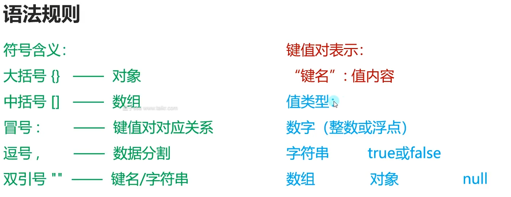

# 【唐老狮】Unity数据持久化

笔记整理者：盘子ssa；QQ：2426966358

# 【唐老狮】Unity数据持久化之PlayerPrefs

# 任务1：PlayerPrefs概述

## 什么是数据持久化

数据持久化就是将内存中的数据模型转换为存储模型，以及将存储模型转换为内存中的数据模型的统称。

通俗来讲：将游戏数据存储到硬盘，硬盘中数据读取到游戏中，也就是传统意义上的存盘。

## Unity中数据持久化系列—第一部分PlayerPrefs

XML、JSON、2进制则是其他进阶的数据持久化的知识。

## 主要学习内容

1. PlayerPrefs的基本方法
2. PlayerPrefs在不同平台的存储位置
3. 利用反射结合PlayerPrefs制作通用存储工具

## 学习建议

PlayerPrefs相关知识点非常简单

重要的是反射结合PlayerPrefs的==实践内容==

1. 熟练使用PlayerPrefs存储读取相关的API
2. 感受反射在实际应用中的作用
3. 掌握反射结合PlayerPrefs制作通用存储工具的手法

# 任务2：PalyerPrefs基本方法 知识点

> [UnityEngine.PlayerPrefs - Unity 脚本 API](https://docs.unity.cn/cn/2020.3/ScriptReference/PlayerPrefs.html)

## 知识点一 PlayerPrefs是什么？

PlayerPrefs是Unity提供的可以用于存储读取玩家数据的公共类。

## 知识点二 存储相关

PlayerPrefs的数据存储，类似于键值对存储，一个键对应一个值

PlayerPrefs提供了存储==3种数据==的方法int，float，string。

键：string类型

值：int float string对应3种API

## 知识点二 读取相关

直接调用Set相关方法，只会把数据存到内存里。

当游戏结束时，Unity会自动把数据存到硬盘中。
如果游戏不是正常结束的，而是崩溃，数据是不会存到硬盘中的。

```C#
PlayerPrefs.SetInt("age", 1);
PlayerPrefs.SetFloat("height", 1);
PlayerPrefs.SetString("name", "Panzi");
```

### 立即保存到外存

只要调用该方法就会马上存储到硬盘中。

```C#
PlayerPrefs.Save();
```

### PlayerPrefs是有局限性

PlayerPrefs是有局限性的，它只能存3种类型的数据

如果你想要存储别的类型的数据，只能降低精度或者上升精度来进行存储。

```C#
bool sex = true;
PlayerPrefs.SetInt("sex", sex ? 1 : 0);
```

### 同名键保存

如果==不同类型==用同一键名进行存储，会进行覆盖。

```C#
PlayerPrefs.SetInt("age", 1);
PlayerPrefs.SetFloat("age", 1);	//覆盖
```

## 知识点三 读取相关

> 注意：运行时只要你Set了对应键值对，即使你没有马上存储save在本地，也能够读取出信息。

如果对应键没有存储值，将会返回这个类型的默认值。

也可以直接使用重载函数，第二个参数为默认值。

```C#
public static int GetInt(string key)
public static extern int GetInt(string key, int defaultValue);
```

如果没有对应键，返回默认类型默认值。

```C#
float height = PlayerPrefs.GetFloat("height");
height = PlayerPrefs.GetFloat("height", 10);
```

### defaultValue作用

第二个参数默认值对于我们的作用：就是在得到没有的数据的时候就可以用它来进行基础数据的初始化。

### 判断数据是否存在

```C#
if (PlayerPrefs.HasKey("height"))
{
    print("存在height");
}
```

## 知识点四 删除数据

删除指定键值对

```C#
PlayerPrefs.DeleteKey("height");
```

删除所有数据

```C#
PlayerPrefs.DeleteAll();
```

## 总结

PlayerPrefs：Set，Get，HasKey，Delete。

## 练习题

### 第一题

现在有玩家信息类，有名字，年龄，攻击力，防御力等成员现在为其封装两个方法，一个用来存储数据，一个用来读取数据。

### 第二题

现在有装备信息类，装备类中有id，数量两个成员。

上一题的玩家类中包含一个List存储了拥有的所有装备信息。

请在上一题的基础上，把装备信息的存储和读取加上

```C#
using System.Collections;
using System.Collections.Generic;
using UnityEngine;
//**********************************
//创建人：
//功能说明：
//**********************************
public class PlayerInfo
{
    public string name;
    public int age;
    public int atk;
    public int def;
    public List<Equipment> equipments;

    public void SaveData()
    {
        PlayerPrefs.SetString("name", name);
        PlayerPrefs.SetInt("age", age);
        PlayerPrefs.SetInt("atk", atk);
        PlayerPrefs.SetInt("def", def);

        PlayerPrefs.SetInt("equipmentNum", equipments.Count);
        for (int i = 0; i < equipments.Count; i++)
        {
            PlayerPrefs.SetInt("EquipmentId" + i, equipments[i].id);
            PlayerPrefs.SetInt("EquipmentCount" + i, equipments[i].count);
        }
    }

    public void LoadData()
    {
        this.name = PlayerPrefs.GetString("name", "");
        this.age = PlayerPrefs.GetInt("age", 18);
        this.atk = PlayerPrefs.GetInt("atk", 1);
        this.def = PlayerPrefs.GetInt("def", 1);

        equipments = new List<Equipment>();
        int equipmentCount = PlayerPrefs.GetInt("equipmentNum", 0);
        for (int i = 0; i < equipmentCount; i++)
        {
            equipments.Add(new Equipment());
            equipments[i].id = PlayerPrefs.GetInt("EquipmentId" + i);
            equipments[i].count = PlayerPrefs.GetInt("EquipmentCount" + i);
        }
    }
}

public class Equipment
{
    public int id;
    public int count;
}
```

> 多个玩家，就给玩家加一个唯一id，存储时带上这个id，应该可行。

# 任务4：PlayerPrefs存储位置 知识点

## 知识点一 PlayerPrefs存储的数据在哪里？

### Windows平台

PlayerPrefs 存储在`HKEY_CURRENT_USER\SOFTWARE\Unity\UnityEditor\公司名称\产品名称`下的注册表中

其中公司和产品名称是在“Project settings”中设置的名称。

具体步骤：win + R，输入regedit，运行注册表，找到`HKEY_CURRENT_USER\SOFTWARE\Unity\UnityEditor\公司名称\产品名称`。

如果数据未加密，那么我们可以直接修改里面的数据。

### Android平台

`/data/data/包名/shared_prefs/pkg-name.xml`

### IOS平台

`/Library/Preferences/[应用ID].plist`

## 知识点二 PlayerPrefs数据唯一性

PlayerPrefs中不同数据的唯一性，是由key决定的。

不同的key决定了不同的数据

同一项目中如果不同数据key相同，会造成数据丢失。

要保证数据不丢失就要建立一个保证key唯一的规则。

## 练习题

### 第一题

将知识点一中的练习题，改为可以支持存储多个玩家信息。

```C#
using System.Collections;
using System.Collections.Generic;
using UnityEngine;
//**********************************
//创建人：
//功能说明：
//**********************************
public class PlayerInfo
{
    public string name;
    public int age;
    public int atk;
    public int def;
    private string keyName;
    public List<Item> items;
    
    public void SaveData(string keyName)
    {
        PlayerPrefs.SetString(keyName + ":" + "name", name);
        PlayerPrefs.SetInt(keyName + ":" + "age", age);
        PlayerPrefs.SetInt(keyName + ":" + "atk", atk);
        PlayerPrefs.SetInt(keyName + ":" + "def", def);

        PlayerPrefs.SetInt(keyName + ":" + "itemNum", items.Count);
        for (int i = 0; i < items.Count; i++)
        {
            PlayerPrefs.SetInt(keyName + ":" + "itemId" + i, items[i].id);
            PlayerPrefs.SetInt(keyName + ":" + "itemCount" + i, items[i].count);
        }
    }

    public void LoadData()
    {
        this.name = PlayerPrefs.GetString(keyName + "name", "");
        this.age = PlayerPrefs.GetInt(keyName + "age", 18);
        this.atk = PlayerPrefs.GetInt(keyName + "atk", 1);
        this.def = PlayerPrefs.GetInt(keyName + "def", 1);

        items = new List<Item>();
        int equipmentCount = PlayerPrefs.GetInt(keyName + "itemNum", 0);
        for (int i = 0; i < equipmentCount; i++)
        {
            items.Add(new Item());
            items[i].id = PlayerPrefs.GetInt(keyName + "itemId" + i);
            items[i].count = PlayerPrefs.GetInt(keyName + "itemCount" + i);
        }
    }
}

public class Item
{
    public int id;
    public int count;
}
```


### 第二题

要在游戏中做一个排行榜功能。

排行榜主要记录玩家名(可重复)，玩家得分，玩家通关时间。

请用PlayerPrefs存储读取排行榜相关信息。

```C#
using System.Collections;
using System.Collections.Generic;
using UnityEngine;
//**********************************
//创建人：
//功能说明：
//**********************************
public class RankListInfo
{
    public List<RankInfo> rankList;

    public RankListInfo()
    {
        Load();
    }

    public void AddInfo(RankInfo info)
    {
        rankList.Add(info);
        Save();
    }

    public void Save()
    {
        PlayerPrefs.SetInt("RankListLen", rankList.Count);
        for (int i = 0; i < rankList.Count; i++)
        {
            PlayerPrefs.SetString("PlayerName" + i, rankList[i].playerName);
            PlayerPrefs.SetInt("PlayerScore" + i, rankList[i].playerScore);
            PlayerPrefs.SetString("PlayerTime" + i, rankList[i].playerTime);
        }
        PlayerPrefs.Save();
    }

    private void Load()
    {
        int len = PlayerPrefs.GetInt("RankListLen");
        rankList = new List<RankInfo>();
        for (int i = 0; i < len; i++)
        {
            RankInfo info = new RankInfo(PlayerPrefs.GetString("PlayerName" + i),
                                        PlayerPrefs.GetInt("PlayerScore" + i),
                                        PlayerPrefs.GetString("PlayerTime" + i));
            rankList.Add(info);
        }
    }
}

public class RankInfo
{
    public string playerName;
    public int playerScore;
    public string playerTime;

    public RankInfo(string playerName, int playerScore, string playerTime)
    {
        this.playerName = playerName;
        this.playerScore = playerScore;
        this.playerTime = playerTime;
    }
}

public class Lesson2_P : MonoBehaviour
{
    private void Start()
    {
        RankListInfo rank = new RankListInfo();
        print(rank.rankList.Count);
        for (int i = 0; i < rank.rankList.Count; i++)
        {
            print("Name:" + rank.rankList[i].playerName);
            print("Score:" + rank.rankList[i].playerScore);
            print("Time:" + rank.rankList[i].playerTime);

        }
        rank.AddInfo(new RankInfo("panzi", 111, "10:10"));
        rank.AddInfo(new RankInfo("panzi", 111, "10:10"));
    }
}
```


# 任务7：必备知识点—反射知识小补充

> [Type 类 (System) | Microsoft Learn](https://learn.microsoft.com/zh-cn/dotnet/api/system.type?view=net-7.0)

## 知识点一 反射知识回顾

反射三剑客：1 T 2 A

Type：用于获取类的所有信息，字段、属性、方法等等

Assembly：用于获取程序集，通过程序集获取Type

Activator：用于快速实例化对象

## 知识点二 判断一个类型的对象是否可以让另一个类型为自己分配空间

> [Type.IsAssignableFrom(Type) 方法 (System) | Microsoft Learn](https://learn.microsoft.com/zh-cn/dotnet/api/system.type.isassignablefrom?view=net-7.0#system-type-isassignablefrom(system-type))
>
> [Type.IsAssignableTo(Type) 方法 (System) | Microsoft Learn](https://learn.microsoft.com/zh-cn/dotnet/api/system.type.isassignableto?view=net-7.0#system-type-isassignableto(system-type))
>
> 注意：IsAssignableTo在Unity不可使用，因为Unity的.Net是2.0或4.0版本，IsAssignAbleTo需要.Net 5及以上
>
> [Unity 中的 .NET 概述 - Unity 手册](https://docs.unity.cn/cn/2021.1/Manual/overview-of-dot-net-in-unity.html)

`其实就是父类装子类`，是否可以使用某个类型的对象，为自己分配空间。

使用Type.AssignableFrom(Type)

```C#
public virtual bool IsAssignableFrom(Type c);
```

```C#
Type fatherType = typeof(Father);
Type sonType = typeof(Son);
if (fatherType.IsAssignableFrom(sonType))
{
	print("ok");
}
else
{
	print("不可以");
}
```

## 知识点三 通过反射获取泛型类型

> [Type.GetGenericArguments 方法 (System) | Microsoft Learn](https://learn.microsoft.com/zh-cn/dotnet/api/system.type.getgenericarguments?view=net-7.0#system-type-getgenericarguments)

使用Type.GetGenericArguments()

```c#
public virtual Type[] GetGenericArguments();
```

```C#
List<string> list = new List<string>();
Type liststrType = list.GetType();
Type[] types = liststrType.GetGenericArguments();
print(types[0]);
```

# -----------------------------------------

# 【唐老狮】Unity数据持久化之XML

# 任务1：数据持久化XML 概述

## Unity数据持久化系列—第二部分

1. PlayerPrefs
2. XML
3. JSON
4. 2进制

## 什么是数据持久化?

数据持久化就是将内存中的数据模型，转换为存储模型，以及将存储模型转换为内存中的数据模型的统称。

说人话：将游戏数据存储到硬盘，硬盘中数据读取到游戏中，也就是传统意义上的存盘。

## XML是什么?

全称：可拓展标记语言(EXtensible Markup Language)

XML是国际通用的

它是被设计来用于传输和存储数据的一种文本特殊格式

文件后缀一般为.xml

## 如何理解不同后缀的文件

文件后缀名决定了文件的格式

不同的软件可以根据后缀名用来判断文件的类型，并且在打开文件时以特定的读取规则去解析它

文件后缀名是人为定的规则，可以有无数种，可以自定义

## 我们一般使用XML文件来记录和传输数据

`xml测试文本.xml`
XML文档就是使用XML格式配置填写的文档，后缀一般为.xml

我们在游戏中可以把游戏数据按照XML的格式标准，存储在XML文档中，再将XML文档存储在硬盘上或者传输给远端，达到数据持久化的目的。

## 主要学习内容

- XML文件格式
- C#读取和存储XML文件
- 通过序列化和反序列化快速存储读取XML文件

## 学会后对于我们的意义

1. 多了一种存储和传输数据的选择
2. 多了一种配置数据的方法（具体会结合UI第二部曲讲解)

## 主要学习方式

理论+习题+实践

- 理论：语法知识
- 习题：基于知识点的针对性习题
- 实践：基于知识点的小项目实践

## 总结

1. 掌握XML基础规则
2. 掌握C#读取存储XML文件
3. 掌握利用基于反射的序列化和反序列化快速存储和读取XML文件

# 任务2：XML基本语法 知识点

XML格式是一种树形结构

## 注释

```C#
<!--注释-->
```

## 固定内容

xml版本信息和编码信息

```C#
<?xml version = "1.0" encoding = "UTF-8"?>
```

## 基本语法

xml语法就是`<元素标签>内容</元素标签>`

xml必须有一个根节点

```C#
<?xml version = "1.0" encoding = "UTF-8"?>
<PlayerInfo>
	<name>盘子ssa</name>
	<atk>10</atk>
	<ItemList>
		<Item>
			<id>1</id>
			<num>1</num>
		</Item>
		<Item>
			<id>2</id>
			<num>1</num>
		</Item>
		<Item>
			<id>2</id>
			<num>1</num>
		</Item>
	</ItemList>
</PlayerInfo>

```

## 基本规则

1. 每个元素都必须有关闭标签
2. 元素命名规则基本遵照C#中变量名命名规则
3. XML标签对大小写敏感
4. XML文档必须有根元素
5. 特殊的符号应该用实体引用
   - &lt：\<，小于
   - &gt：\>，大于
   - &amp：&，与
   - &apos：'，单引号
   - &quot："，引号

## 总结

1. 创建XML文件：右键创建文档改后缀
2. 注释：`<!--汪释内容-->`
3. 固定内容：`<?xml version = "1.0" encoding = "UTF-8"?>`
4. 基本语法：`<元素标签>元素内容</元素标签>`，多层嵌套包裹形成树形结构
5. 基本规则：必须有跟节点，实体引用替代符等等

# 任务3：XML属性 知识点

## 属性语法

属性语法：元素标签后面空格，添加内容

```C#
<PlayerInfo name = "盘子ssa" atk = "10">
	<ItemList>
		<Item id = "1" num = "1"/>
		<Item id = "2" num = "1"/>
		<Item id = "2" num = "1"/>
	</ItemList>
</PlayerInfo>
```

如果标签中间没有内容，可以直接以`/`结束标签

```C#
<Content/>
```

## 属性和元素节点的区别

属性和元素节点只是写法上的区别而已，我们可以选择自己喜欢的方式来记录数据。

## 如何查语法错误

1. 元素标签必须配对
2. 属性必必须有引号
3. 注意命名

使用网页查错

> [XML 验证器 | 菜鸟教程 (runoob.com)](https://www.runoob.com/xml/xml-validator.html)

推荐使用VSCode，配合XML插件，检错。

## 总结

1. 属性语法：`<元素标签名属性名=”信息”>元素信息</元素标签名>`
2. 属性和元素的区别：写法上不同，根据实际情况选择使用
3. 如何查语法错误：配对，命名，引号等等，或者直接复制信息到网页上检测，使用VSCode配合XML插件检测。

## 练习题

将下列C#类，使用XML表示出来。

```C#
public class Item
{
    public int id;
    public int num;
}

public class PlayerInfo
{
    public string name;
    public int atk;
    public int def;
    public float moveSpeed;
    public float roundSpeed;
    public Item weapon;
    public List<int> iistint;
    public List<Item> itemList;
    public Dictionary<int,Item> itemDic;
}
```

```C#
<?xml version = "1.0" encoding = "UTF-8"?>

<PlayerInfo>
	<name type = "string" value = ""></name>
	<akt type = "int" value = ""></akt>
	<def type = "int" value = ""></def>
	<moveSpeed type = "float" value = ""></moveSpeed>
	<roundSpeed type = "float" value = ""></roundSpeed>
	<weapon type = "Item">
		<id type = "int" value = ""></id>
		<num type = "int" value = ""></num>
	</weapon>
	<listInt type = "List" GenericType = "int">

	</listInt>
	<itemList type = "List" GenericType = "int">

	</itemList>
	<itemDic type = "Dictionary" keyType = "int" valueType = "Item">

	</itemDic>
</PlayerInfo>
```

# 任务5：XML文件存放位置 知识点

## 1.只读不写的XML文件

可以放在`Resources`或者`StreamingAssets`文件夹下

## 2.动态存储的XML文件

放在`Application.persistentDataPath`路径下

# 任务6：C#读取XML文件 知识点

> [XmlDeclaration 类 (System.Xml) | Microsoft Learn](https://learn.microsoft.com/zh-cn/dotnet/api/system.xml.xmldeclaration?view=net-7.0)
>
> [XmlDocument 类 (System.Xml) | Microsoft Learn](https://learn.microsoft.com/zh-cn/dotnet/api/system.xml.xmldocument?view=net-7.0)
>
> [XmlNode 类 (System.Xml) | Microsoft Learn](https://learn.microsoft.com/zh-cn/dotnet/api/system.xml.xmlnode?view=net-7.0)
>
> [XmlNodeList 类 (System.Xml) | Microsoft Learn](https://learn.microsoft.com/zh-cn/dotnet/api/system.xml.xmlnodelist?view=net-7.0)

## 知识点一 读取xml文件信息

C#读取XML的方法有几种

1. XmlDocument   (把数据加载到内存中，方便读取)
2. XmlTextReader  (以流形式加载，内存占用更少，但是是单向只读，使用不是特别方便，除非有特殊需求，否则不会使用)
3. Linq(以后专门讲Linq的时候讲)

使用XmlDocument类读取是较方便最容易理解和操作的方法。

### 通过XmlDocument读取xml文件 有两个API

```C#
 XmlDocument xml = new XmlDocument();
```

1.直接根据xml字符串内容 来加载xml文件

存放在Resorces文件夹下的xml文件加载处理

```C#
TextAsset asset = Resources.Load<TextAsset>("TestXml");
print(asset.text);
//通过这个方法 就能够翻译字符串为xml对象
xml.LoadXml(asset.text);
```

2.是通过xml文件的路径去进行加载

```C#
xml.Load(Application.streamingAssetsPath + "/TestXml.xml");
```

## 知识点二 读取元素和属性信息

节点信息类

- XmlNode 单个节点信息类
- XmlNodeList 多个节点信息类

### 获取单个节点信息

获取xml当中的根节点

```C#
XmlNode root = xml.SelectSingleNode("Root");
```

再通过根节点 去获取下面的子节点

```C#
XmlNode nodeName = root.SelectSingleNode("name");
```

如果想要获取节点包裹的元素信息 直接 `.InnerText`

```C#
print(nodeName.InnerText);
XmlNode nodeAge = root.SelectSingleNode("age");
print(nodeAge.InnerText);
```

#### 获取属性信息

```C#
XmlNode nodeItem = root.SelectSingleNode("Item");
```

第一种方式 直接 中括号获取信息

```C#
print(nodeItem.Attributes["id"].Value);
print(nodeItem.Attributes["num"].Value);
```

第二种方式 

```C#
print(nodeItem.Attributes.GetNamedItem("id").Value);
print(nodeItem.Attributes.GetNamedItem("num").Value);
```

### 获取多个同名节点信息

```C#
XmlNodeList friendList = root.SelectNodes("Friend");
```

遍历方式一：迭代器遍历

```C#
foreach (XmlNode item in friendList)
{
    print(item.SelectSingleNode("name").InnerText);
    print(item.SelectSingleNode("age").InnerText);
}
```

遍历方式二：通过for循环遍历

通过XmlNodeList中的 成员变量 Count可以得到 节点数量

```C#
for (int i = 0; i < friendList.Count; i++)
{
    print(friendList[i].SelectSingleNode("name").InnerText);
    print(friendList[i].SelectSingleNode("age").InnerText);
}
```

## 总结

1. 读取XML文件：`XmlDocument xml = new XmlDocument();`

   读取文本方式1-`xml.LoadXml(传入xml文本字符串)`

   读取文本方式2-`xml.Load(传入路径)`

2. 读取元素和属性

   获取单个节点 : `XmlNode node = xml.SelectSingleNode(节点名)`

   获取多个节点 : `XmlNodeList nodeList = xml.SelectNodes(节点名)`

   获取节点元素内容：`node.InnerText`

   获取节点元素属性：

   1. `item.Attributes["属性名"].Value`
   2. `item.Attributes.GetNamedItem("属性名").Value`

通过迭代器遍历或者循环遍历XmlNodeList对象，可以获取到各单个元素节点。

## 练习题

有一个玩家数据类，请为该类写一个方法结合XML读取知识点，将XML中数据读取到Playerlnfo的一个对象中。

```C#
<?xml version = "1.0" encoding = "UTF-8"?>

<PlayerInfo>
	<name type = "string">Panzi</name>
	<atk type = "int">5</atk>
	<def type = "int">10</def>
	<moveSpeed type = "float">10.0</moveSpeed>
	<roundSpeed type = "float">50.0</roundSpeed>
	<weapon type = "Item" id = "1" num = "1"></weapon>
	<listInt type = "List" GenericType = "int">
		<int>1</int>
		<int>2</int>
		<int>3</int>
	</listInt>
	<itemList type = "List" GenericType = "Item">
		<Item id = "1" num = "10"></Item>
		<Item id = "2" num = "10"></Item>
		<Item id = "3" num = "10"></Item>
	</itemList>
	<itemDic type = "Dictionary" keyType = "int" valueType = "Item">
		<keyValuePair>
			<key>1</key>
			<Item id = "1" num = "10"></Item>
		</keyValuePair>
	</itemDic>
</PlayerInfo>
```

```C#
using System.Collections;
using System.Collections.Generic;
using System.IO;
using System.Xml;
using TMPro;
using UnityEngine;
//**********************************
//创建人：
//功能说明：
//**********************************
public class Item
{
    public int id;
    public int num;
}

public class PlayerInfo
{
    public string name;
    public int atk;
    public int def;
    public float moveSpeed;
    public float roundSpeed;
    public Item weapon;
    public List<int> listInt;
    public List<Item> itemList;
    public Dictionary<int,Item> itemDic;

    public void LoadFromXml(string path)
    {
        if (!File.Exists(path))
        {
            Debug.Log("File not found!");
            return;
        }
        XmlDocument xml = new XmlDocument();
        xml.Load(path);
        //获取节点
        XmlNode playerInfoNode = xml.SelectSingleNode("PlayerInfo");
        XmlNode nameNode = playerInfoNode.SelectSingleNode("name");
        XmlNode atkNode = playerInfoNode.SelectSingleNode("atk");
        XmlNode defNode = playerInfoNode.SelectSingleNode("def");
        XmlNode moveSpeedNode = playerInfoNode.SelectSingleNode("moveSpeed");
        XmlNode roundSpeedNode = playerInfoNode.SelectSingleNode("roundSpeed");
        XmlNode weaponNode = playerInfoNode.SelectSingleNode("weapon");
        XmlNode listIntNode = playerInfoNode.SelectSingleNode("listInt");
        XmlNode itemListNode = playerInfoNode.SelectSingleNode("itemList");
        XmlNode itemDicNode = playerInfoNode.SelectSingleNode("itemDic");

        //赋值
        this.name = nameNode.InnerText;
        this.atk = int.Parse(atkNode.InnerText);
        this.def = int.Parse(defNode.InnerText);
        this.moveSpeed = float.Parse(moveSpeedNode.InnerText);
        this.roundSpeed = float.Parse(roundSpeedNode.InnerText);

        //赋值武器
        this.weapon = new Item()
        {
            id = int.Parse(weaponNode.Attributes["id"].Value),
            num = int.Parse(weaponNode.Attributes["num"].Value)
        };

        //赋值int型列表
        this.listInt = new List<int>();
        XmlNodeList ints = listIntNode.SelectNodes("int");
        for (int i = 0; i < ints.Count; i++)
        {
            this.listInt.Add(int.Parse(ints[i].InnerText));
        }

        //赋值Item型列表
        this.itemList = new List<Item>();
        XmlNodeList items = itemListNode.SelectNodes("Item");
        for (int i = 0; i < items.Count; i++)
        {
            this.itemList.Add(new Item()
            {
                id = int.Parse(items[i].Attributes["id"].Value),
                num = int.Parse(items[i].Attributes["num"].Value)
            });
        }

        //赋值字典
        this.itemDic = new Dictionary<int, Item>();
        XmlNodeList keyValuePairs = itemDicNode.SelectNodes("keyValuePair");
        for (int i = 0; i < keyValuePairs.Count; i++)
        {
            XmlNode keyNode = keyValuePairs[i].SelectSingleNode("key");
            XmlNode itemNode = keyValuePairs[i].SelectSingleNode("Item");
            this.itemDic.Add(
                int.Parse(keyNode.InnerText),
                new Item()
                {
                    id = int.Parse(itemNode.Attributes["id"].Value),
                    num = int.Parse(itemNode.Attributes["num"].Value)
                }
            );
        }
        PrintInfo();
    }

    public void PrintInfo()
    {
        Debug.Log("name:" + this.name);
        Debug.Log("atk:" + this.atk);
        Debug.Log("def:" + this.def);
        Debug.Log("moveSpeed" + this.moveSpeed);
        Debug.Log("roundSpeed" + this.roundSpeed);
        Debug.Log("weapon-id" + this.weapon.id);
        Debug.Log("weapon-num" + this.weapon.num);

        for (int i = 0; i < this.listInt.Count; i++)
        {
            Debug.Log("listInt第" + i + "个元素:" + this.listInt[i]);
        }

        for (int i = 0; i < this.itemList.Count; i++)
        {
            Debug.Log("itemList第" + i + "个元素:id = " + this.itemList[i].id + " num = " + this.itemList[i].num);
        }

        int index = 0;
        foreach (var key in this.itemDic.Keys)
        {
            Debug.Log("itemDic" + index + "个元素:key = " + key + " value = id:" + this.itemDic[key].id + " num:" + this.itemDic[key].num);
        }
    }
}
public class Lesson1_P : MonoBehaviour
{
    // Start is called before the first frame update
    void Start()
    {
        PlayerInfo player = new PlayerInfo();
        player.LoadFromXml(Application.streamingAssetsPath + "/" + "Test.xml");
        player.PrintInfo();
    }
}

```

# 任务8：C#存储XML文件 知识点

## 知识点一 决定存储在哪个文件夹下

注意：存储xml文件 在Unity中一定是使用各平台都可读可写可找到的路径

1. `Resources` 可读 不可写 打包后找不到  ×
2. `Application.streamingAssetsPath` 可读 PC端可写 找得到  ×
3. `Application.dataPath` 打包后找不到  ×
4. `Application.persistentDataPath` 可读可写找得到   √

```C#
string path = Application.persistentDataPath + "/PlayerInfo2.xml";
print(Application.persistentDataPath);
```

## 知识点二 存储xml文件

- 关键类 XmlDocument 用于创建节点 存储文件
- 关键类 XmlDeclaration 用于添加版本信息
- 关键类 XmlElement 节点类

存储有5步

1.创建文本对象

```C#
XmlDocument xml = new XmlDocument();
```

2.添加固定版本信息

```C#
//这一句代码 相当于就是创建<?xml version="1.0" encoding="UTF-8"?>这句内容
XmlDeclaration xmlDec = xml.CreateXmlDeclaration("1.0", "UTF-8", "");
//创建完成过后 要添加进入 文本对象中
xml.AppendChild(xmlDec);
```

3.添加根节点

```C#
XmlElement root = xml.CreateElement("Root");
xml.AppendChild(root);
```

4.为根节点添加子节点

```C#
//加了一个 name子节点
XmlElement name = xml.CreateElement("name");
name.InnerText = "唐老狮";
root.AppendChild(name);

XmlElement atk = xml.CreateElement("atk");
atk.InnerText = "10";
root.AppendChild(atk);

XmlElement listInt = xml.CreateElement("listInt");
for (int i = 1; i <= 3; i++)
{
    XmlElement childNode = xml.CreateElement("int");
    childNode.InnerText = i.ToString();
    listInt.AppendChild(childNode);
}
root.AppendChild(listInt);

XmlElement itemList = xml.CreateElement("itemList");
for (int i = 1; i <= 3; i++)
{
    XmlElement childNode = xml.CreateElement("Item");
    //添加属性
    childNode.SetAttribute("id", i.ToString());
    childNode.SetAttribute("num", (i * 10).ToString());
    itemList.AppendChild(childNode);
}
root.AppendChild(itemList);
```

5.保存

```C#
xml.Save(path);
```

## 知识点三 修改xml文件

### 判断文件是否存在

```C#
using System.IO;

if (File.Exists(path)) {
    ...
}
```

### 修改xml文件

```C#
//1.先判断是否存在文件
if( File.Exists(path) )
{
    //2.加载后 直接添加节点 移除节点即可
    XmlDocument newXml = new XmlDocument();
    newXml.Load(path);

    //修改就是在原有文件基础上 去移除 或者添加
    //移除
    XmlNode node;// = newXml.SelectSingleNode("Root").SelectSingleNode("atk");
    //这种是一种简便写法 通过/来区分父子关系
    node = newXml.SelectSingleNode("Root/atk");
    //得到自己的父节点
    XmlNode root2 = newXml.SelectSingleNode("Root");
    //移除子节点方法
    root2.RemoveChild(node);

    //添加节点
    XmlElement speed = newXml.CreateElement("moveSpeed");
    speed.InnerText = "20";
    root2.AppendChild(speed);

    //改了记得存
    newXml.Save(path);
}
```

## 总结

### 1.读取XML文件

```C#
XmlDocument xml = new XmlDocument();
```

读取文本方式1-`xml.LoadXml(传入xml文本字符串)`

读取文本方式2-`xml.Load(传入路径)`

### 2.读取元素和属性

获取单个节点 : `XmlNode node = xml.SelectSingleNode(节点名)`

获取多个节点 : `XmlNodeList nodeList = xml.SelectNodes(节点名)`

获取节点元素内容：`node.InnerText`

获取节点元素属性：

1. `item.Attributes["属性名"].Value`
2. `item.Attributes.GetNamedItem("属性名").Value`

通过迭代器遍历或者循环遍历XmlNodeList对象，可以获取到各单个元素节点。

# 任务10：总结

## 学习内容回顾

- XML文件格式
- C#读取存储XML

## 优点

XML是国际通用规则，跨平台（游戏，软件，网页等等都能用)文件结构清晰易懂，非常容易编辑和理解，可以用于网络通信交换数据。

## 缺点

重复工作量繁多

自定义数据类，都需要自己去实现存储读取的功能而且代码的相似度极高

数据容易被修改

只要找到文件位置，就可以轻易的进行数据修改

## 主要用处

网络游戏:

可以用于存储一些客户端的简单不重要数据

可以用于传输信息(基本不会大范围使用，因为比较耗流量)

单机游戏:

用于存储游戏相关数据

用于配置游戏数据（结合Ul第二部曲一起讲解)

# 任务11：XML序列化 知识点

## 知识点一 什么是序列化和反序列化

序列化：把对象转化为可传输的字节序列过程称为序列化

反序列化：把字节序列还原为对象的过程称为反序列化

说人话：

- 序列化就是把想要存储的内容转换为字节序列用于存储或传递
- 反序列化就是把存储或收到的字节序列信息解析读取出来使用

## 知识点二 xml序列化

> [XmlSerializer 类 (System.Xml.Serialization) | Microsoft Learn](https://learn.microsoft.com/zh-cn/dotnet/api/system.xml.serialization.xmlserializer?view=net-7.0)

### 1.准备一个数据结构类

```C#
public class Lesson1Test
{
    [XmlElement("testPublic123123")]
    public int testPublic;
    private int testPrivate;
    protected int testProtected;
    internal int testInternal;

    public string testPUblicStr;

    public int testPro { get; set; }

    public Lesson1Test2 testClass = new Lesson1Test2();

    public int[] arrayInt;
    [XmlArray("IntList")]
    [XmlArrayItem("Int32")]
    public List<int> listInt;
    public List<Lesson1Test2> listItem;

    //不支持字典
    //public Dictionary<int, string> testDic = new Dictionary<int, string>() { { 1, "123" } };
}

public class Lesson1Test2
{
    [XmlAttribute("Test1")]
    public int test1 = 1;
    [XmlAttribute()]
    public float test2 = 1.1f;
    [XmlAttribute()]
    public bool test3 = true;
}

Lesson1Test lt = new Lesson1Test();
```

### 2.进行序列化

关键知识点

- `XmlSerializer` 用于序列化对象为xml的关键类
- `StreamWriter` 用于存储文件  
- `using` 用于方便流对象释放和销毁

### 第一步：确定存储路径

```C#
string path = Application.persistentDataPath + "/Lesson1Test.xml";
print(Application.persistentDataPath);
```

### 第二步：结合 using知识点 和 StreamWriter这个流对象 来写入文件

> [using 关键字 - C# 参考 | Microsoft Learn](https://learn.microsoft.com/zh-cn/dotnet/csharp/language-reference/keywords/using)
>
> [using 语句 - 确保正确使用可释放对象 | Microsoft Learn](https://learn.microsoft.com/zh-cn/dotnet/csharp/language-reference/statements/using)
>
> [using 指令 - C# 参考 | Microsoft Learn](https://learn.microsoft.com/zh-cn/dotnet/csharp/language-reference/keywords/using-directive)

括号内的代码：写入一个文件流，如果有该文件，直接打开并修改，如果没有该文件，直接新建一个文件。

using的新用法：括号当中包裹的声明的对象，会在大括号语句块结束后，自动释放掉。

当语句块结束，会自动帮助我们调用，对象的Dispose这个方法，让其进行销毁。

using一般都是配合，内存占用比较大，或者有读写操作时进行使用的。

```C#
using ( StreamWriter stream = new StreamWriter(path) )
{
   ...
}
```

### 第三步：进行xml文件序列化

> [XmlSerializer 类 (System.Xml.Serialization) | Microsoft Learn](https://learn.microsoft.com/zh-cn/dotnet/api/system.xml.serialization.xmlserializer?view=net-7.0)

注意：此方式的序列化，不能序列化不可访问的成员！！只能序列化公共成员

注意：如果字段是引用类型并且没有初始值，将无法序列化

```C#
using ( StreamWriter stream = new StreamWriter(path) )
{
    //第三步：进行xml文件序列化
    XmlSerializer s = new XmlSerializer(typeof(Lesson1Test));
    //这句代码的含义 就是通过序列化对象 对我们类对象进行翻译 将其翻译成我们的xml文件 写入到对应的文件中
    //第一个参数 ： 文件流对象
    //第二个参数: 想要备翻译 的对象
    //注意 ：翻译机器的类型 一定要和传入的对象是一致的 不然会报错
    s.Serialize(stream, lt);
}
```

## 知识点三 自定义节点名 或 设置属性

可以通过特性，设置节点或者设置属性，并且修改名字。

设置节点

```C#
[XmlElement("intPublic")]
public int testPublic = 10;
```

设置属性

注意：这个属性会变为上一级的属性，也就是`lt`和`Lesson1Test2`标签的属性。

```C#
[XmlAttribute("testInt")]	//指定属性名为testInt
public int test1 = 1;
[XmlAttribute()]			//不指定，则使用变量名
public float test2 = 1.1f;
[XmlAttribute()]			//不指定，则使用变量名
public bool test3 = false;
```

设置数组

```C#
[XmlArray("intArray111")]	//标签为intArray111
[XmlArrayItem("item")]		//数组元素标签为item
public int[] intArray = new int[3] { 1, 2, 3 };
```

完整代码

```C#
public class Lesson1Test
{
    [XmlElement("testPublic123123")]
    public int testPublic;
    private int testPrivate;
    protected int testProtected;
    internal int testInternal;

    public string testPUblicStr;

    public int testPro { get; set; }

    public Lesson1Test2 testClass = new Lesson1Test2();

    public int[] arrayInt;
    [XmlArray("IntList")]
    [XmlArrayItem("Int32")]
    public List<int> listInt;
    public List<Lesson1Test2> listItem;

    //不支持字典
    //public Dictionary<int, string> testDic = new Dictionary<int, string>() { { 1, "123" } };
}

public class Lesson1Test2
{
    [XmlAttribute("Test1")]
    public int test1 = 1;
    [XmlAttribute()]
    public float test2 = 1.1f;
    [XmlAttribute()]
    public bool test3 = true;
}
```

## 总结

### 序列化流程

1. 有一个想要保存的类对象
2. 使用XmlSerializer 序列化该对象
3. 通过StreamWriter 配合 using将数据存储 写入文件

### 注意：

1. 只能序列化公共成员
2. 不支持字典序列化
3. 可以通过特性修改节点信息，或者设置属性信息
4. Stream相关要配合using使用

# 任务12：XML反序列化 知识点

## 知识回顾

序列化：就是把类对象，转换为可存储和传输的数据（转换为字符或者其他形式的文件，存在硬盘上）。
反序列化：就是把存储或收到的数据，转换为类对象。

xml序列化关键知识

1. using 和 StreamWriter
2. XmlSerializer 的 Serialize序列化方法

## 知识点一 判断文件是否存在

```C#
string path = Application.persistentDataPath + "/Lesson1Test.xml";
if( File.Exists(path) )
{
    ...
}
```

## 知识点二 反序列化

关键知识

1. using 和 StreamReader
2. XmlSerializer 的 Deserialize反序列化方法

```C#
string path = Application.persistentDataPath + "/Lesson1Test.xml";
if( File.Exists(path) )
{
    #region 知识点二 反序列化
        // 关键知识
        // 1.using 和 StreamReader
        // 2.XmlSerializer 的 Deserialize反序列化方法

        //读取文件
    using (StreamReader reader = new StreamReader(path))
    {
        //产生了一个 序列化反序列化的翻译机器
        XmlSerializer s = new XmlSerializer(typeof(Lesson1Test));
        Lesson1Test lt = s.Deserialize(reader) as Lesson1Test;
    }
    #endregion
}
```

## 总结

1. 判断文件是否存在 File.Exists
2. 文件流获取 StreamReader reader = new StreamReader(path)
3. 根据文件流 XmlSerializer通过Deserialize反序列化 出对象

注意：List对象，如果有默认值，反序列化时，==不会清空==，会往后面添加。

# 任务13：IXmlSerializable接口 知识点

## 知识点一 IXmlSerializable是什么

C# 的`XmlSerializer` 提供了可拓展内容 ；

可以让一些不能被序列化和反序列化的特殊类能被处理；

让特殊类继承 `IXmlSerializable` 接口 实现其中的方法即可。

## 知识点二 自定义类实践

> [XmlReader 类 (System.Xml) | Microsoft Learn](https://learn.microsoft.com/zh-cn/dotnet/api/system.xml.xmlreader?view=net-7.0)
>
> [XmlWriter 类 (System.Xml) | Microsoft Learn](https://learn.microsoft.com/zh-cn/dotnet/api/system.xml.xmlwriter?view=net-7.0)

### 复习序列化和反序列化

```C#
using System.Collections;
using System.Collections.Generic;
using System.IO;
using System.Xml.Serialization;
using UnityEngine;
//**********************************
//创建人：
//功能说明：
//**********************************
public class Lesson3Test
{
    public int intTest = 10;
    public string strTest;
}

public class Lesson3 : MonoBehaviour
{
    // Start is called before the first frame update
    void Start()
    {
        //序列化
        Lesson3Test lt = new Lesson3Test();
        string path = Application.persistentDataPath + "/Lesson3Test.xml";
        print(path);
        lt.strTest = "Panzi";
        using (StreamWriter writer = new StreamWriter(path))
        {
            XmlSerializer s = new XmlSerializer(typeof(Lesson3Test));
            s.Serialize(writer, lt);
        }
	
        //反序列化
        Lesson3Test lt2;
        using (StreamReader reader = new StreamReader(path))
        {
            XmlSerializer s = new XmlSerializer(typeof(Lesson3Test));
            lt2 = s.Deserialize(reader) as Lesson3Test;
        }
        print(lt2.intTest);
        print(lt2.strTest);
    }
}

```

### 自定义序列化

若要自定义序列化，需要继承`IXmlSerializable`接口，并实现其中方法，使用参数读和写。

```C#
public class Lesson3Test : IXmlSerializable
{
    public int intTest = 10;
    public string strTest;

    //返回结构
    public XmlSchema GetSchema()
    {
        return null;
    }

    //反序列化时，自动调用此方法
    public void ReadXml(XmlReader reader)
    {
       //在此方法自定义反序列化规则
    }

    //序列化时，自动调用此方法
    public void WriteXml(XmlWriter writer)
    {
        //在此方法自定义序列化规则
    }
}
```

#### 读属性，写属性

```C#
public void ReadXml(XmlReader reader)
{
    //在此方法自定义反序列化规则

    //1.读属性
    this.intTest = int.Parse(reader["intTest"]);
    this.strTest = reader["strTest"];
}

public void WriteXml(XmlWriter writer)
{
    //在此方法自定义序列化规则

    //1.写属性
    writer.WriteAttributeString("intTest", intTest.ToString());
    writer.WriteAttributeString("strTest", strTest);
}

//xml
<?xml version="1.0" encoding="utf-8"?>
<Lesson3Test intTest="10" strTest="Panzi" />
```

#### 写节点

```C#
public void WriteXml(XmlWriter writer)
{
    //在此方法自定义序列化规则

    //2.写节点
    writer.WriteElementString("intTest", intTest.ToString());
    writer.WriteElementString("strTest", strTest);
}

//xml
<?xml version="1.0" encoding="utf-8"?>
<Lesson3Test>
  <intTest>10</intTest>
  <strTest>Panzi</strTest>
</Lesson3Test>
```

#### 读节点

第一种方式，使用Read一个个读取，Read函数每一次读取一个内容（标签，属性，标签内包裹内容）

```C#
//Read读一个标签，初始时，在根节点
reader.Read();  //读取到intTest
reader.Read();  //读取到标签包裹的内容，也就是两个标签当中的内容，此时，才能获取其中内容
this.intTest = int.Parse(reader.Value); //赋值
reader.Read();  //读取到/Test

reader.Read();  //读取到strTest
reader.Read();  //读取到标签包裹的内容，也就是两个标签当中的内容，此时，才能获取其中内容
this.strTest = reader.Value;
//后面内容没啥用，就不用读了
```

第二种方式，由于Read函数返回bool，可以一直读取，如果读取的到的类型是我们想要的类型，就获取它。

> NodeType 是 XmlNodeType
>
> XmlNodeType 是一个枚举类型

```C#
while (reader.Read())
{
    if (reader.NodeType == XmlNodeType.Element)
    {
        switch (reader.Name)
        {
            case "intTest":
                reader.Read();
                this.intTest = int.Parse(reader.Value);
                break;
            case "strTest":
                reader.Read();
                this.strTest = reader.Value;
                break;
        }
    }
}
```

#### 写包裹节点

注意：如果这么写，读取时也应该按对应方式读取

```C#
//3.写包裹节点
XmlSerializer s = new XmlSerializer(typeof(int));   //使用自带序列化去写
writer.WriteStartElement("intTest");
s.Serialize(writer, intTest);
writer.WriteEndElement();

XmlSerializer s2 = new XmlSerializer(typeof(string));   //使用自带序列化去写
writer.WriteStartElement("strTest");
s2.Serialize(writer, strTest);
writer.WriteEndElement();

//xml
<?xml version="1.0" encoding="utf-8"?>
<Lesson3Test>
  <intTest>
    <int>10</int>
  </intTest>
  <strTest>
    <string>Panzi</string>
  </strTest>
</Lesson3Test>
```

#### 读包裹节点

```C#
//3.读包裹节点
reader.Read();  //读取到Lesson3Test
reader.ReadStartElement("intTest");
XmlSerializer intSeri = new XmlSerializer(typeof(int));
this.intTest = (int)intSeri.Deserialize(reader);
reader.ReadEndElement();

reader.ReadStartElement("strTest");
XmlSerializer strSeri = new XmlSerializer(typeof(int));
this.strTest = strSeri.Deserialize(reader).ToString();
reader.ReadEndElement();
```

其实还可以包裹读属性，写属性。

# 任务14：让Dictionary支持序列化反序列化 知识点

## 知识点一 思考如何让Dictionary支持xml序列和反序列化

1. 我们没办法修改C#自带的类
2. 那我们可以重写一个类，继承Dictionary然后让这个类继承序列化拓展接口IXmlSerializable
3. 实现里面的序列化和反序列化方法即可

## 知识点二 让Dictionary支持序列化和反序列化

继承Dictionary和IXmlSerializable，实现自定义序列化方法。

```C#
using System.Collections;
using System.Collections.Generic;
using System.Xml;
using System.Xml.Schema;
using System.Xml.Serialization;
using UnityEngine;
//**********************************
//创建人：
//功能说明：
//**********************************
public class SerializableDictionary<TKey, TValue> : Dictionary<TKey, TValue>, IXmlSerializable
{
    XmlSerializer keySeri = new XmlSerializer(typeof(TKey));
    XmlSerializer valueSeri = new XmlSerializer(typeof(TValue));
    public XmlSchema GetSchema()
    {
        return null;
    }

    public void ReadXml(XmlReader reader)
    {
        //跳过根节点
        reader.Read();
        //当当前节点不是结束标记，就继续
        while (reader.NodeType != XmlNodeType.EndElement)
        {
            //反序列化key和value，这将会直接跳过内层的结束标记
            TKey key = (TKey)keySeri.Deserialize(reader);
            TValue value = (TValue)valueSeri.Deserialize(reader);
            this.Add(key, value);
        }
        reader.Read();
    }

    public void WriteXml(XmlWriter writer)
    {
        //遍历key和value
        foreach (KeyValuePair<TKey, TValue> item in this)
        {
            //直接序列化key和value
            keySeri.Serialize(writer, item.Key);
            valueSeri.Serialize(writer, item.Value);
        }
    }
}
```

```C#
void Start()
{
    Lesson4Test l4t = new Lesson4Test();
    string path = Application.persistentDataPath + "/Lesson4Test.xml";
    XmlSerializer seri = new XmlSerializer(typeof(Lesson4Test));
    using (StreamWriter writer = new StreamWriter(path))
    {
        seri.Serialize(writer, l4t);
    }

    Lesson4Test l4t2;
    using (StreamReader reader = new StreamReader(path))
    {
        l4t2 = seri.Deserialize(reader) as Lesson4Test;
    }
    foreach (int key in l4t2.dic.Keys)
    {
        print("key = " + key + " : value = " + l4t2.dic[key]);
    }
}
```

# ---------------------------------------

# 【唐老狮】Unity数据持久化之Json

# 任务1：Json概述

## 知识回顾

## Unity数据持久化系列—第二部分

1. PlayerPrefs
2. XML
3. JSON
4. 2进制

## 什么是数据持久化?

数据持久化就是将内存中的数据模型，转换为存储模型，以及将存储模型转换为内存中的数据模型的统称。

说人话：将游戏数据存储到硬盘，硬盘中数据读取到游戏中，也就是传统意义上的存盘。

## 如何理解不同后缀的文件

文件后缀名决定了文件的格式
不同的软件可以根据后缀名用来判断文件的类型并且在打开文件时以特定的读取规则去解析它

文件后缀名是人为定的规则
可以有无数种，可以自定义

## Json是什么？

全称: JavaScript对象简谱(JavaScript Object Notation)

Json是国际通用的一种轻量级的数据交换格式

主要在网络通讯中用于传输数据，或本地数据存储和读取
易于人阅读和编写，同时也易于机器解析和生成，并有效地提升网络传输效率

## 我们一般使用Json文件来记录和传输数据

Json文档就是使用Json格式配置填写的文档
后缀一般为.json
我们在游戏中可以把游戏数据按照Json的格式标准
存储在Json文档中，再将Json文档存储在硬盘上或者传输给远端
达到数据持久化或者数据传输的目的

## Json和Xml的异同

共同点

1. 都是纯文本
2. Json配置更简单
3. 都有层级结构

不同点

1. Json在某些情况
2. 都具有描述性，下读写更快速。

## 学会后对于我们的意义

1. 多了一种存储和传输数据的选择
2. 多了一种配置数据的方法（具体会结合UI第三部曲讲解)

## 主要学习方式

理论+习题+实践

- 理论:语法知识
- 习题:基于知识点的针对性习题
- 实践:基于知识点的小项目实践吧

## 总结

1. 掌握Json的基础规则
2. 掌握C#读取存储Json文件

# 任务2：Json配置规则 知识点

## 用什么编辑Json文件?

只要能打开文档的软件都能打开Json文件常用的一些编辑Json文件的方式

1. 系统自带——记事本、写字板
2. 通用文本编辑器——Sublime Text等等
3. 网页上的Json编辑器

推荐使用VSCode。

## 创建Json文件

直接右键创建文本，后缀改为json选择自己喜欢的用于编辑Json的软件进行文本编辑

## JSON语法规则



注意：json后来不支持注释了（发明者要求json应该简洁）

```C#
public class MrTang{
    public string name;
    public int age;
    public bool sex;
    public List<int> ids;
    public List<Person> students;
    public Home home;
    public Person son;
    public Dictionary<int, string> dic;
}

public class Person {
    public string name;
    public int age;
    public bool sex;
}

public class Home {
    public string address;
    public string street;
}
```

变量名就是键，键用 `""`表示；
冒号后面的内容就是值，值的类型不同表示不同。

注意：字典的键值对都是使用 `""`表示。

```json
{
    "name":"Panzi",
    "age":18,
    "set":true,
    "testF":1.4,
    "ids":[1, 2, 3, 4, 5, 6],
    "students":[
        {"name":"zlx", "age":10, "sex":false},
        {"name":"lsl", "age":10, "sex":true}
    ],
    "home":{"address":"成都", "street":"明理路"},
    "son":null,
    "dic":{"1":"123", "2":"234"} 
}
```

## 配置Json文档时的注意事项

1. 如果数据表示对象那么最外层有大括号
2. 一定是键值对形式
3. 键一定是字符串格式
4. 键值对用逗号分开
5. 数组用`[]`包裹
6. 对象用`{}`包裹

## 总结

1. 创建Json文件——右键创建文档改后缀
2. 注释—— `/`和`/**/`
3. 语法规则——对象用大括号,数组用中括号,键值对用冒号,数据分割用逗号
4. 注意事项要记牢

# 任务4：Excel转Json 知识点

Excel中配置数据

列标题为属性名，列元素为数据

然后使用在线工具转换为json

> [在线Excel、CSV转JSON格式-BeJSON.com](https://www.bejson.com/json/col2json/)

## 总结

1. 在Excel表中配置游戏数据——更方便策划人员配置
2. 将Excel表中配置的数据转为Json配置——方便将数据读取到内存中

# 任务6-7：JsonUtility 序列化/反序列化 知识点

## 知识点一 JsonUtility是什么？

JsonUtlity是Unity自带的用于解析Json的公共类

它可以：

1. 将内存中对象序列化为Json格式的字符串
2. 将Json字符反序列化为类对象

## 知识点二 必备知识点--在文件中存读字符串

使用 `File.WriteAllText` 和 `File.ReadAllText`

需要使用命名空间 `System.IO`。

```C#
//1、存储字符串到指定路径文件中
//参数一：存储的路径+/文件名
//参数二：存储的字符串的内容
File.WriteAllText(Application.streamingAssetsPath + "/Test.json", "Panzi");

//2、在指定路径文件中读取字符串
//参数一：存储的路径+/文件名
string str = File.ReadAllText(Application.streamingAssetsPath + "/Test.json");
```

## 知识点三 使用JsonUtility进行序列化

序列化：把内存中的数据，存储到硬盘上。

使用 `JsonUtility.ToJson(obj)` 方法即可。

注意：

1. float序列化时看起来会有一些误差（实际读出来就正常了）
2. 自定义类需要加上序列化特性 `[System.Serializable]`
3. 想要序列化私有变量，需要加上特性 `[SerializeField]`
4. JsonUtlity不支持字典序列化（和XmlSerializer一样）
5. JsonUtlity存储null对象不会是null，而是默认值数据

```C#
Data d = new Data();
string ret = JsonUtility.ToJson(d);
File.WriteAllText(Application.streamingAssetsPath + "/Test.json", ret);
```

## 知识点四 使用JsonUtility进行反序列化

反序列化：把硬盘上的数据读取到内存中

使用 `JsonUtility.FromJson(string, type)`方法即可(支持泛型)

```C#
ret = File.ReadAllText(Application.streamingAssetsPath + "/Test.json");
Data data = JsonUtility.FromJson(ret, typeof(Data)) as Data;
data = JsonUtility.FromJson<Data>(ret);
```

注意：如果Json当中内容少了，不会报错，会设置为类型默认值。

## 知识点五 注意事项

1. JsonUtility无法直接读取数据集合，可以使用一个类包裹来读取

   ```C#
   List<Data> datas = JsonUtility.FromJson<List<Data>>(ret);   //无法读取
   ```

2. 文本编码格式需要是UTF-8，不然无法加载

## 总结

1. 必备知识点一File存读专符串的方法 ReadAllText和writeAllText
2. JsonUtlity提供的序列化反序列化方法ToJson和 FromJson
3. 自定义类需要加上序列化特性[System.Serializable]
4. 私有保护成员需要加上[serializeField]
5. JsonUtlity不支持字典
6. JsonUtlity不能直接将数据反序列化为数据集合
7. Json文档编码格式必须是UTF-8

# 任务9：LitJson 序列化 知识点

## 知识点一 LitJson是什么

它是一个第三方库，用于处理Json的序列化和反序列化
LitJson是c#编写的，体积小、速度快、易于使用
它可以很容易的嵌入到我们的代码中
只需要将LitJson代码拷贝到工程中即可

## 知识点二 获取LitJson

1. 前往LitJson官网
2. 通过官网前往GitHub获取最新版本代码
3. 讲代码拷贝到unity工程中即可开始使用LitJson

## 知识点三 序列化

1. 相对JsonUtlity不需要加特性
2. 不能序列化私有变量
3. 支持字典类型,字典的键建议都是字符串因为Json的特点Json中的键会加上双引号
4. 需要引用Litson命名空间
5. Lit]son可以准确的保存nuli类型

使用 `JsonMapper.ToJson(obj)`，返回字符串，然后将字符串写入文件即可。

```C#
DataInfo data = new DataInfo();
string str = JsonMapper.ToJson(data);
File.WriteAllText(Application.streamingAssetsPath + "/Test2.json", str);
```

## 知识点四 反序列化

使用 `JsonMapper.To0bject(字符串)`，支持泛型

注意：

1. 类结构需要无参构造函数,否则反序列化时报错
2. 字典虽然支持但是键在使用为数值时会有问题需要使用字符串类型

```C#
str = File.ReadAllText(Application.streamingAssetsPath + "/Test2.json");
JsonData data = JsonMapper.ToObject(str);
print(data["age"]);

d = JsonMapper.ToObject<DataInfo>(str);
```

## 知识点五 注意事项

1. LitJson可以直接读取数据集合
2. 文本编码格式需要是UTF-8 不然无法加载

## 总结

1. LitJson提供的序列化反序列化方法`JsonMapper.ToJson`和`ToObject`（支持泛型）
2. LitJson无需加特性
3. LitJson不支持私有变量
4. LitJson支持字典序列化反序列化
5. LitJson可以直接将数据反序列化为数据集合
6. LitJson反序列化时自定义类型需要无参构造
7. json文档编码格式必须是UTF-8

# 任务12：JsonUtility和LitJson对比 知识点

## 知识点一 JsonUtility和LitJson相同点

1. 他们都是用于Json的序列化反序列化
2. Json文档编码格式必须是UTF-8
3. 都是通过静态类进行方法调用

## 知识点二 不同点

1. JsonUtility是Unity自带，LitJson是第三方需要引用命名空间
2. JsonUtility使用时自定义类需要加特性,LitJson不需要
3. JsonUtility支持私有变量(加特性),LitJson不支持
4. JsonUtility不支持字典,LitJson支持(但是键只能是字符串)
5. JsonUtility不能直接将数据反序列化为数据集合(数组字典),LitJson可以
6. JsonUtility对自定义类不要求有无参构造，LitJson需要
7. JsonUtility存储空对象时会存储默认值而不是null，LitJson会存null

## 知识点三

根据实际需求

建议使用LitJson

原因：LitJson不用加特性，支持字典，支持直接反序列化为数据集合，存储null更准确

# 任务13：知识点总结

## 学习内容回顾

- Json文件格式
- C#读取存储Json

## Json优点

1. 和XML一致的优点

   Json是国际通用规则，跨平台(游戏，软件，网页等等都能用，不同操作系统也能用)
   文件结构清晰易懂，非常容易编辑和理解，可以用于网络通信交换数据

2. 可以利用Excel转Json帮助策划进行数据配置

## 缺点

重复工作量繁多
自定义数据类，都需要自己去实现存储读取的功能而且代码的相似度极高

数据容易被修改
只要找到文件位置，就可以轻易的进行数据修改

## 主要用处

网络游戏:
可以用于存储一些客户端的简单不重要数据
可以用于传输信息

单机游戏:
用于存储游戏相关数据
用于配置游戏数据（结合UI第三部曲一起讲解)

# ---------------------------------------

# 【唐老狮】Unity数据持久化之2进制

# 任务1-1：数据持久化2进制—概述

## 知识回顾

## Unity数据持久化系列第四部分

1. PlayerPrefs
2. XML
3. JSON
4. 2进制

## 什么是数据持久化?

数据持久化就是将内存中的数据模型，转换为存储模型，以及将存储模型转换为内存中的数据模型的统称。

说人话：将游戏数据存储到硬盘，硬盘中数据读取到游戏中，也就是传统意义上的存盘。

## 如何理解不同后缀的文件

文件后缀名决定了文件的格式

不同的软件可以根据后缀名用来判断文件的类型，并且在打开文件时以特定的读取规则去解析它

文件后缀名是人为定的规则，可以有无数种，可以自定义。

## 2进制是什么?

2进制是计算技术中广泛采用的一种数制。2进制数据是用0和1两个数码来表示的数。它的基数为2，进位规则是“逢二进一”。

计算机中存储的数据本质上都是2进制数的存储，在计算机中位(bit)是最小的存储单位。1位就是一个0或者一个1。

也就是说一个文件的数据本质上都是由n个0和1组合而成的，通过不同的解析规则最终呈现在我们的眼前。

## 学习2进制读写数据的原因

之前我们学过的xml和json都是用特定的字符串组合规则来读写数据的。

清晰易懂是他们的共同好处，但是也是一把双刃剑，比如如果我们用xml或者json存储数据，只要玩家找到对应的存储信息，就能够快速修改其中的内容。

而且由于他们把数据转换成了对应的xml或者json字符串，我们最终在存储数据时存储的都是字符串数据，在读写时效率较低，内存和硬盘空间占用较大。

总结: xml和json安全性和效率较低

## 数据持久化之2进制的好处

通过2进制进行数据持久化的好处

1. 安全性较高
2. 效率较高
3. 为网络通信做铺垫

# 任务3-1：各类型转字节数组
