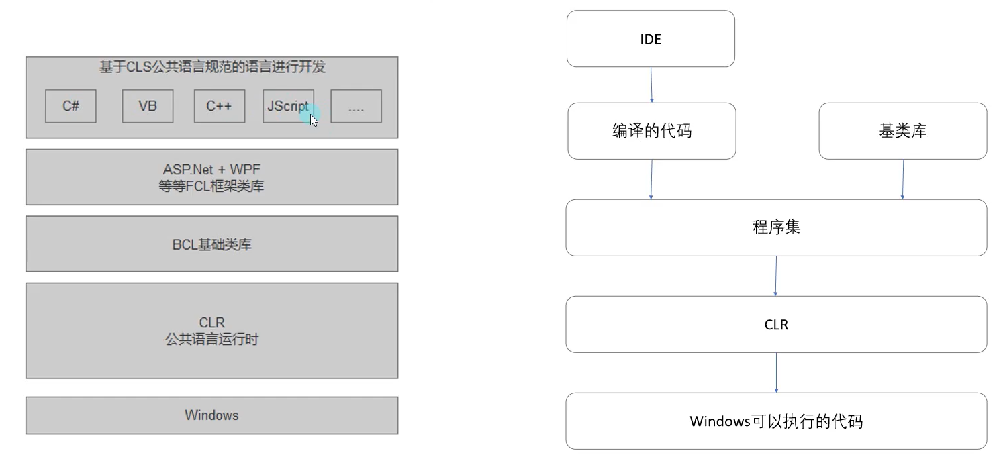
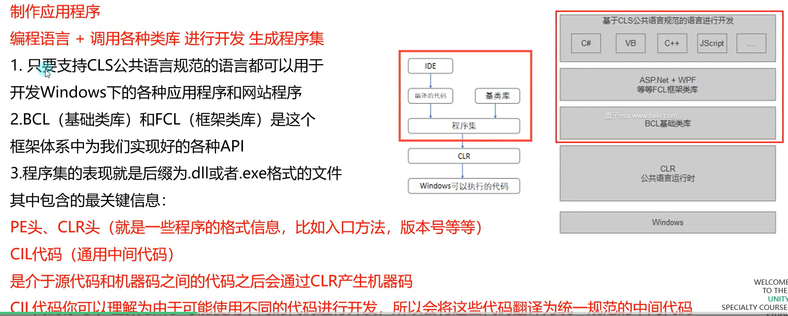
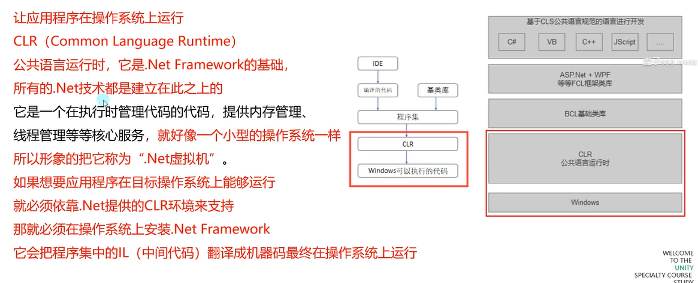
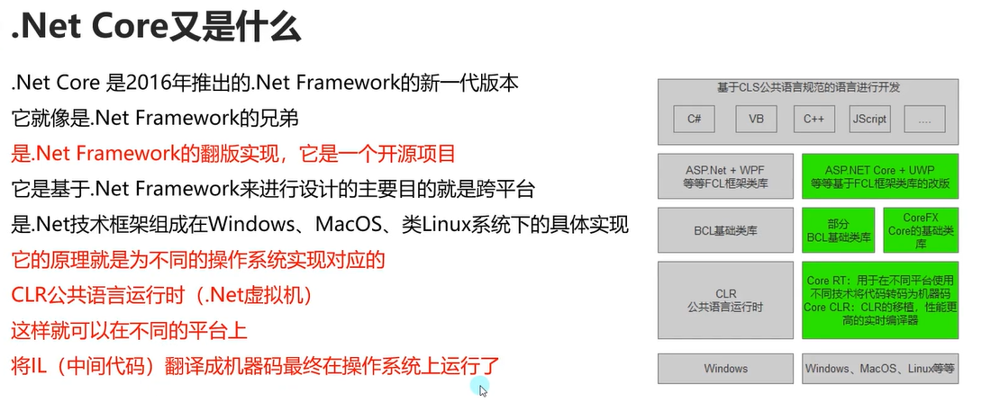
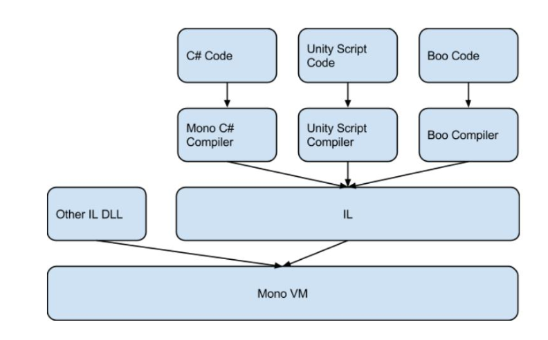
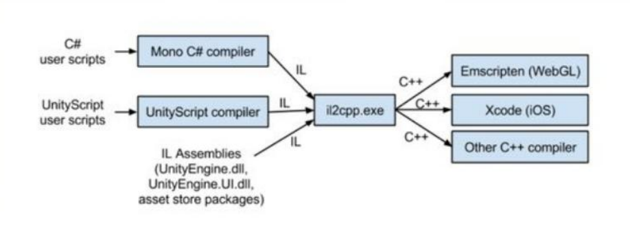
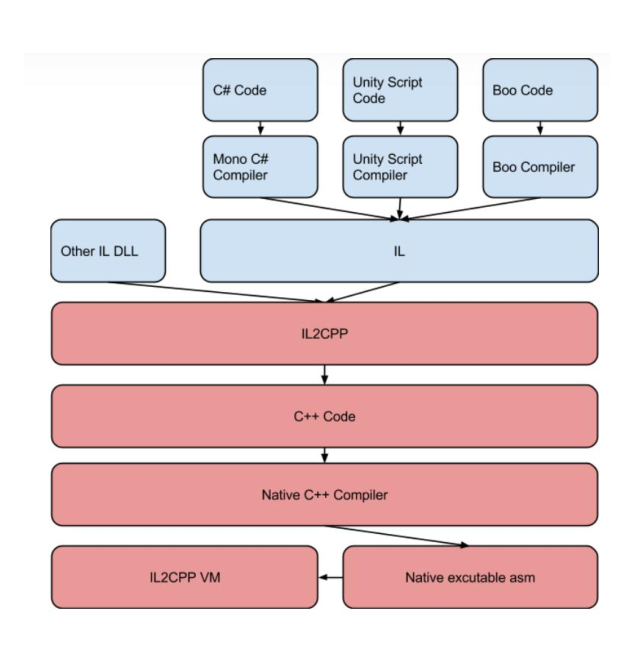

# 【唐老狮】Unity进阶之C#知识补充

# 任务2-1：了解.Net相关知识 知识点

> [.NET相关概念_NRatel的博客-CSDN博客](https://blog.csdn.net/NRatel/article/details/127148390)

## 微软的.Net是什么？

### 微软的.Net

微软的.Net既不是编程语言也不是框架
是类似于互联网时代、次时代、21世纪、信息时代之类的宣传口号它是一整套技术体系的统称，或者说它是微软提供的技术平台的代号包含的内容有

框架体系: .Net Framework、.Net Core、Mono等等

开发语言:C#、VB、F#等等（C#是.Net平台主推的开发语言)

开发工具: Visual Studio、Visual Studio Code 等等

你可以简单理解.Net本质上就是微软为自己的一系列产品取的一个代号。

### 微软做.Net平台的目的

1. 跨语言

   只要是面向.NET平台的编程语言(C#、VB、C++、F#等等)，用其中一种语言编写的内容可以无缝地用在另一种语言编写的应用程序中

2. 跨平台
   一次编译，不需要任何代码修改，应用程序就可以运行在任意有.NET框架实现的操作系统上，即代码不依赖于操作系统，也不依赖硬件环境

## .Net跨语言的实现

### 如何实现的跨语言?

#### CLS (Common Language Specification)公共语言规范

.Net专门参考每种语言并找出了语言间的共性，定义了一组规则。与其说是规则，不如说它是一组语言互操作的标准规范

只要开发者都遵守这个规则来编码，那么代码就能被任意.Net平台支持的语言所通用，即可以通过不同的编程语言(C#、VB、J#等等）来创建应用程序。

#### CTS (Common Type System)

公共类型系统
当你需要设计面向.Net的语言时需要遵循一个体系，这个体系就是CTS

刚才提到的CLS公共语言规范就是是CTS公共类型系统的子级

一个编程语言，如果它能够支持CTS，那么我们就称它为面向.NET平台的语言

#### CLl (Common Language Infrastructure)

公共语言基础结构
是微软将CTS等内容提交给国际组织计算机制造联合会ECMA的一个工业标准。

#### 总结

微软为了实现跨语言，制定了一些规范。
$\textcolor{OrangeRed}{只要一门语言支持CTS(公共类型系统)的规则
，那么我们就能够使用它在.Net平台下开发应用程序}$

CLS(公共语言规范）是CTS的一个子级，是一组语言互操作的标准规范我们经常可以看到的CLI公共语言基础结构，它包含CTS公共类型系统
它是微软将CTS等内容提交给国际组织计算机制造联合会ECMA的一个工业标准

## .Net跨平台的实现

### 如何实现的跨平台?

通过上面对跨语言的讲解，大家很容易发现
.Net的跨语言是让各种语言支持.Net的规范CLI(也就是CTS等规范)

早期的.Net系列产品主要是为了给Windows操作系统服务的
并没有跨平台的特性，即使跨语言了
也只是可以使用多语言开发Windows上的应用程序。

那么这里就不得不提几个个概念
.Net Framework 、.Net Core和Mono我们先来认识下他们

### .Net Framework

.Net Framework在2002年推出1.0版本
.NETFramework是一个可以快速开发、部署网站服务及应用程序的开发框架
是 Windows 中的一个组件，部分开源，主要用于开发Windows下应用程序

包括

- 公共语言运行时(Common Language Runtime, CLR)
- 虚拟执行系统
- .NET Framework类库等

### .Net Framework的体系结构







### 总结

.Net Framework
是一个主要用于跨语言开发Windows操作系统下的应用程序的框架结构他并不支持跨平台

## .Net Core

### .Net Core又是什么？



## .Net FrameWork 到.Net Core

从前面.Net FrameWork和.Net Core相关内容我们了解到，从并不跨平台的.Net FrameWork在2002年正式问世，到2016年跨平台的.Net Core的诞生。

中间.Net平台有14年的并不跨平台的空窗期，而在这段时间内，难道.Net就并不支持跨平台了吗?

答案当然是否定的，那么我们就不得不提Mono了。

## Mono又是什么？

Mono是一个由Xamarin公司（已被微软收购）所赞助的开源项目。

它基于.Net的CLI (Common Language Infrastructure)公共语言基础结构，提供了微软.Net FrameWork的另一种实现。

它相对.Net FrameWork最大的区别就是具备跨平台的能力，它不仅可以运行在Windows、MacOS、Linux等操作系统，甚至还可以运行在PS3、XBOX、Wii等主机平台上。

Mono的1.0版本出现在2004年，也就是说在.Net Core出现之前，Mono是.Net平台实现跨平台的不二之选

## Mono如何实现快平台?

Mono利用.Net平台制定的CLI公共语言基础结构规则。

利用它我们可以把很多种语言编译成通用规范的CIL公共中间语言，再利用CLR公共语言运行时，将这些CIL公共中间语言转换为操作系统的原生代码。

（主要做的就是在各种操作系统上实现了对应的CLR内容)

这样用各种不同语言编写的逻辑就能够在指定操作系统上运行了。

它的这一套规则是在.Net Framework规则上进行的修改和添加

## 总结 如何实现跨平台的？

- .Net Framework (2002年发布)∶

  部分开源，主要用于开发Windows平台下应用，包含Windows平台的所有特性

- .Net Core (2016年发布)︰
  完全开源，可以针对多个平台开发应用，包含.Net Framework部分特性

- Mono (2004年发布)︰
  完全开源，早期乃至现在也是.Net的跨平台解决方案

## 总体而言

在.Net Core出现之前开发者都通过Mono来实现.Net的跨平台

我们可以使用基于.Net平台的Mono开发

便可以发布可以在主流的各种操作系统上运行的应用程序

## 主要内容

1. 微软的.Net是什么

   是一个包含编程语言、框架、IDE等产品的系列产品统称

2. .Net跨语言的实现

   CLI公共语言基础结构（CTS公共类型系统)

   CLS公共语言规范是它的子级

3. .Net跨平台的实现

   基于.Net Framework的 Mono和.Net Core

他们两都基于CLI公共语言基础结构和CLR公共语言运行时实现跨语言和跨平台

## 练习题

### 请简要说明.Net跨语言和跨平台的原理（往往是面试时的口头询问）。

.Net跨语言主要通过CTS（公共类型系统），CTS是.Net语言应该遵循的体系。 CLS（公共语言规范）是CTS的一个子集，是一种规则，只要开发者都遵循这个规则来编码，那么代码就能被任意的.Net平台支持的语言所通用。

跨平台在.NetFramework不支持，但是可以使用Mono（第三方开源项目）实现跨平台。而2016年发布的.Net Core，通过为不同的操作系统实现对应的CLR，在不同平台上将IL翻译为机器码，最终实现跨平台。

> 参考答案：
>
> 1.跨语言
>
> .Net制定了了CLI公共语言基础结构的规则
>
> 只要是按照该规则设计的语言在进行.Net相关开发时
>
> 编译器会将源代码（C#、VB等等）编译为CIL通用中间代码。
>
> 也就是说不管什么原因进行开发，最终都会统一规范变为中间代码
>
> 最终通过CLR（公共语言运行时或者称为.Net虚拟）将中间代码翻译为对应操作系统的原生代码（机器码）
>
> 在操作系统上运行
>
>  
>
> 2.跨平台
>
> 由于.Net Framework中利用CLI和CLR实现了跨语言，CLR主要起到一个翻译、运行、管理中间代码的作用
>
> .Net Cor和Mono就是利用了CLR的这一特点，为不同操作系统实现对应CLR（公共语言运行时或.Net虚拟机）
>
> 那么不同操作系统对应的CLR就会将IL中间代码翻译为对应系统可以执行的原生代码（机器码）
>
> 达到跨平台的目的

# 任务4-1：Unity跨平台的基本原理（Mono） 知识点

> [【Unity游戏开发】Mono和IL2CPP的区别 - 知乎 (zhihu.com)](https://zhuanlan.zhihu.com/p/352463394)

## Unity和Mono的关系

我们上节课了解了.Net的相关知识，我们先回顾一下其中的两个关键点。

- Mono是基于.Net的跨平台方案，同时它具备.Net平台的跨语言特点
- Mono的第一个版本是在2004年发布的

Unity公司于2004年成立，Unity的底层是通过C/C++来完成的。

但是为了更方便的让开发者使用，Mono在当时成为了不二之选。

它同时具备跨平台和跨语言的两个特性。

### 总结

Unity希望能有更多的开发者使用其进行游戏开发并且一次开发一劳永逸。

所以跨语言和跨平台对于他们来说是很重要的

虽然C++本身跨平台，但是如果使用C++作为上层逻辑开发语言，那么作为开发
者来说选择性相对较少，并且对于初学者来说学习难度也较大。

所以当时的Mono是非常满足Unity需求的，不仅支持跨语言还支持跨平台。

## Unity跨平台的必备概念

### Unity主要包括两个部分：

Unity Engine（引擎）：
提供UnityEngine.dll动态库，各平台不同，C/C++编写，包含平台相关代码、图形API、物理引擎、灯光等等所有游戏引擎底层内容

Unity Editor（编辑器）：
提供UnityEditor.dll动态库，大部分由C#编写，用户脚本最初可以使用C#、JavaScript、Boo语言编写，项目代码最后由Mono编译

### 回顾Mono跨平台基本原理

Mono利用.Net平台制定的CLI公共语言基础结构规则。

利用它我们可以把很多种语言编译成通用规范的CIL公共中间语言，再利用CLR公共语言运行时，将这些CIL公共中间语言转换为对应操作系统的原生代码。

这样用各种不同语言编写的逻辑就能够在指定操作系统上运行了。

它的这一套规则是在.Net Framework规则上进行的修改和添加。

### Mono主要构成部分

1. C#编译器（mcs）

2. Mono Runtime 类似CLR公共语言运行时（虚拟机）

   包括JIT（Just in time）即时编译器、AOT（Ahead of time）提前编译器、GC、类库加载器 等等

3. BCL基础类库

4. Mono类库

   提供很多超出.Net的一些额外功能，主要用于构建各种操作系统上的应用

## Unity跨平台的基本原理（Mono）


在Unity下使用各种语言进行逻辑实现，这些语言在发布时会被编译成，IL中间代码。

最终这些中间代码在对应操作系统上，通过Mono VM（虚拟机），真正翻译成机器码运行起来。



## 基于Mono跨平台的优缺点

优点：
只要在不同操作系统上实现Mono VM（虚拟机）
那我们能够支持的平台就会“无限”多

缺点：
维护工作耗时耗力，当Unity版本更新时，Mono VM也需要维护和更新
那多对于N多个平台来说，工作量是非常大的。（Unity的工作量）
低版本Mono无法支持新版本C#的强大新特性

## 总结

主要内容
1. Unity和Mono的关系
利用Mono实现Unity上层逻辑的跨语言和跨平台
2. Unity跨平台的必备概念
Unity底层是C/C++，上层逻辑支持多语言（目前只用C#）
Mono的基本构成有C#编译器、Mono运行时（虚拟机）、各种类库等
3. Unity跨平台的基本原理（Mono）
将基于CLI公共语言基础规则的语言编译成CIL公共中间语言，再通过Mono VM（虚拟机）
将其在各操作系统中转译为原生机器码进行运行
4. 基于Mono跨平台的优缺点
无限跨平台，维护工作量大，低版本的Mono无法支持新版C#新功能

## 练习题

### 请简要描述Unity如何利用Mono实现跨平台的？（面试时可能会问Unity为什么可以跨平台）

通过将C#代码用Mono C#编译器翻译为IL代码，再通过不同平台上的Mono虚拟机翻译为对应平台的机器码来运行。

> 参考答案：
>
> Mono跨平台的原理是：
>
> 我们编写的C#代码——>
>
> 会通过Mono C#编译器（mcs）——>
>
> 编译为IL中间代码（基于CLI规则的字节码）——>
>
> Mono VM（Mono Runtime）也就是Mono虚拟机会把IL中间代码转译为——>
>
> 操作系统的原生代码（机器码）最终运行起来
>
>  
>
> 通过Mono达到了跨语言和跨平台的特性
>
> 只不过目前跨语言的特性在Unity当中已经不常见了，因为UnityScript（JavaScript）和Boo语言已经被C#给淘汰了

# 任务6-1：Unity跨平台的基本原理（I L 2 C P P） 知识点

> [【Unity游戏开发】Mono和IL2CPP的区别 - 知乎 (zhihu.com)](https://zhuanlan.zhihu.com/p/352463394)

## IL2CPP是什么

IL2CPP是在Unity4.6.1 p5之后的版本中，加入的脚本后处理方式。你可以把它简单理解为是继Mono之后的一种跨平台解决方案。

顾名思义，就是把IL中间代码转译为CPP代码（C++）。

想要了解它我们可以先回顾一下Mono。

### Mono跨平台回顾

在Unity下使用各种语言进行逻辑实现，这些语言在发布时会被编译成，IL中间代码。

最终这些中间代码在对应操作系统上，通过Mono VM（虚拟机），真正翻译成机器码运行起来。

### Mono优缺点回顾

优点：

只要在不同操作系统上实现Mono VM（虚拟机），那我们能够支持的平台就会“无限”多。

缺点：

维护工作耗时耗力，当Unity版本更新时，Mono VM也需要维护和更新，那么对于N多个平台来说，工作量是非常大的。（Unity的工作量）。低版本Mono无法支持新版本C#的强大新特性。

## IL2CPP跨平台原理



通过IL2CPP我们可以将编译好的IL中间代码转译成C++代码

再利用各平台优化过的编译器编译为对应平台的目标代码

### IL2CPP和Mono的区别就在于

当生成了IL中间代码后，Mono是直接通过虚拟机转译运行。

而IL2CPP的步骤多了一些，会将IL中间代码转译为C++代码，再通过各平台的C++编译器直接编译
为可执行的原生汇编代码。



### 需要注意的是

虽然中间代码变为了C++，但是内存管理还是遵循C#中GC的方式。

这也是为什么有一个IL2CPP VM（虚拟机），存在的原因，它主要是用来完成GC管理，线程创建等服务工作的。

## Mono和IL2CPP的区别

### Mono

1. 构建（最终打包时）速度快
2. Mono编译机制是JIT即时编译，所以支持更多类库
3. 必须将代码发布为托管程序集（.dll文件）
4. Mono VM虚拟机平台维护麻烦，且部分平台不支持（WebGL）
5. 由于Mono版本授权原因，C#很多新特性无法使用
6. IOS支持Mono，但不在允许32位的Mono应用提交到应用商店

### IL2CPP

1. 相对Mono构建（最终打包时）速度慢
2. 只支持AOT提前编译
3. 可以启用引擎代码剥离来减少代码的大小
4. 程序的运行效率比Mono高，运行速度快
5. 多平台移植更加方便

### Mono和IL2CPP的最大区别就是

IL2CPP不能在运行时动态生成代码和类型，所以必须在编译时就完全确定需要用到的类型。

举例：List\<A\>和List\<B\>中A和B是我们自定义的类，我能必须在代码中显示的调用过，IL2CPP才能保留List\<A\>和List\<B\>两个类型。

如果在热更新时我们调用List\<C\>，但是它之前并没有在代码中显示调用过，那么这时就会出现报错等
问题。主要就是因为JIT和AOT两个编译模式的不同造成的。

具体的解决方案我们在下节课中讲解

## Mono和IL2CPP的使用建议

由于IL2CPP的运行效率有很大优势，所以建议大家在实际开发中，直接使用IL2CPP模式进行打包。

## 总结

主要内容
1. IL2CPP是什么
是Unity4.6.1版本之后加入的新的一种跨平台解决方案
2. Mono跨平台回顾
C#代码—>Mono C#编译器—>IL中间代码—>Mono VM—>操作系统的原生代码
3. IL2CPP跨平台原理
C#代码—>Mono C#编译器—>IL中间代码—>IL2CPP—>C++—>C++编译器—>原生汇编代码—>IL2CPP VM
4. Mono和IL2CPP的区别
IL2CPP效率高于Mono，跨平台也更好维护。
Mono是JIT即时编译，IL2CPP是AOT提前编译
5. Mono和IL2CPP两种方式的使用建议
建议使用效率更高的IL2CPP

## 练习题

### 请简要描述Unity是如何利用IL2CPP进行跨平台的？（面试时可能会问Unity为什么可以跨平台）

通过IL2Cpp程序，将IL中间语言代码翻译为Cpp代码，再其他平台的Cpp编译器编译为各平台本地代码。

主要是利用了Cpp本身就跨平台的特性。

需要注意的是，虽然代码是Cpp，但是GC还是C#，所以需要一个IL2Cpp VM用来完成GC管理，线程创建等服务 。

> 参考答案：
>
> IL2CPP跨平台的原理是：
>
> 我们编写的C#代码——>
>
> 会通过Mono C#编译器（mcs）——>
>
> 编译为IL中间代码（基于CLI规则的字节码）——>
>
> Unity会利用IL2CPP.exe运行程序将代码转译为C++代码——>
>
> 然后优化过的各平台C++编译器会把C++代码编译为原生汇编代码（机器码）——>
>
> 最终在各操作系统上会通过IL2CPP VM将这些原生代码运行管理起来
>
>  
>
> 通过IL2CPP达到了跨语言和跨平台的特性
>
> 只不过目前跨语言的特性在Unity当中已经不常见了，因为UnityScript（JavaScript）和Boo语言已经被C#给淘汰了

# 任务8-1：IL2CPP模式可能存在的问题处理 知识点

> [【Unity游戏开发】Mono和IL2CPP的区别 - 知乎 (zhihu.com)](https://zhuanlan.zhihu.com/p/352463394)

## 知识点一 —— 安装Unity IL2CPP打包工具

在Unityhub中下载 IL2CPP打包相关工具

## 知识点二 —— IL2CPP打包存在的问题——类型裁剪

IL2CPP在打包时会自动对Unity工程的DLL进行裁剪，将代码中没有引用到的类型裁剪掉，以达到减小发布后包的尺寸的目的。

然而在实际使用过程中，很多类型有可能会被意外剪裁掉，造成运行时抛出找不到某个类型的异常。

特别是通过反射等方式在编译时无法得知的函数调用，在运行时都很有可能遇到问题

### 解决方案：

1. IL2CPP处理模式时，将PlayerSetting->Other Setting->Managed Stripping Level(代码剥离)设置为Low

   Disable:Mono模式下才能设置为不删除任何代码

   Low:默认低级别，保守的删除代码，删除大多数无法访问的代码，同时也最大程度减少剥离实际使用的代码的可能性

   Medium:中等级别，不如低级别剥离谨慎，也不会达到高级别的极端

   Hight:高级别，尽可能多的删除无法访问的代码，有限优化尺寸减小。如果选择该模式一般需要配合link.xml使用

2. 通过Unity提供的link.xml方式来告诉Unity引擎，哪些类型是不能够被剪裁掉的

   在Unity工程的Assets目录中（或其任何子目录中）建立一个叫link.xml的XML文件

### link.xml

```xml
<?xml version="1.0" encoding="UTF-8"?>
  
  <!--保存整个程序集-->
  <assembly fullname="UnityEngine" preserve="all"/>
  <!--没有“preserve”属性，也没有指定类型意味着保留所有-->
  <assembly fullname="UnityEngine"/>

  <!--完全限定程序集名称-->
  <assembly fullname="Assembly-CSharp, Version=0.0.0.0, Culture=neutral, PublicKeyToken=null">
    <type fullname="Assembly-CSharp.Foo" preserve="all"/>
  </assembly>

  <!--在程序集中保留类型和成员-->
  <assembly fullname="Assembly-CSharp">
    <!--保留整个类型-->
    <type fullname="MyGame.A" preserve="all"/>
    <!--没有“保留”属性，也没有指定成员 意味着保留所有成员-->
    <type fullname="MyGame.B"/>
    <!--保留类型上的所有字段-->
    <type fullname="MyGame.C" preserve="fields"/>
    <!--保留类型上的所有方法-->
    <type fullname="MyGame.D" preserve="methods"/>
    <!--只保留类型-->
    <type fullname="MyGame.E" preserve="nothing"/>
    <!--仅保留类型的特定成员-->
    <type fullname="MyGame.F">
      <!--类型和名称保留-->
      <field signature="System.Int32 field1" />
      <!--按名称而不是签名保留字段-->
      <field name="field2" />
      <!--方法-->
      <method signature="System.Void Method1()" />
      <!--保留带有参数的方法-->
      <method signature="System.Void Method2(System.Int32,System.String)" />
      <!--按名称保留方法-->
      <method name="Method3" />

      <!--属性-->
      <!--保留属性-->
      <property signature="System.Int32 Property1" />
      <property signature="System.Int32 Property2" accessors="all" />
      <!--保留属性、其支持字段（如果存在）和getter方法-->
      <property signature="System.Int32 Property3" accessors="get" />
      <!--保留属性、其支持字段（如果存在）和setter方法-->
      <property signature="System.Int32 Property4" accessors="set" />
      <!--按名称保留属性-->
      <property name="Property5" />

      <!--事件-->
      <!--保存事件及其支持字段（如果存在），添加和删除方法-->
      <event signature="System.EventHandler Event1" />
      <!--根据名字保留事件-->
      <event name="Event2" />
    </type>

    <!--泛型相关保留-->
    <type fullname="MyGame.G`1">
      <!--保留带有泛型的字段-->
      <field signature="System.Collections.Generic.List`1&lt;System.Int32&gt; field1" />
      <field signature="System.Collections.Generic.List`1&lt;T&gt; field2" />

      <!--保留带有泛型的方法-->
      <method signature="System.Void Method1(System.Collections.Generic.List`1&lt;System.Int32&gt;)" />
      <!--保留带有泛型的事件-->
      <event signature="System.EventHandler`1&lt;System.EventArgs&gt; Event1" />
    </type>


    <!--如果使用类型，则保留该类型的所有字段。如果类型不是用过的话会被移除-->
    <type fullname="MyGame.I" preserve="fields" required="0"/>

    <!--如果使用某个类型，则保留该类型的所有方法。如果未使用该类型，则会将其删除-->
    <type fullname="MyGame.J" preserve="methods" required="0"/>

    <!--保留命名空间中的所有类型-->
    <type fullname="MyGame.SomeNamespace*" />

    <!--保留名称中带有公共前缀的所有类型-->
    <type fullname="Prefix*" />

  </assembly>

</linker>
```


## 知识点三 —— IL2CPP打包存在的问题——泛型问题

我们上节课提到了IL2CPP和Mono最大的区别是 不能在运行时动态生成代码和类型。

就是说 泛型相关的内容，如果你在打包生成前没有把之后想要使用的泛型类型显示使用一次。

那么之后如果使用没有被编译的类型，就会出现找不到类型的报错。

举例：`List<A>`和`List<B>`中A和B是我们自定义的类，我能必须在代码中显示的调用过，IL2CPP才能保留`List<A>`和`List<B>`两个类型。

如果在热更新时我们调用`List<C>`，但是它之前并没有在代码中显示调用过，那么这时就会出现报错等问题。主要就是因为JIT和AOT两个编译模式的不同造成的。

```C#
List<A> list = new List<A>();
List<B> list2 = new List<B>();
```

### 解决方案：

泛型类：声明一个类，然后在这个类中声明一些public的泛型类变量

泛型方法：随便写一个静态方法，在将这个泛型方法在其中调用一下。这个静态方法无需被调用。

这样做的目的其实就是在预言编译之前让IL2CPP知道我们需要使用这个内容

## 总结

对于我们目前开发的新项目，都建议大家使用IL2CPP脚本后处理模式来进行打包。

主要原因是因为它的效率相对Mono较高，同时由于它自带裁剪功能，包的大小也会小一些。

但是如果在测试时出现 类型无法识别等问题，需要用到我们这节课学习的知识点来解决这些问题。

## 练习题

### IL2CPP和Mono的执行效率谁高？为什么？

IL2Cpp，因为