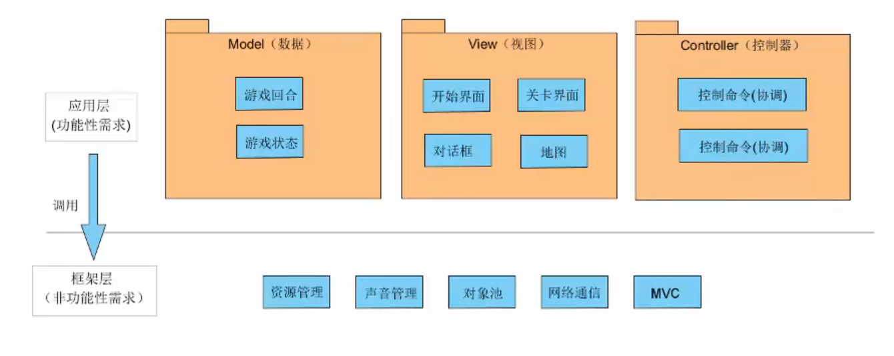
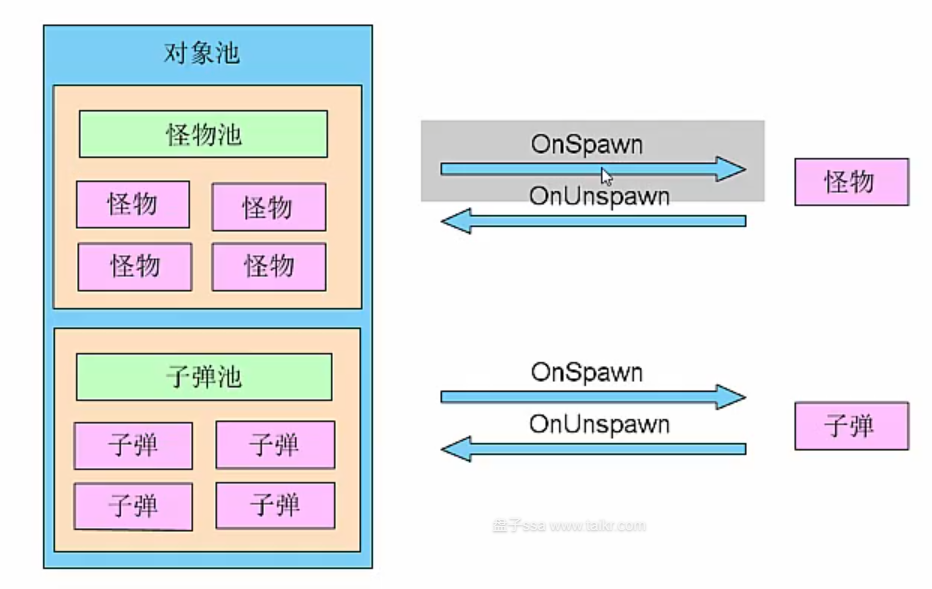
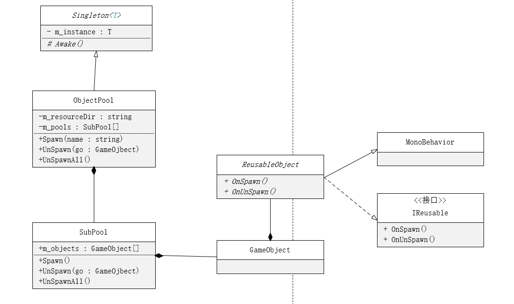
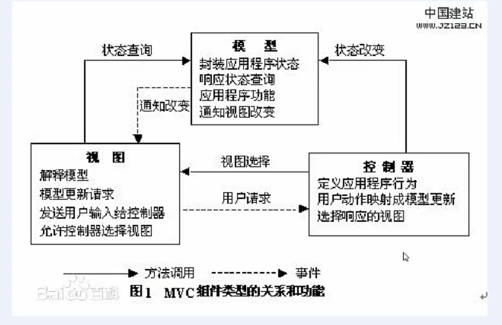

# 经典2D塔防游戏:保卫萝卜

2023年4月20日，盘子ssa，QQ：2426966358

# 功能分析与框架设计

# 任务2：1.2 分析游戏的功能模块

经过分析，保卫萝卜大体需要以下功能模块

- 特效：子弹爆炸特效
- 子弹：炮塔发射子弹
- 信息界面
- 关卡界面
- 对话框
- 开始界面
- 地图
- 炮塔
- 游戏回合：控制怪物产出
- 存档数据：存储玩家数据
- 静态数据：怪物数据等其他数据
- 游戏状态：游戏运行时状态
- 对象池：提高性能，优化创建和销毁对象带来的损耗
- 声音管理：
- 资源管理：动态加载资源管理

分析了游戏功能模块，还是不足以支持开发。

我们需要把游戏功能模块之间的交互也设计总结出来。

# 任务3：1.3 框架的高层设计

我们可以将上一节当中的游戏功能划分一下，分为应用层（功能性需求）和框架层（非功能性需求）

一般来说，功能性需求是策划提出的，需要直接实现的功能，属于应用层，基本上是不可重用的。

非功能性需求是为了优化程序运行，管理游戏等实现的，属于框架层，是可重用的。

框架层的功能是为了给游戏运行提供一个运行的基础功能，框架层一般来说是无需知道应用层对象的，应用层将调用框架层的模块实现。

本次游戏开发使用MVC框架实现。

即：Model（数据模型），View（视图（UI）），Controller（控制器）

将应用层再次划分，使得模块间的耦合程度降低。



# 对象池

# 任务5：2.2 对象池原理

> [对象池(Object Pool) - 知乎 (zhihu.com)](https://zhuanlan.zhihu.com/p/108538606)
>
> [[游戏编程技巧\]-对象池 - 知乎 (zhihu.com)](https://zhuanlan.zhihu.com/p/62403282)

对象池主要是为了解决：当需要频繁的创建和销毁一些相同的对象（比如子弹）带来的性能消耗问题。

对象池将对象事先创建好，当需要对象时，直接在池子里面取出来即可，避免了对象频繁创建和销毁产生的性能消耗和GC问题。

## 保卫萝卜当中的对象池



我们需要频繁的创建怪物和子弹。

由于需要在取到对象时初始化对象，在放回对象时重置对象状态（因为放回时对象状态可能已经被修改）。

所以我们需要对象拥有初始化（OnSpawn）和重置状态（OnUnSpawn）的方法。

一个对象池可以包含多个子对象池，所以子对象池和对象池是组合关系。

# 任务6：2.3 对象池IReusable接口，ReusableObject类

## 类图分析



GameObject与ReusableObject是组合关系，因为组件需要挂载到GameObject。

ReusableObject是一个MonoBehavior，并且实现IReusable接口，实现OnSpawn和OnUnSpawn方法。

但是由于ReusableObject是顶层的父类，所以应该是abstract，对于OnSpawn和OnUnSpawn也应该为abstract。

SubPool：子对象池。保存所有对象的引用

- Spawn：用来取出对象
- UnSpawn：用来回收对象
- UpSpawnAll：用来回收所有对象

ObjectPool：对象池，用来管理所有子对象池，子对象的功能，委托给这个对象池实现。同时，这个对象池也是一个对象池（保存所有子对象池）。对象池一般只有一个，所有他是一个单例

- m_resourceDir：保存资源目录的索引
- m_pools：对象池包含很多子池子，包含子对象池的引用
- Spawn：根据名字，从子对象池当中取出元素
- UnSpawn：回收对象

## IReuseble.cs

```C#
using System.Collections;
using System.Collections.Generic;
using UnityEngine;
//**********************************
//创建人：
//功能说明：可回收的对象接口
//**********************************
public interface IReusable
{
    /// <summary>
    /// 取出时调用
    /// </summary>
    void OnSpawn();

    /// <summary>
    /// 回收时调用
    /// </summary>
    void OnUnSpawn();
}
```

## ReusableObject.cs

可回收对象抽象基类，继承Monobehavior、IReusable。

由于可回收对象具体实现可能是不同的，所以我们可以使用抽象类。

```C#
using System;
using System.Collections.Generic;
using System.Text;
using UnityEngine;

public abstract class ReusableObject : MonoBehaviour, IReusable
{
    public abstract void OnSpawn();

    public abstract void OnUnSpawn();
}
```

# 任务7：2.4 对象池SubPool类

子对象池类，用来创建具体的对象。

## SubPool.cs

### 字段属性

- private GameObject m_prefab：预设体
- private List\<GameObject\> m_objects：保存所有对象引用
- public string Name：名字标识就使用预设体名字

### 成员

- public SubPool()：ctor，传入对象池需要的预设体
- public GameObject Spawn()：取出一个空闲对象，如果没有，就实例化一个。取出时，调用对象OnSpawn方法
- public void UnSpawn(GameObject go)：如果对象池包含这个对象，就回收它。回收时，调用对象OnUnSpawn方法
- public void UnSpawnAll()：回收所有对象。如果对象是启用状态，就回收它。
- public bool Contains(GameObject go)：判断对象是否存在于对象池当中

```C#
using System;
using System.Collections.Generic;
using System.Text;
using UnityEngine;

public class SubPool
{
    //预设体
    GameObject m_prefab;

    //集合
    List<GameObject> m_objects = new List<GameObject>();

    //名字标识
    public string Name { get => m_prefab.name; }

    //构造函数
    public SubPool(GameObject prefab)
    {
        this.m_prefab = prefab;
    }

    //取对象
    public GameObject Spawn()
    {
        GameObject go = null;
        foreach (GameObject obj in m_objects)
        {
            if (!obj.activeSelf)    //如果池子当中有对象，那么直接取出来
            {
                go = obj;
                break;
            }
        }

        if (go == null) //如果池子当中没有对象，那么实例化一个对象
        {
            go = GameObject.Instantiate<GameObject>(m_prefab);
            m_objects.Add(go);
        }
        //将对象设置为可用
        go.SetActive(true);
        
        //go.GetComponent<ReusableObject>().OnSpawn();
        //发送一条消息，调用OnSpawn，用来初始化对象
        go.SendMessage("OnSpawn", SendMessageOptions.DontRequireReceiver);  
        return go;
    }
    
    //回收对象
    public void UnSpawn(GameObject go)
    {
        //如果对象存在于对象池当中，那么回收
        if (Contains(go))
        {
            //发送一条消息，调用OnUnSpawn，重置对象状态
            go.SendMessage("OnUnSpawn", SendMessageOptions.DontRequireReceiver);
            go.SetActive(false);
        }
    }

    //回收该池子的所有对象
    public void UnSpawnAll()
    {
        //回收所有对象
        foreach (GameObject obj in m_objects)
        {
            //如果对象是启用状态，那么就回收
            if (obj.activeSelf)
            {
                UnSpawn(obj);
            }
        }
    }
    
    //是否包含对象
    public bool Contains(GameObject go)
    {
        return m_objects.Contains(go);
    }
}
```

个人认为，在OnSpawn和OnUnSpawn发送消息时，可以用 `go.GetComponent<ReusableObject>().OnSpawn();`
或者 `go.GetComponent<IReusable>().OnUnSpawn();`
来代替SendMessage方法，

# 任务8：2.5 对象池ObjectPool类

## ObjectPool.cs

对象池类，保存所有子对象池。

实际上使用的对象池类，代理执行子对象池。

```C#
using System.Collections;
using System.Collections.Generic;
using UnityEngine;
//**********************************
//创建人：
//功能说明：
//**********************************
public class ObjectPool
{
    //资源目录路径（Resources目录下的子目录路径）  
    public string ResourceDir = "";

    //通过预设体的name，对应子对象池
    private Dictionary<string, SubPool> m_pools = new Dictionary<string, SubPool>();

    //取对象
    public GameObject Spawn(string name)
    {
        //如果没有对应的子对象池，则创建它
        if (!m_pools.ContainsKey(name))
        {
            RegisterNew(name);
        }
        //取出子对象池
        SubPool pool = m_pools[name];   
        //从子对象池当中取出一个对象
        return pool.Spawn();
    }

    //回收对象
    public void UnSpawn(GameObject go)
    {
        SubPool pool = null;
        //在所有子对象池当中查找是否拥有此元素
        foreach (SubPool p in m_pools.Values)
        {
            if (p.Contains(go))
            {
                pool = p;
                break;
            }
        }
        //回收对象
        pool.UnSpawn(go);

    }

    //回收所有对象
    public void UnSpawnAll()
    {
        //遍历所有子对象池，调用UnSpawnAll方法
        foreach (SubPool p in m_pools.Values)
        {
            p.UnSpawnAll();
        }
    }

    //创建新的子对象池
    //
    private void RegisterNew(string name)
    {
        //预设路径
        string path = "";
        //如果Resources目录下还有子目录，就添加路径
        if (string.IsNullOrEmpty(ResourceDir))
        {
            path = name;
        }
        else
        {
            path = ResourceDir + "/" + name;
        }

        //加载预设
        GameObject prefab = Resources.Load<GameObject>(path);

        //创建子对象池
        SubPool pool = new SubPool(prefab);
        m_pools.Add(pool.Name, pool);
    }

}
```

# 任务9：2.6 单例模版Singleton类

很多时候，一个类我们只希望它拥有一个实例，如资源管理、音频管理类等。

那么，我们可以使用单例模式。

又为了方便实现单例，我们可以写一个单例模板基类，哪个类需要是单例，那么继承这个类就可以了。

由于是在Unity当中，管理类需要继承MonoBehavior，那么就在Awake当中实例化m_instance。

## Singleton.cs

### 字段成员

- `private static T m_instance`：静态单例，在Awake初始化

### 方法成员

- `public static T Instance`：属性，返回单例的引用
- `protected virtual void Awake()`：生命周期函数，保护的虚函数Awake，由于可能在子类Awake当中做一些其他的事，所以是protected的。

```C#
using System.Collections;
using System.Collections.Generic;
using UnityEngine;
//**********************************
//创建人：
//功能说明：单例模板类
//**********************************

/// <summary>
/// 单例模板类
/// </summary>
/// <typeparam name="T">约束T，必须继承MonoBehavior</typeparam>
public abstract class Singleton<T> : MonoBehaviour where T : MonoBehaviour
{
    //由于是UnityMono的单例，我们不可以直接New
    private static T m_instance = null;

    public static T Instance { get => m_instance; }

    //由于可能在子类Awake当中做一些其他的事，所以是protected的
    protected virtual void Awake()
    {
        //在Awake当中给其赋值  
        m_instance = this as T;
    }
}
```

ObjectPool改动

```C#
public class ObjectPool : Singleton<ObjectPool>
```

# 任务10：2.7 声音管理原理

游戏当中，一般分为两种声音，音效和音乐。

一般来说，音效比较短，作为特效释放，攻击等的声音；音乐比较长，作为背景音乐。

# 任务11：2.8 声音管理Sound类

## Sound.cs

声音管理类，显然，声音管理类只需要一个，那么继承Singleton即可。

### 字段和属性

- 为了动态加载资源，我们需要一个资源的路径`ResourceDir`
- 为了播放音乐和音效，我们需要两个AudioSource组件，在程序运行时动态添加两个组件
  - `m_bgSound`
  - `m_effSound`
- 两个属性，用来控制音乐和音效大小

### 方法

- 重写父类`Awake`方法，为了创建AudioSource组件；记得调用父类Awake，不然单例无法获取
- `public void PlayBg(string audioName)`
  - 播放音乐方法，根据audioName加载音频资源。
  - 如果音乐名和之前一样，就不重新播放
  - 根据路径和`audioName`加载`AudioClip`
  - 替换`AudioSource`的`clip`属性，然后`Play`，以达到音乐替换播放的效果
- `public void StopBg()`
  - 停止音乐，直接调用AudioSource的Stop方法，然后设置clip为null
- `public void PlayEff(string audioName)`
  - 播放特效的方法。
  - 根据路径和`audioName`加载 `AudioClip`
  - 特效一般只播放一次，所以直接使用 `AudioSource`的 `PlayOneShot`方法
  - 特效播放没有停止方法，因为音效一般只播放一次

```C#
using System.Collections;
using System.Collections.Generic;
using UnityEngine;
//**********************************
//创建人：
//功能说明：
//**********************************

public class Sound : Singleton<Sound>
{
    //资源在Resource文件夹下的更深一级目录
    //如果没有，就直接在Resource下加载
    public string ResourceDir = "";

    //两个AudioSource组件，控制音效和音乐
    private AudioSource m_bgSound; 
    //重写父类Awake，为了创建组件
    protected override void Awake()
    {
        //必须调用父类Awake,不然获取不了instance
        base.Awake();

        //创建两个组件
        m_bgSound = this.gameObject.AddComponent<AudioSource>();
        m_bgSound.playOnAwake = false;  //设置一开始不播放
        m_bgSound.loop = true;          //设置一直循环

        m_effSound = this.gameObject.AddComponent<AudioSource>();
    }

    //音乐大小
    public float BgVolume { get => m_bgSound.volume; set => m_bgSound.volume = value; }
    
    //音效大小
    public float EffVolume { get => m_effSound.volume; set => m_effSound.volume = value; }


    //播放音乐
    public void PlayBg(string audioName)
    {
        string oldName = "";
        //获取当前正在播放的背景音乐的name
        if (m_bgSound.clip == null)
        {
            oldName = "";
        }
        else
        {
            oldName = m_bgSound.clip.name;
        }

        //如果音乐不一样才重新替换播放
        if (oldName != audioName)
        {
            //获取音乐文件路径
            string path;
            if (string.IsNullOrEmpty(ResourceDir))
            {
                path = "";
            }
            else
            {
                path = ResourceDir + "/" + audioName;
            }
            //加载音乐
            AudioClip clip = Resources.Load<AudioClip>(path);

            //播放
            if (clip != null)
            {
                m_bgSound.clip = clip;
                m_bgSound.Play();
            }
        }
    }

    //停止音乐
    public void StopBg()
    {
        m_bgSound.Stop();
        m_bgSound.clip = null;
    }

    //播放特效
    public void PlayEff(string audioName)
    {
        //获取路径
        string path;
        if (string.IsNullOrEmpty(ResourceDir))
        {
            path = "";
        }
        else
        {
            path = ResourceDir + "/" + audioName;
        }
        //加载音频
        AudioClip clip = Resources.Load<AudioClip>(path);
        //播放

        m_effSound.PlayOneShot(clip);
    }
}

```

# MVC框架

# 任务12：2.9 MVC框架原理

## MVC框架原理图



> [【Unity游戏开发】MVC、MVP、MVVM 三种组合模式区别 - 知乎 (zhihu.com)](https://zhuanlan.zhihu.com/p/133416486)

游戏开发当中，常常出现一个数据，多处UI需要使用的情况（一对多关系），此时可以使用MVC处理。

MVC是用来解除数据模块与UI模块之间的交互产生的高耦合的。

其中，模型和视图是拥有状态的，是经常改变的。控制器是无状态的，使用完可以立即销毁。

# 任务13：2.10 MVC框架MVC相关类

## 为什么需要MVC这个中间类？

因为不想让Model，View，Controller类写重复的注册事件，分发事件的代码。

使用一个静态的MVC中间类，直接来控制事件的分发和注册。

这是组合模式、观察者模式、代理模式的结合应用。

## Model类（数据模型类）

抽象的数据模型基类，由于只是数据，所以不需要继承MonoBehavior

### 方法成员

- `public abstract string Name`，获取模型的名字

```C#
public abstract class Model { 
    public abstract string Name { get; }
}
```

## View类（视图类）

抽象的视图类，由于视图大概率是UI，所以需要挂载到GameObject，所以需要继承MonoBehavior

### 字段和属性

- `public List<string> AttationEvents`，视图关心的事件，在MVC发放事件时，需要访问。
- `public abstract string Name`，获取视图名字

### 方法

- `public abstract void HandleEvent(string eventName, object data)`，事件的处理。

```C#
public abstract class View : MonoBehaviour
{
    public abstract string Name { get; }

    //视图关心的事件
    public List<string> AttationEvents = new List<string>();

    //事件处理
    public abstract void HandleEvent(string eventName, object data);
}
```

## Controller类（控制器类）

抽象的控制器类，用来进行逻辑控制。

### 方法成员

- `public abstract void HandleEvent(string eventName, object data)`，事件处理

```C#
public abstract class Controller
{
    public abstract void HandleEvent(string eventName, object data);
    
}
```

## MVC类（用于事件的注册和分发）

静态的MVC框架中间类，用于事件的注册和分发，这样，就不需要在Model、View、Controller当中写事件的注册和分发代码了（因为这些代码大概率是重复的）。

### 字段和属性

首先我们需要存储所有的Model、View、Controller，以便于事件的注册和分发。

我们使用名字和实例的键值对形式保存。

由于Model和View是实时的，所以需要保存实例。

其中由于Controller是==无状态==（只需要处理逻辑）的，所以只需要在使用时临时创建，然后调用事件处理方法即可。不需要保存具体的实例，保存控制器名和控制器类型即可。

- `public static Dictionary<string, Model> Models`
  根据Model的Name保存对应实例，数据模型名对应模型实例。
- `public static Dictionary<string, View> Views`
  根据View的Name保存对应实例，视图名对应视图实例。
- `public static Dictionary<string, Type> CommandMap`
  根据控制器名保存控制器类型，事件名对应控制器类型。

### 方法

- 注册相关方法

- `public static void RegisterModel(Model model)`
  注册Model，根据model\.Name保存Model实例，添加到Models当中。

- `public static void RegisterView(View view)`
  注册View，根据view.Name保存View实例，添加到Views当中。

- `public static void RegisterController(string eventName, Type controllertype)`
  注册Controller，只需要保存控制器名和对应类型即可。

- 获取相关方法

- `public static Model GetModel<T>() where T : Model`
  获取模型，如果Models当中存在类型T，则返回这个Model实例

- `public static View GetView<T>() where T : View`
  获取视图，如果Views当中存在类型T，则返回这个View实例

- `public static void SendEvent(string eventName, object data = null)`
  根据MVC框架图，Controller和View需要响应事件，Model和View需要发送事件。

  分发事件，如果CommandMap当中存在eventName，那么取出对应类型，然后实例化一个Controller，响应事件（HandleEvent）。由于可能会带有一些数据，那么需要一个data（默认值为null）。
  由于View可能也需要响应事件，那么遍历Views的所有View实例，如果某个View实例关心（AttationEvents）这个事件，那么这个View实例就响应事件（HandleEvent）。

```c#
using System.Collections;
using System.Collections.Generic;
using UnityEngine;
using System;
//**********************************
//创建人：
//功能说明：MVC管理
//**********************************
public static class MVC
{
    //存储MVC
    public static Dictionary<string, Model> Models = new Dictionary<string, Model>();   //模型名对应模型实例
    public static Dictionary<string, View> Views = new Dictionary<string, View>();      //视图名对应视图实例
    public static Dictionary<string, Type> CommandMap = new Dictionary<string, Type>(); //事件名对应控制器类型

    #region 注册
    //注册模型
    public static void RegisterModel(Model model)
    {
        if (!Models.ContainsKey(model.Name))
        {
            Models.Add(model.Name, model);
        }
        else
        {
            Models[model.Name] = model;
        }
    }

    //注册视图
    public static void RegisterView(View view)
    {
        //注意，这里需要使用Name（也就是自己重写的Name属性）
        //不应该使用name，name是获取GameObject的名字
        if (!Views.ContainsKey(view.Name))
        {
            Views.Add(view.Name, view);
        }
        else
        {
            Views[view.Name] = view;
        }
    }

    //注册事件控制器
    public static void RegisterController(string eventName, Type controllertype)
    {
        if (!CommandMap.ContainsKey(eventName))
        {
            CommandMap.Add(eventName, controllertype);
        }
        else
        {
            CommandMap[eventName] = controllertype;
        }
    }
    #endregion

    #region 获取
    //获取Model
    public static Model GetModel<T>() where T : Model
    {
        //遍历所有的Model，如果类型对应则返回
        foreach (Model model in Models.Values)
        {
            if (model is T)
            {
                return model;
            }
        }
        return null;
    }

    //获取View
    public static View GetView<T>() where T : View
    {
        //遍历所有的View，如果类型对应则返回
        foreach (View view in Views.Values)
        {
            if (view is T)
            {
                return view;
            }
        }
        return null;
    }

    //发送事件,先是控制器响应事件，再是视图响应事件
    public static void SendEvent(string eventName, object data = null)
    {
        //先是控制器响应事件
        //判断命令映射当中是否存在此事件
        if (CommandMap.ContainsKey(eventName))
        {
            //如果存在就实例化此控制器，然后执行
            Type t = CommandMap[eventName];
            Controller c = Activator.CreateInstance(t) as Controller;
            //控制器执行事件,
            c.Execute(data);
        }

        //再是视图响应事件
        //遍历所有视图
        foreach(View v in Views.Values)
        {
            //如果视图的关心事件列表当中存在此事件，那么就响应
            if (v.AttationEvents.Contains(eventName))
            {
                v.HandleEvent(eventName, data);
            }
        }
    }
    #endregion

}

```

# 任务14：2.11 MVC框架Model类

抽象的数据模型基类，由于只是数据，所以不需要继承MonoBehavior。

根据MVC框架图，Model需要发送消息，那么，提供发送消息的方法，委托MVC中间类实现。

## 属性和字段

- `public abstract string Name`
  获取模型的名字。

## 方法

- `protected void SendEvent(string eventName, object data = null)`
  发送消息，委托给MVC（中间类）实现。

```C#
public abstract class Model { 
    public abstract string Name { get; }

    //发送消息，委托给MVC（中间类）实现
    protected void SendEvent(string eventName, object data = null)
    {
        MVC.SendEvent(eventName, data);
    }
}
```

# 任务15：2.12 MVC框架View类

抽象的视图类，由于视图大概率是UI，所以需要挂载到GameObject，所以需要继承MonoBehavior。

根据MVC框架图，视图需要响应事件，发送事件，那么需要存储关心的事件（因为分发事件时MVC框架当中有两个类需要响应事件），实现发送事件和响应事件的方法。

其中发送事件委托给MVC中间类实现，具体事件处理留给子类实现，View类无需关心是谁发送的事件，只需要处理事件。

又因为视图需要Model提供数据，进行状态查询，所以需要获取Model，需要一个获取Model的方法（委托给MVC中间类实现）。

### 字段和属性

- `public List<string> AttationEvents`，视图关心的事件，在MVC发放事件时，需要访问。
- `public abstract string Name`，获取视图标识。

### 方法

- `public abstract void HandleEvent(string eventName, object data)`，事件的处理。
- `protected Model GetModel<T>() where T : Model`
  获取模型，委托给MVC中间类处理。
- `protected void SendEvent(string eventName, object data = null)`
  发送消息,委托给MVC中间类处理。

```C#
public abstract class View : MonoBehaviour
{
    //视图标识
    public abstract string Name { get; }

    //视图关心的事件
    public List<string> AttationEvents = new List<string>();

    //事件处理
    public abstract void HandleEvent(string eventName, object data);

    //获取模型，委托给MVC中间类处理
    protected Model GetModel<T>() where T : Model
    {
        return MVC.GetModel<T>();
    }

    //发送消息,委托给MVC中间类处理
    protected void SendEvent(string eventName, object data = null)
    {
        MVC.SendEvent(eventName, data);
    }

}
```

# 任务16：2.13 MVC框架Controller类

## Controller类改动

由于在MVC这个中间类当中，我们的eventName是和Controller的Type是一一对应的。

```C#
//MVC.cs
public static Dictionary<string, Type> CommandMap = new Dictionary<string, Type>(); //事件名对应控制器类型
```

那么，我们在控制器响应事件，即`HandleEvent`函数，我们只需要传入数据即可。

我们将`HandleEvent`的函数名改为 `Execute`，并将参数改为只有数据（`data`）。

我们的Controller类，应该是可以获取模型、获取视图、注册模型、注册视图的，因为Controller类也是Model和View的中间调和者。那么我们在Controller当中写相关方法，然后委托给MVC中间类即可。

### 方法

- `protected Model GetModel<T>() where T : Model`
  获取模型
- `protected View GetView<T>() where T : View`
  获取视图
- `protected void RegisterModel(Model model)`
  注册模型
- `protected void RegisterController(string eventName, Type controllerType)`
  注册控制器
- `public abstract void Execute(object data);`
  响应事件，执行系统消息
  由原来的HandleEvent改写。

```C#
using System;
using System.Collections;
using System.Collections.Generic;
using UnityEngine;
//**********************************
//创建人：
//功能说明：控制器
//**********************************
public abstract class Controller
{
    //获取模型
    protected Model GetModel<T>() where T : Model
    {
        return MVC.GetModel<T>();
    }
    
    //获取视图
    protected View GetView<T>() where T : View
    {
        return MVC.GetView<T>();
    }

    //注册模型
    protected void RegisterModel(Model model)
    {
        MVC.RegisterModel(model);
    }

    //注册视图
    protected void RegisterView(View view)
    {
        MVC.RegisterView(view);
    }

    //注册控制器
    protected void RegisterController(string eventName, Type controllerType)
    {
        MVC.RegisterController(eventName, controllerType);
    }

    //处理系统消息
    public abstract void Execute(object data);
    
}
```

# 任务17：2.14 MVC框架ApplicationBase类

MVC框架的启动入口类。

由于程序启动时，我们的Model，View，Controller需要统一的在Controller注册。

我们希望拥有一个入口类，帮助我们启动框架。

```C#
public abstract class ApplicationBase<T> : Singleton<T> where T : MonoBehaviour
{
    //注册控制器
    protected void (string eventName, Type controllerType)
    {
        MVC.RegisterController(eventName, controllerType);
    }
	
    //发送事件
    protected void SendEvent(string eventName)
    {
        MVC.SendEvent(eventName);
    }
}
```

# 地图编辑器

# 任务18：3.1 介绍编辑器

介绍编辑器主要功能

- 地图网格
- 路径选择
- 可种植方格选择

# 任务19：3.2 创建编辑器

## 添加标题栏

使用UGUi。

1. 添加一个Image，命名为board，设置对齐方式为两端对齐在上方。使用变换工具，点击边界后，按住shift+alt，等比例全局缩放。然后拖至画布上方即可。

## 添加基础Map游戏对象

1. 创建一个空物体命名为Map，作为父对象，重置Transform。
2. 在Map下创建一个2D Sprite命名为BackGround，选择Sprite为bg1，调整缩放（要比屏幕大一点）和旋转，作为游戏背景。
3. 在Map下创建一个2D Sprite命名为Road，选择Sprite为road1，调整缩放，将下边界与屏幕下边界对齐，左右边界对齐屏幕左右边界。

# 任务20：3.3 关卡文件的定义

关卡文件应该包含的内容：

- 关卡名称
- 路径图片名
- 背景图片名
- 关卡初始金币
- 可放置塔的位置
- 怪物行走的路径节点
- 出怪的信息（怪物轮次信息）
  - 每一轮包括怪物类型和数量

我们在Unity当中编辑好关卡之后，保存为xml文件。

游戏时，通过读取xml文件来加载关卡的具体信息。

# 任务21：3.4 实现Point,Tile，Round类

## 创建项目所需文件夹

Application下

- Args：事件参数名
- Data：数据结构类（需要加载的）
- Misc：其他文件
- Objects：游戏对象
- StaticData：静态的数据

## 创建基本数据结构类

为了格式化关卡信息，我们需要一些数据类型。

- Point：地图每一个格子所包含的X，Y
- Tile：地图的每一个格子，包含位置和种植在这个格子上面的数据
- Round：关卡轮次，包含本轮生成的怪物ID和怪物数量

## Point类

包含一个坐标，表示格子在地图的位置

```C#
/// <summary>
/// 格子坐标
/// </summary>
public class Point
{
    public int X;
    public int Y;

    public Point(int x, int y)
    {
        X = x;
        Y = y;
    }
}
```

## Tile类

瓦片类，表示地图上的每一个格子。

### 字段

- X、Y：表示格子位置。
- `public bool CanHold`：表示格子是否可以种植炮塔。
- `public object Data`：表示格子上种植的炮塔的数据。

```C#
/// <summary>
/// 格子信息
/// </summary>
public class Tile
{
    public int X;
    public int Y;
    public bool CanHold;    //是否可以放置塔
    public object Data;     //格子所保存的数据

    public Tile(int x, int y)
    {
        this.X = x;
        this.Y = y;
    }

    /// <summary>
    /// 重写ToString，输出格子信息
    /// </summary>
    /// <returns></returns>
    public override string ToString()
    {
        return string.Format("[X:{0}, Y:{1}, CanHold:{2}", X, Y, CanHold);
    }
}
```

## Round类

游戏轮次类，用来保存每一轮怪物的数据和数量。

### 字段

- `public int Monster`：怪物类型ID
- `public int Count`：怪物数量

```C#
/// <summary>
/// 游戏回合信息
/// </summary>
public class Round
{
    public int Monster; //怪物类型ID
    public int Count;   //怪物数量
    

    public Round(int monster, int count)
    {
        this.Monster = monster;
        this.Count = count;
    }
}
```

# 任务22：3.5 实现Level,Tools,Consts类 

## Level.cs

关卡信息数据结构类，对应Level的xml文件，每个字段和xml文件的节点一一对应。

### 属性字段

- `public string Name;`：关卡名字
- `public string Background;`：背景图片名
- `public string Road;`：路径图片名
- `public int InitScore;`：初始金币
- `public List<Point> Holder = new List<Point>();`：炮塔可放置位置
- `public List<Point> Path = new List<Point>();`：怪物行走的路径
- `public List<Round> Rounds = new List<Round>();`：出怪回合信息

```C#
using System.Collections;
using System.Collections.Generic;
using UnityEngine;
//**********************************
//创建人：
//功能说明：
//**********************************

/// <summary>
/// 关卡数据结构类
/// </summary>
public class Level
{
    //关卡名字
    public string Name;

    //背景图片名
    public string Background;

    //路径图片名
    public string Road;

    //初始金币
    public int InitScore;

    //炮塔可放置位置
    public List<Point> Holder = new List<Point>();

    //怪物行走的路径
    public List<Point> Path = new List<Point>();

    //出怪回合信息
    public List<Round> Rounds = new List<Round>();
}
```

## Consts.cs

为了存储代码当中使用的常量，我们使用一个静态的Consts类来保存。

之后代码当中用到的常量，我们都可以在这个类当中声明。

```C#
using System.Collections;
using System.Collections.Generic;
using UnityEngine;
//**********************************
//创建人：
//功能说明：
//**********************************
public static class Consts {
    //关卡目录
    public static string LevelDir = @"\Game\Res\Levels";

}

```

## Tools.cs

为其他类提供一些工具方法，是一个静态类。

### 方法

- `public static List<FileInfo> GetLevelFiles()`：从文件读取关卡列表
- `public static void FillLevel(string fileName, ref Level level)`
  ：填充Level数据（反序列化Level）
- `public static void SaveLevel(string fileName, Level level)`
  ：保存关卡(序列化Level）

> 这里序列化和反序列化使用的是StringBuilder，一行行Apeend，后面可以考虑使用唐老狮的XmlDataMgr中的方法替换

```C#
using System.Collections;
using System.Collections.Generic;
using UnityEngine;
using System.IO;
using System.Text;
using System.Xml;
using System;

//**********************************
//创建人：
//功能说明：用来加载文件
//**********************************

/// <summary>
/// 工具类，类型XMLDataMgr
/// </summary>
public static class Tools
{
    //读取关卡列表
    public static List<FileInfo> GetLevelFiles()
    {
        string[] files = Directory.GetFiles(Consts.LevelDir, "*.xml");
        List<FileInfo> list = new List<FileInfo>();
        for (int i = 0; i < files.Length; ++i)
        {
            FileInfo file = new FileInfo(files[i]);
            list.Add(file);
        }
        return list;
    }

    //填充Level数据（反序列化Level）
    public static void FillLevel(string fileName, ref Level level)
    {
        //读取文件
        FileInfo file = new FileInfo(fileName);
        
        //打开文件，加载到流当中
        using (StreamReader sr = new StreamReader(file.OpenRead(), Encoding.UTF8))
        {
            //读取为xml文件
            XmlDocument doc = new XmlDocument();
            doc.Load(sr);

            //读取前几个节点
            level.Name = doc.SelectSingleNode("/Level/Name").InnerText;
            level.Background = doc.SelectSingleNode("/Level/Background").InnerText;
            level.Road = doc.SelectSingleNode("/Level/Road").InnerText;
            level.InitScore = int.Parse(doc.SelectSingleNode("/Level/InitScore").InnerText);

            //获取Holder下所有Point节点（可以种植的点）
            XmlNodeList nodes;
            nodes = doc.SelectNodes("/Level/Holder/Point");
            //读取每一个节点的属性值
            for (int i = 0; i < nodes.Count; ++i)
            {
                XmlNode node = nodes[i];
                Point p = new Point(int.Parse(node.Attributes["X"].Value), int.Parse(node.Attributes["Y"].Value));
                //添加到关卡信息中
                level.Holder.Add(p);
            }

            //获取Path下所有Point节点（怪物行走的点）
            nodes = doc.SelectNodes("/Level/Path/Point");
            for (int i = 0; i < nodes.Count; ++i)
            {
                XmlNode node = nodes[i];
                Point p = new Point(int.Parse(node.Attributes["X"].Value), int.Parse(node.Attributes["Y"].Value));
                //添加到关卡信息中
                level.Path.Add(p);
            }

            //获取Rounds下所有Round节点（波次信息）
            nodes = doc.SelectNodes("/Level/Rounds/Round");
            for (int i = 0; i < nodes.Count; ++i)
            {
                XmlNode node = nodes[i];
                //获取每一波怪物ID和数量
                Round r = new Round(int.Parse(node.Attributes["Monster"].Value), int.Parse(node.Attributes["Count"].Value));
                //添加到关卡信息当中
                level.Rounds.Add(r);
            }
        }
        
    }

    //保存关卡(序列化Level）
    public static void SaveLevel(string fileName, Level level)
    {
        StringBuilder sb = new StringBuilder();
        //添加固定版本头信息
        sb.AppendLine("<?xml version=\"1.0\" encoding=\"utf-8\"?>");
        //根节点
        sb.AppendLine("<Level>");
        //对应Level4个属性
        sb.AppendLine(string.Format("<Name>{0}</Name>", level.Name));
        sb.AppendLine(string.Format("<Background>{0}</Background>", level.Background));
        sb.AppendLine(string.Format("<Road>{0}</Road>", level.Road));
        sb.AppendLine(string.Format("<InitScore>{0}</InitScore>", level.InitScore));
        //一个个添加可种植Point
        sb.AppendLine("<Holder");
        for (int i = 0; i < level.Holder.Count; ++i)
        {
            sb.AppendLine(string.Format("<Point X=\"{0}\" Y=\"{1}\"/>", level.Holder[i].X, level.Holder[i].Y));
        }
        sb.AppendLine("</Holder");
        //一个个添加怪物路径Point
        sb.AppendLine("<Path>");
        for (int i = 0; i < level.Path.Count; ++i)
        {
            sb.AppendLine(string.Format("<Point X=\"{0}\" Y=\"{1}\"/>", level.Path[i].X, level.Path[i].Y));
        }
        sb.AppendLine("</Path>");
        //一个个添加Round
        sb.AppendLine("<Rounds>");
        for (int i = 0; i < level.Rounds.Count; ++i)
        {
            sb.AppendLine(string.Format("<Round Monster=\"{0}\" Count=\"{1}\"/>", level.Rounds[i].Monster, level.Rounds[i].Count));
        }
        sb.AppendLine("</Rounds>");
        //添加根节点结束
        sb.AppendLine("</Level>");
        //将StringBuilder转换为String
        string content = sb.ToString();
        //写入文件
        using (StreamWriter sw = new StreamWriter(fileName, false, Encoding.UTF8))
        {
            sw.Write(content);
            sw.Flush();
        }

    }
}
```

# 任务23：3.6 编辑器--创建Map类

## Map.cs

地图类，用来存储地图的基本信息。

提供一些基本方法，用来获取格子信息

### 属性和字段

- `public const int RowCount = 8;      //行数`
- `public const int ColumnCount = 12;  //列数`
- `private float MapWidth;     //地图宽高`
- `private float MapHeight;`
- `private float TileWidth;    //格子宽高`
- `private float TileHeight;`
- `private List<Tile> m_grid = new List<Tile>();  //格子集合`
- `private List<Tile> m_road = new List<Tile>();  //路径点集合`
- `public bool DrawGizmos = true;  //是否绘制网格参考线`

### 方法

- `private void CalculateSize()`：计算地图大小，格子大小
- `private Vector3 GetPositon(Tile t)`：获取格子中心点所在的世界坐标
- `private Tile GetTile(int tileX, int tileY)`：根据格子索引号，获取到格子
- `private Vector3 GetWorldPosition()`：获取鼠标所在位置的世界坐标
- `private Tile GetTIleUnderMouse()`：获取鼠标当前位置的格子是什么

```C#
using System.Collections;
using System.Collections.Generic;
using UnityEngine;
//**********************************
//创建人：
//功能说明：用于描述一个关卡地图的状态
//**********************************

//用于描述一个关卡地图的状态

public class Map : MonoBehaviour
{
    #region 常量
    public const int RowCount = 8;      //行数
    public const int ColumnCount = 12;  //列数
    #endregion

    #region 事件

    #endregion

    #region 字段
    private float MapWidth;     //地图宽高
    private float MapHeight;

    private float TileWidth;    //格子宽高
    private float TileHeight;

    private List<Tile> m_grid = new List<Tile>();  //格子集合
    private List<Tile> m_road = new List<Tile>();  //路径点集合
    
    public bool DrawGizmos = true;  //是否绘制网格参考线
    #endregion

    #region 属性

    #endregion

    #region 方法

    #endregion

    #region Unity回调

    #endregion

    #region 事件回调

    #endregion

    #region 帮助方法

    //计算地图大小，格子大小
    private void CalculateSize()
    {
        //由于我们不能使用Screen.Width和Screen.Height（因为这个坐标是像素值，单位不是米）
        //那么我们可以使用视口坐标，将左下和右上视口坐标转换为世界坐标，以求得地图的宽高
        Vector3 bottomLeft = Camera.main.ViewportToWorldPoint(new Vector3(0, 0));
        Vector3 topRight = Camera.main.ViewportToWorldPoint(new Vector3(1, 1));

        MapWidth = (topRight.x - bottomLeft.x);
        MapHeight = (topRight.y - bottomLeft.y);

        //格子的宽高就是地图宽高 / 行列数
        TileWidth = MapWidth / ColumnCount;
        TileHeight = MapHeight / RowCount;
    }

    //获取格子中心点所在的世界坐标
    private Vector3 GetPositon(Tile t)
    {
        //由于地图在世界坐标的（0，0，0），所以需要-MapWidth / 2，将坐标偏移到左下角
        //由于获取的格子中心点，所以坐标需要+0.5f， 再*TileWidth
        //Tile.X/Y是格子的索引
        return new Vector3(-MapWidth / 2 + (t.X + 0.5f) * TileWidth, -MapHeight / 2 + (t.Y + 0.5f) * TileWidth, 0);
    }

    //根据格子索引号，获取到格子
    private Tile GetTile(int tileX, int tileY)
    {
        int index = tileX + tileY * ColumnCount;
        if (index < 0 || index >= m_grid.Count) return null;
        return m_grid[index];
    }

    //获取鼠标所在位置的世界坐标
    private Vector3 GetWorldPosition()
    {
        //这里由于直接使用Camera.main.ScreenToWorldPoint转换存在问题，所以使用以下方式。
        Vector3 viewPos = Camera.main.ScreenToViewportPoint(Input.mousePosition);
        Vector3 worldPos = Camera.main.ViewportToWorldPoint(viewPos);

        return worldPos; 
    }

    //获取鼠标当前位置的格子是什么
    private Tile GetTIleUnderMouse()
    {
        //先获取鼠标世界坐标  
        Vector2 worldPos = GetWorldPosition();
        //再转换为格子的索引
        int col = (int)((worldPos.x + MapWidth / 2) / TileWidth);
        int row = (int)((worldPos.y + MapHeight / 2) / TileHeight);
        //然后返回格子引用
        return GetTile(col, row);
    }
    #endregion
}
```

# 任务24：3.7 编辑器--加载和绘制地图

## Tools改动

为了加载图片，我们需要一个方法，由于加载图片是很常用的方法，我们放到Tools当中。

```C#
//从URL加载图片到一个SpriteRenderer
public static IEnumerator LoadImage(string url, SpriteRenderer render)
{
    //根据URL，创建一个WWW对象

    WWW www = new WWW(url);
    //如果没有加载完成url就一直加载
    while (!www.isDone)
    {
        yield return www;
    }
    //加载完成后，获取www的texture
    Texture2D texture = www.texture;
    //创建Sprite
    Sprite sp = Sprite.Create(texture, new Rect(0, 0, texture.width, texture.height), new Vector2(0.5f, 0.5f));
    //加载到传递的SpriteRenderer
    render.sprite = sp;

    ////注意：WWW已经过时，我们可以使用UnityWebRequest代替
    //UnityWebRequest request = UnityWebRequest.Get(url);
    //while(!request.downloadHandler.isDone)
    //{
    //    yield return request.SendWebRequest();
    //}
    ////加载完成后，获取www的texture
    //Texture2D texture1 = DownloadHandlerTexture.GetContent(request);
    ////创建Sprite
    //Sprite sp1 = Sprite.Create(texture1, new Rect(0, 0, texture1.width, texture1.height), new Vector2(0.5f, 0.5f));
    ////加载到传递的SpriteRenderer
    //render.sprite = sp1;
}
```

## Map改动

### 属性

为了方便获取各个字段，我们添加一些属性。

- `public string BackgroundImage`：设置背景图
- `public string RoadImage`：设置路径图片
- `public List<Tile> Grid`：获取网格
- `public List<Tile> Road`：获取路径
- `public Vector3[] Path`：获取怪物的寻路路径，将格子点，转换为世界坐标点。

### 字段

- `private Level m_level;`：关卡数据

```C#
#region 属性
//设置背景图
public string BackgroundImage
{
    set
    {
        SpriteRenderer render = transform.Find("Background").GetComponent<SpriteRenderer>();
        StartCoroutine(Tools.LoadImage(value, render));
    }
}

//设置路径图片
public string RoadImage
{
    set
    {
        SpriteRenderer render = transform.Find("Road").GetComponent<SpriteRenderer>();
        StartCoroutine(Tools.LoadImage(value, render));
    }
}

//获取网格
public List<Tile> Grid
{
    get { return m_grid; }
}

//获取路径
public List<Tile> Road
{
    get { return m_road; }
}

//获取怪物的寻路路径
public Vector3[] Path
{
    get
    {
        //将所有路径上面的Tile（格子）坐标，转换为世界坐标，返回
        List<Vector3> m_path = new List<Vector3>();
        for (int i = 0; i < m_road.Count; ++i)
        {
            Tile t = m_road[i];
            Vector3 point = GetPositon(t);
            m_path.Add(point);
        }
        return m_path.ToArray();
    }
}
#endregion
```

### 方法

```C#
//加载关卡
public void LoadLevel(Level level)
{
    //清除当前状态
    Clear();

    this.m_level = level;
    //设置图片
    this.BackgroundImage = "file:://" + Consts.MapDir + level.Background;
    this.RoadImage = "file:://" + Consts.MapDir + level.Road;

    //寻路路径
    for (int i = 0; i < level.Path.Count; ++i)
    {
        //获取路径点
        Point p = level.Path[i];
        //转换为格子
        Tile t = GetTile(p.X, p.Y);
        //添加到路径当中
        m_road.Add(t);
    }

    //炮塔空地
    for (int i = 0; i < level.Holder.Count; i++)
    {
        Point p = level.Holder[i];
        Tile t = GetTile(p.X, p.Y);
        //将格子可放置属性设置为true
        t.CanHold = true;
    }
}

//清除塔位信息
public void ClearHolder()
{
    foreach (Tile t in m_grid)
    {
        if (t.CanHold)
        {
            t.CanHold = false;
        }
    }
}

//清除路径信息
public void ClearRoad()
{
    m_road.Clear();
}

//清除所有信息
public void Clear()
{
    m_level = null;
    ClearHolder();
    ClearRoad();
}
```

### Unity回调

```C#
//初始化地图和格子
private void Awake()
{
    //计算地图和格子大小
    CalculateSize();

    //创建所有的格子
    for (int i = 0; i <RowCount; ++i)
    {
        for (int j = 0; j < ColumnCount; ++j)
        {
            m_grid.Add(new Tile(j, i));
        }
    }
}

//只在编辑下起作用，所以Awake需要重新调用CalculateSize
private void OnDrawGizmos()
{
    if (!DrawGizmos) return;

    CalculateSize();

    //绘制格子
    Gizmos.color = Color.green;

    //绘制横线（从下往上）
    for (int row = 0; row <= RowCount; row++)
    {
        //从左开始，每次偏移TileHeight
        Vector2 from = new Vector2(-MapWidth / 2, -MapHeight / 2 + row * TileHeight);
        //到右结束点，每次偏移TileHeight
        Vector2 to = new Vector2(-MapWidth / 2 + MapWidth, -MapHeight / 2 + row * TileHeight);
        //绘制
        Gizmos.DrawLine(from, to);
    }
    //绘制竖线（从左往右）
    for (int col = 0; col <= ColumnCount; ++col)
    {
        //从上
        Vector2 from = new Vector2(-MapWidth / 2 + col * TileWidth, MapHeight / 2);
        //到下
        Vector2 to = new Vector2(-MapWidth / 2 + col * TileWidth, -MapHeight / 2);
        //绘制
        Gizmos.DrawLine(from, to);
    }
}
```

# 任务25：3.8 编辑器--设置塔位和寻路路径

## Map改动

### Unity回调

为了方便我们查看，我们需要将可以放置塔的位置和怪物可以行走的路径绘制出来。

仍然使用Gizmos绘制。

```C#
//只在编辑下起作用，所以Awake需要重新调用CalculateSize
private void OnDrawGizmos()
{
    if (!DrawGizmos) return;

    CalculateSize();

    //绘制格子
    Gizmos.color = Color.green;

    //绘制横线（从下往上）
    for (int row = 0; row <= RowCount; row++)
    {
        //从左开始，每次偏移TileHeight
        Vector2 from = new Vector2(-MapWidth / 2, -MapHeight / 2 + row * TileHeight);
        //到右结束点，每次偏移TileHeight
        Vector2 to = new Vector2(-MapWidth / 2 + MapWidth, -MapHeight / 2 + row * TileHeight);
        //绘制
        Gizmos.DrawLine(from, to);
    }
    //绘制竖线（从左往右）
    for (int col = 0; col <= ColumnCount; ++col)
    {
        //从上
        Vector2 from = new Vector2(-MapWidth / 2 + col * TileWidth, MapHeight / 2);
        //到下
        Vector2 to = new Vector2(-MapWidth / 2 + col * TileWidth, -MapHeight / 2);
        //绘制
        Gizmos.DrawLine(from, to);
    }

    //绘制可放置塔的点
    foreach (Tile t in m_grid)
    {
        //如果格子可以放塔
        if (t.CanHold)
        {
            //获取世界坐标，然后绘制一张图片
            Vector3 pos = GetPosition(t);
            Gizmos.DrawIcon(pos, "holder.png", true);
        }
    }
    //设置线的颜色为红色
    Gizmos.color = Color.red;
    //遍历路径点
    for (int i = 0; i < m_road.Count; ++i)
    {
        //如果是第一个，就绘制一个开始图标
        if (i == 0)
        {
            Gizmos.DrawIcon(GetPosition(m_road[i]), "start.png", true);
        }
        //如果是最后一个，就绘制一个end图标
        if (m_road.Count > 1 && i == m_road.Count -1)
        {
            Gizmos.DrawIcon(GetPosition(m_road[i]), "end.png", true);
        }
        //如果是其他点，就绘制一条线
        if (m_road.Count > 1 && i != 0)
        {
            //以前一个为起点
            Vector3 from = GetPosition(m_road[i - 1]);
            //当前为终点
            Vector3 to = GetPosition(m_road[i]);
            Gizmos.DrawLine(from, to);
        }
    }
}
```

# 任务26：3.9 编辑器扩展--MapEditor类

## MapEditor

Map类的编辑器扩展，主要是为了实现将编辑模式下编辑的关卡信息保存到文件当中去。

特性：`[CustomEditor(typeof(Map))]`，设置作用于Map类

### 字段

- `public Map Map = null`：地图信息，保存地图的引用
  - 特性：`[HideInInspector]`，不希望在Inspector显示。
- `private List<FileInfo> m_files = new List<FileInfo>();`：关卡列表文件信息
- `private int m_selectIndex = -1;`：当前编辑的关卡索引号

### 方法

- `public override void OnInspectorGUI()`：重写Inspector面板显示
- `string[] GetNames(List<FileInfo> files)`：获取关卡文件名数组，用以显示
- 加载关卡：`private void LoadLevel()`
- 加载关卡文件列表：`private void LoadLevelFiles()`
- 保存关卡：`private void SaveLevel()`

```C#
using System.IO;
using System.Collections;
using System.Collections.Generic;
using UnityEditor;
using UnityEngine;
//**********************************
//创建人：
//功能说明：
//**********************************

//设置作用于哪一个类
[CustomEditor(typeof(Map))]
public class MapEditor : Editor
{
    [HideInInspector]
    public Map Map = null;  //地图信息

    //关卡列表
    private List<FileInfo> m_files = new List<FileInfo>();

    //当前编辑的关卡索引号
    private int m_selectIndex = -1;

    //重写Inspector面板
    public override void OnInspectorGUI()
    {
        //显示原来的基础属性
        base.OnInspectorGUI();

        //关联的Mono脚本组件
        Map = target as Map;

        //添加新的代码

        //开始一个横向平铺（相当于开始一行）
        EditorGUILayout.BeginHorizontal();
        {
            //显示一个下拉列表（返回选择的Index）;
            int currentIndex = EditorGUILayout.Popup(0, GetNames(m_files));
            //如果切换了地图，就加载它
            if (currentIndex != m_selectIndex)
            {
                m_selectIndex = currentIndex;
                LoadLevel();
            }
            if (GUILayout.Button("读取列表"))
            {
                LoadLevelFiles();
            }
        }
        EditorGUILayout.EndHorizontal();

        EditorGUILayout.BeginHorizontal();
        {   //给定几个一键清除按钮
            if (GUILayout.Button("清除放塔点"))
            {
                Map.ClearHolder();
            }

            if (GUILayout.Button("清除路径"))
            {
                Map.ClearRoad();
            }
        }
        EditorGUILayout.EndHorizontal();

        //保存数据
        if (GUILayout.Button("保存数据"))
        {
            //保存数据
            SaveLevel();
        }
    }

    //获取关卡文件名数组，用以显示
    string[] GetNames(List<FileInfo> files)
    {
        List<string> names = new List<string>();
        foreach (FileInfo file in files)
        {
            names.Add(file.Name);
        }
        return names.ToArray();
    }

    //加载关卡
    private void LoadLevel()
    {

    }

    //加载关卡文件列表
    private void LoadLevelFiles()
    {

    }

    //保存关卡
    private void SaveLevel()
    {

    }
}

```

# 任务27：3.10 编辑器扩展--读取关卡列表，加载关卡


# 任务28：3.11 编辑器扩展--保存关卡
