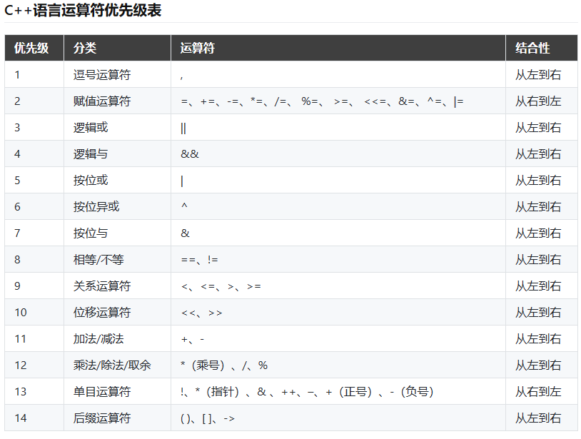

# 面试题

# 第一部分Cpp

# 1、C/Cpp指针与引用的区别？

> [基础语法-01-20 | 阿秀的学习笔记 (interviewguide.cn)](https://interviewguide.cn/notes/03-hunting_job/02-interview/01-01-01-basic.html#_3、指针和引用的区别)

1. 引用不能为空，即不存在对空对象的引用，指针可以为空，指向空对象。
2. 引用必须初始化，指定对哪个对象的引用，指针不需要。
3. 引用初始化后不能改变，指针可以改变所指对象的值。
4. 引用访问对象是直接访问，指针访问对象是间接访问。
5. 引用的大小是所引用对象的大小，指针的大小，是指针本身大小，通常是4字节。
6. 引用没有const，指针有const
7. 引用和指针的+自增运算符意义不同。
8. 引用不需要分配内存空间，指针需要。

# 2、常量指针与指针常量的区别？

> [基础语法-01-20 | 阿秀的学习笔记 (interviewguide.cn)](https://interviewguide.cn/notes/03-hunting_job/02-interview/01-01-01-basic.html#_17、常量指针和指针常量区别)

- 指针常量是一个不能给改变指向的指针。指针是个常量，必须初始化，一旦初始化完成，它的值（也就是存放在指针中的地址）就不能在改变了，即不能中途改变指向，如int *const p。
- 常量指针是一个指针，读成常量的指针，指向一个只读变量，也就是后面所指明的int const 和 const int，都是一个常量，可以写作int const *p或const int *p。

# 3、为什么要写虚析构？

> [其余问题-01-20 | 阿秀的学习笔记 (interviewguide.cn)](https://interviewguide.cn/notes/03-hunting_job/02-interview/01-05-01-other.html#_2、为什么析构函数一般写成虚函数)

由于类的多态性，基类指针可以指向派生类的对象，如果删除该基类的指针，就会调用该指针指向的派生类析构函数，而派生类的析构函数又自动调用基类的析构函数，这样整个派生类的对象完全被释放。

如果析构函数不被声明成虚函数，则编译器实施静态绑定，在删除基类指针时，只会调用基类的析构函数而不调用派生类析构函数，这样就会造成派生类对象析构不完全，造成内存泄漏。

所以将析构函数声明为虚函数是十分必要的。在实现多态时，当用基类操作派生类，在析构时防止只析构基类而不析构派生类的状况发生，要将基类的析构函数声明为虚函数。

# 4、前置和后置++的区别？

> [前置++和后置++的区别_randyjiawenjie的博客-CSDN博客](https://blog.csdn.net/randyjiawenjie/article/details/6747720)
>
> [STL模板库-01-20 | 阿秀的学习笔记 (interviewguide.cn)](https://interviewguide.cn/notes/03-hunting_job/02-interview/01-04-01-STL.html#_4、迭代器-it、it-哪个好-为什么)

1. 前置返回一个引用，后置返回一个对象
2. 前置不会产生临时对象，后置必须产生临时对象，临时对象会导致效率降低

# 5、拷贝构造函数什么情况下调用？

> [基础语法-21-40 | 阿秀的学习笔记 (interviewguide.cn)](https://interviewguide.cn/notes/03-hunting_job/02-interview/01-01-02-basic.html#_40、什么情况下会调用拷贝构造函数)

- 用类的一个实例化对象去初始化另一个对象的时候
- 函数的参数是类的对象时（非引用传递）
- 函数的返回值是函数体内局部对象的类的对象时 ,此时虽然发生（Named return Value优化）NRV优化，但是由于返回方式是值传递，所以会在返回值的地方调用拷贝构造函数

# 6、赋值函数什么情况下调用？

有类型声明的时候，不管有没有等号都是构造，之前定义过用等号接收的就是赋值。

接收的是右值就是移动构造或移动赋值，接收左值就是拷贝构造或拷贝赋值。

# 7、运算符优先级？



# 8、如何交换两个变量的值？

1. ```C#
   int temp = a;
   a = b;
   b = a;
   ```

2. ```C#
   a = a ^ b;
   b = a ^ b;
   a = a ^ b;
   ```

# 9、冒泡排序？

```C#
for (int i = 0; i < nums.size(); ++i) {
    for (int j = 0; j < nums.size() - i - 1; ++j) {
        if (nums[j] > nums[j + 1]) {
            int temp = nums[j];
            nums[j] = nums[j + 1];
            nums[j + 1] = temp;
        }
    }
}
```

# 10、普通函数和成员函数的区别？

1. 普通函数作用域为函数定义开始的到文件结束
2. 成员函数只要类对象存在，就可以通过类对象使用
3. 普通函数没有this指针，成员函数有
4. 普通函数无法继承，成员函数可以

# 11、Cpp当中const的五种用法？

1. 常量变量：const可以用来声明常量变量，即不可修改的值。例如：

   ```cpp
   const int MAX_VALUE = 100;
   ```

2. 常量指针：const可以用来声明指向常量的指针，即指针所指向的值不可修改。例如：

   ```cpp
   const int* ptr = &MAX_VALUE;
   ```

   指针常量：const可以用来声明指针常量，即指针本身不可修改。例如：

   ```cpp
   int* const ptr = &value;
   ```

3. 常量引用：const可以用来声明常量引用，即引用所绑定的值不可修改。例如：

   ```cpp
   const int& ref = value;
   ```

   

4. const成员函数：const可以用来修饰类的成员函数，表示该函数不会修改类的成员变量。例如：

   ```cpp
   class MyClass {
       int value;
   public:
       int getValue() const {
           return value;
       }
   };
   ```

5. const和重载函数：
   在类内，重载函数的末尾加上const，const相当于参数的一个部分，const可以重载函数
   类外，const也可以作为函数重载的一部分

# 12、Cpp当中static的五种用法？

1. 静态变量（Static Variables）：在函数内部声明的静态变量在程序的整个生命周期内保持其值，而不是在每次函数调用时重新初始化。静态变量只会被初始化一次。

   ```Cpp
   void foo() {
       static int count = 0; // 静态变量
       count++;
       cout << "Count: " << count << endl;
   }
   
   int main() {
       foo(); // 输出：Count: 1
       foo(); // 输出：Count: 2
       foo(); // 输出：Count: 3
       return 0;
   }
   ```

2. 静态函数（Static Functions）：静态函数属于类而不是类的实例。它们可以直接通过类名调用，而无需创建类的对象。静态函数不能访问非静态成员变量，只能访问静态成员变量。

   ```cpp
   class MathUtils {
   public:
       static int add(int a, int b) { // 静态函数
           return a + b;
       }
   };
   
   int main() {
       int result = MathUtils::add(5, 3); // 调用静态函数
       cout << "Result: " << result << endl; // 输出：Result: 8
       return 0;
   }
   ```

3. 静态数据成员（Static Data Members）：静态数据成员是类的成员变量，它们在所有类的实例之间共享。它们只有一个副本，并且可以在类的任何实例之间共享。

   ```cpp
   class MyClass {
   public:
       static int count; // 静态数据成员
   };
   
   int MyClass::count = 0; // 静态数据成员的初始化
   
   int main() {
       MyClass obj1;
       MyClass obj2;
       obj1.count = 5;
       cout << "Count: " << obj2.count << endl; // 输出：Count: 5
       return 0;
   }
   ```

   > 1.静态成员变量
   > 2.静态成员函数
   > 3.static修饰文件全局变量(主函数外默认为文件全局变量)(真正的全局变量用extern修饰)
   > 4.static修饰块作用变量(该变量的作用域没有改变，内存存在全局数据区)(举例：在main函数里面有一个for循环，在里面定义了一个static int a;在出循环之后访问不到a但是a的内存没有释放，在第二次进入该for循环时a的值还是上一次循环的值)(函数内也是相同的道理)
   > 5.static修饰函数(函数默认为全局作用域改变为文件作用域)

# 13、普通全局变量和static全局变量的区别？

在C++中，普通全局变量和静态全局变量之间有几个重要的区别：

1. 存储位置：普通全局变量存储在全局数据区，而静态全局变量存储在静态存储区。

2. 生命周期：普通全局变量的生命周期从程序开始到程序结束，而静态全局变量的生命周期也是从程序开始到程序结束，但是它们的初始化只会发生一次。

3. 可见性：普通全局变量在整个程序中都是可见的，可以被其他文件访问，而静态全局变量的可见性限制在定义它的文件内部，其他文件无法直接访问。

4. 默认初始化：普通全局变量会被默认初始化为0或空值，而静态全局变量会被默认初始化为0或空值，或者根据其类型的默认构造函数进行初始化。

5. 编译单元：普通全局变量可以在多个编译单元中定义，而静态全局变量只能在定义它的编译单元中访问。

总结来说，普通全局变量具有更广泛的可见性和可访问性，而静态全局变量具有更严格的作用域和生命周期控制。在大多数情况下，建议使用静态全局变量来限制其作用域，以避免命名冲突和不必要的全局变量访问。

# 14、普通局部变量和static局部变量的区别？

- 普通局部变量的生命周期仅限于方法或代码块的执行期间，而静态局部变量的生命周期与整个程序的执行期间相同。
- 两者都只能在声明他们的方法或代码块内部访问

# 15、Cpp内存区域的划分与区别？

在C++中，内存被划分为以下几个区域：

1. 栈（Stack）：栈是用于存储局部变量和函数调用的信息。它的大小在编译时确定，并且在程序执行期间自动分配和释放。栈上的内存分配和释放非常快速，但是它的大小有限。

2. 堆（Heap）：堆是用于动态分配内存的区域。它的大小不固定，可以根据需要动态增长。堆上的内存分配和释放相对较慢，需要手动管理内存的分配和释放，否则可能会导致内存泄漏或者悬挂指针。

3. 全局区（Global Area）：全局区用于存储全局变量和静态变量。全局变量在程序启动时分配，在程序结束时释放。静态变量在程序执行期间一直存在，直到程序结束。

4. 常量区（Constant Area）：常量区用于存储常量数据，如字符串常量。这些数据在程序执行期间不可修改。

5. 代码区（Code Area）：代码区存储程序的可执行代码。这部分内存通常是只读的，不可修改。

这些内存区域在C++中具有不同的特点和用途，了解它们的划分和区别对于正确使用和管理内存非常重要。

在C#中，内存区域主要分为以下几个部分：

1. 堆（Heap）：用于存储动态分配的对象。在堆上分配的对象由垃圾回收器负责回收。堆是一个大的、共享的内存区域，可以动态地分配和释放内存。

2. 栈（Stack）：用于存储局部变量和方法调用的上下文信息。栈上的内存分配和释放是自动进行的，由编译器和运行时系统负责管理。栈是一个小的、私有的内存区域，具有快速的分配和释放速度。

3. 静态存储区（Static Storage）：用于存储静态变量和常量。静态存储区在程序启动时分配，并在程序结束时释放。

4. 常量存储区（Constant Storage）：用于存储常量值。常量存储区在程序启动时分配，并在程序结束时释放。

5. 程序代码区（Code Segment）：用于存储程序的可执行代码。程序代码区在程序启动时分配，并在程序结束时释放。

这些内存区域在C#中具有不同的特点和用途。了解它们的划分和区别可以帮助我们更好地理解和管理内存。

# 16、什么情况下需要实现深拷贝？

## Cpp

在C++中，需要实现深拷贝的情况通常是当类中包含指针成员变量时。深拷贝是为了确保在拷贝对象时，不仅仅复制指针的值，还要复制指针所指向的内存内容。

以下是一些需要实现深拷贝的常见情况：

1. 类中包含动态分配的内存：如果类中有使用new关键字动态分配内存的成员变量，那么在拷贝对象时，需要重新分配内存并将原始对象的数据复制到新的内存中。

2. 类中包含指向其他对象的指针：如果类中有指向其他对象的指针成员变量，那么在拷贝对象时，需要创建一个新的对象，并将原始对象指针所指向的对象也进行拷贝。

3. 类中包含资源管理器：如果类中包含资源管理器，如文件句柄、数据库连接等，那么在拷贝对象时，需要确保每个对象都有自己独立的资源副本，以避免资源冲突或泄漏。

需要注意的是，如果类中没有指针成员变量或资源管理器，通常可以使用默认的浅拷贝（浅拷贝只复制指针值）来满足需求。但是在上述情况下，为了避免潜在的问题，需要手动实现深拷贝。

## C#

在C#中，需要实现深拷贝的情况通常是当你想要创建一个对象的完全独立副本时。深拷贝会复制对象及其所有引用类型成员的内容，而不仅仅是引用。这样可以确保修改副本不会影响原始对象。

以下是一些常见的情况，你可能需要实现深拷贝：

1. 当你需要在不影响原始对象的情况下修改副本时，例如在算法中使用对象的副本进行操作。
2. 当你需要创建一个对象的独立副本，以便在多线程环境中安全地访问和修改对象。
3. 当你需要在对象之间传递数据，而不希望修改原始对象的情况下，使用深拷贝可以确保数据的独立性。
4. 当你需要在对象之间进行比较时，深拷贝可以确保比较的是对象的内容而不是引用。

要实现深拷贝，你可以使用以下方法之一：

- 使用序列化和反序列化：将对象序列化为字节流，然后反序列化为新的对象。
- 递归复制对象及其引用类型成员：对于每个引用类型成员，递归地创建其深拷贝。

请注意，对于自定义类，你需要确保类及其成员都实现了深拷贝，否则可能会导致浅拷贝的情况。

# 17、在什么情况下使用“常引用”？

在C++中，常引用（const reference）通常在以下情况下使用：

1. 避免不必要的拷贝：当函数需要接受参数并且不需要修改参数的值时，使用常引用可以避免不必要的拷贝操作，提高性能。

2. 保证函数不会修改参数的值：当函数需要接受参数并且承诺不会修改参数的值时，使用常引用可以明确表达这个意图，并且提供了一种保证。

3. 与重载函数一起使用：常引用可以用于重载函数的参数类型，以便在函数调用时能够正确匹配参数类型。

4. 在类的成员函数中使用：常引用可以用于类的成员函数中，以便在函数中访问成员变量或调用其他成员函数时不会修改它们的值。

总之，常引用在C++中用于传递不需要修改的参数，提高性能，明确表达意图，并与重载函数和类的成员函数一起使用。

# 18、重写strcpy函数？

```Cpp
#include <stdio.h>

char* strcpy(char* destination, const char* source) {
    char* ptr = destination;
    while (*source != '\0') {
        *ptr++ = *source++;
    }
    *ptr = '\0';
    return destination;
}

int main() {
    char source[] = "Hello, world!";
    char destination[20];
    strcpy(destination, source);
    printf("Copied string: %s\n", destination);
    return 0;
}
```

# 19、#include<>和“”的区别？

\#include <> 和 #include "" 是C/C++中用于包含头文件的两种不同方式。

\#include <> 是用于包含系统提供的标准库头文件，编译器会在系统的标准库路径中查找该头文件。

\#include "" 是用于包含用户自定义的头文件，编译器会在当前文件所在目录中查找该头文件。

总结起来，#include <> 用于包含系统提供的标准库头文件，而 #include "" 用于包含用户自定义的头文件。

# 20、重载/隐藏/覆盖（重写）的区别？

> 注意覆盖也称为重写

在面向对象编程中，重载（overloading）、隐藏（hiding）和覆盖（overriding）是三种不同的概念。

1. 重载（Overloading）是指在同一个类中定义多个具有相同名称但参数列表不同的方法。重载方法可以有不同的返回类型，但不能仅仅通过返回类型的不同来进行重载。重载方法通常用于提供不同的方法签名来处理不同的输入参数，以便提供更灵活的使用方式。

2. 隐藏（Hiding）是指在派生类中定义了与基类中具有相同名称的成员（方法、属性或字段），从而隐藏了基类中的成员。隐藏成员可以使用关键字new来显式地标记。隐藏成员不会影响基类中的成员，而是在派生类中创建了一个新的成员。当通过派生类的实例访问成员时，将根据引用的类型来确定使用哪个成员。

3. 覆盖（重写）（Overriding）是指在派生类中重新定义了基类中具有相同名称和参数列表的方法。覆盖方法必须具有相同的返回类型或其派生类型。覆盖方法使用关键字override来标记。覆盖方法允许派生类提供自己的实现，从而替换基类中的实现。当通过派生类的实例访问方法时，将使用派生类中的实现。

总结：

- 重载是在同一个类中定义多个具有相同名称但参数列表不同的方法。
- 隐藏是在派生类中定义了与基类中具有相同名称的成员，从而隐藏了基类中的成员。
- 覆盖是在派生类中重新定义了基类中具有相同名称和参数列表的方法，提供自己的实现来替换基类中的实现。

# 21、插入排序？

```cpp
public static void InsertionSort(int[] arr)
{
    int n = arr.Length;
    for (int i = 1; i < n; ++i)
    {
        int key = arr[i];
        int j = i - 1;

        // 将比 key 大的元素向后移动
        while (j >= 0 && arr[j] > key)
        {
            arr[j + 1] = arr[j];
            j = j - 1;
        }

        arr[j + 1] = key;
    }
}
```

# 22、参数传递的方式和区别？

在C++中，有以下几种参数传递的方式和区别：

1. 值传递（Pass by Value）：将实际参数的值复制给形式参数，函数内部对形式参数的修改不会影响实际参数的值。这种方式适用于参数较小且不需要在函数内部修改的情况。

2. 引用传递（Pass by Reference）：将实际参数的引用传递给形式参数，函数内部对形式参数的修改会影响实际参数的值。这种方式可以用于需要在函数内部修改参数值的情况。

3. 指针传递（Pass by Pointer）：将实际参数的地址传递给形式参数，函数内部可以通过指针来访问和修改实际参数的值。这种方式与引用传递类似，但需要手动解引用指针来访问和修改参数值。

4. 常量引用传递（Pass by Constant Reference）：将实际参数的引用传递给形式参数，并将形式参数声明为常量引用，函数内部不能修改形式参数的值。这种方式适用于需要传递大型对象，但不需要在函数内部修改的情况，可以避免复制大型对象的开销。

这些参数传递方式的选择取决于函数的需求和实际情况。需要注意的是，传递指针或引用时需要确保实际参数的生命周期足够长，以避免访问无效的内存。

# 23、函数调用流程？


# 24、创建一个派生类的对象，构造函数的调用顺序以及析构函数的调用顺序？

在创建派生类的对象时，构造函数和析构函数的调用顺序如下：

1. 首先，调用派生类的构造函数。派生类的构造函数负责初始化派生类自己的成员变量，并且会自动调用基类的构造函数来初始化继承的成员变量。构造函数的调用顺序是从基类到派生类，即先调用基类的构造函数，再调用派生类的构造函数。

2. 接下来，创建派生类的对象。对象的创建过程包括分配内存空间和调用构造函数。

3. 当派生类对象不再被使用时，会调用析构函数来释放对象占用的内存空间。析构函数的调用顺序与构造函数相反，即先调用派生类的析构函数，再调用基类的析构函数。

总结起来，构造函数的调用顺序是从基类到派生类，析构函数的调用顺序是从派生类到基类。这样可以确保在对象的创建和销毁过程中，基类和派生类的成员变量都能得到正确的初始化和释放。

# 25、实现单例模式？

## C++实现饿汉式单例模式

```Cpp
class Singleton {
private:
    static Singleton* instance;
    
    // 私有构造函数，防止外部实例化
    Singleton() {}
    
public:
    // 获取单例实例的静态方法
    static Singleton* getInstance() {
        return instance;
    }
};

// 初始化静态成员变量
Singleton* Singleton::instance = new Singleton();
```

## C++实现懒汉式单例模式

### 线程不安全

```cpp
class Singleton {
private:
    static Singleton* instance;
    Singleton() {} // private constructor to prevent instantiation

public:
    static Singleton* getInstance() {
        if (instance == nullptr) {
            instance = new Singleton();
        }
        return instance;
    }
};

Singleton* Singleton::instance = nullptr;
```

### 线程安全

```cpp
#include <mutex>

class Singleton {
private:
    static Singleton* instance;
    static std::mutex mtx;
    
    // 私有构造函数，防止外部实例化
    Singleton() {}
    
public:
    // 获取单例实例的静态方法
    static Singleton* getInstance() {
        if (instance == nullptr) {
            std::lock_guard<std::mutex> lock(mtx);
            if (instance == nullptr) {
                instance = new Singleton();
            }
        }
        return instance;
    }
};

Singleton* Singleton::instance = nullptr;
std::mutex Singleton::mtx;
```

# 26、名词解释:数组越界、野指针、内存泄漏？

## 数组越界

数组越界指的是访问数组时超出了数组的有效索引范围。在大多数编程语言中，数组的索引从0开始，到数组长度减1为止。当我们尝试访问超出这个范围的索引时，就会发生数组越界错误。这可能导致程序崩溃、产生不可预测的结果或者访问到无效的内存区域。

## 野指针

野指针是指指向无效内存地址的指针。当我们声明一个指针变量但没有为其分配有效的内存地址时，该指针就是野指针。野指针可能是未初始化的指针、已经释放的指针、或者指向已经销毁的对象的指针。使用野指针可能导致程序崩溃、产生不可预测的结果或者访问到无效的内存区域。

## 内存泄漏

内存泄漏指的是在程序运行过程中，分配的内存空间没有被正确释放或回收的情况。当我们动态分配内存（如使用malloc或new）但没有相应地释放（如使用free或delete）时，就会发生内存泄漏。内存泄漏会导致程序占用的内存逐渐增加，最终可能导致系统资源耗尽。为了避免内存泄漏，我们应该在不再使用内存时及时释放它。

# 27、指针用字符串初始化和数组用字符串初始化，有何区别?

指针和数组在使用字符串进行初始化时有一些区别。

1. 字符串初始化指针：当使用字符串初始化指针时，指针变量将指向字符串的第一个字符的地址。例如，如果有一个字符串char *str = "Hello";，指针str将指向字符串中的第一个字符'H'的地址。

2. 字符串初始化数组：当使用字符串初始化数组时，数组将按顺序存储字符串中的每个字符。例如，如果有一个字符数组char arr[] = "Hello";，数组arr将依次存储字符串中的字符'H'、'e'、'l'、'l'、'o'。

需要注意的是，指针和数组在使用字符串初始化时的行为略有不同。指针变量只是存储字符串的地址，而数组则存储字符串的实际内容。这意味着对指针进行修改可能会导致未定义的行为，而对数组进行修改则是安全的。

另外，需要注意的是，使用字符串初始化指针或数组时，字符串的最后一个字符会自动添加一个空字\'\0\'作为字符串的结束标志。这个空字符在C语言中非常重要，用于表示字符串的结束位置。

# 28、选择排序？

选择排序（Selection Sort）是一种简单直观的排序算法。它的基本思想是每次从待排序的数据元素中选出最小（或最大）的一个元素，存放在序列的起始位置，直到全部待排序的数据元素排完。

以下是C++实现选择排序的示例代码：

```cpp
void selectionSort(int arr[], int n) {
    for (int i = 0; i < n-1; i++) {
        int minIndex = i;
        for (int j = i+1; j < n; j++) {
            if (arr[j] < arr[minIndex]) {
                minIndex = j;
            }
        }
        swap(arr[i], arr[minIndex]);
    }
}
```

# 30、h头文件中的ifndef/define/endif的作用？

\#ifndef/#define/#endif 是C/C++中的预处理指令，用于防止头文件的重复包含。

\#ifndef 指令用于检查一个标识符是否已经被定义，如果没有被定义，则执行下面的代码块。通常用于防止头文件的重复包含。

\#define 指令用于定义一个标识符，通常用于定义头文件的宏。它可以用来定义常量、函数宏、条件编译等。

\#endif 指令用于结束一个条件编译块，与#ifndef配合使用，表示条件编译的结束。

通过使用#ifndef/#define/#endif，可以确保头文件只被包含一次，避免了重复定义和编译错误的问题。这是一种常见的编程实践，用于提高代码的可维护性和可重用性。

# 31、malloc/free和new/delete的区别？

malloc和free是C语言中用于动态分配和释放内存的函数，而new和delete是C++中用于动态分配和释放内存的运算符。

以下是它们之间的区别：

1. 语法：malloc和free是函数，需要使用函数调用的语法来分配和释放内存。而new和delete是运算符，可以直接使用运算符的语法来分配和释放内存。

2. 类型安全：malloc和free是C语言的函数，它们不会执行构造函数和析构函数。而new和delete是C++的运算符，它们会执行构造函数和析构函数，从而确保对象的正确初始化和清理。

3. 内存大小：malloc函数需要手动指定要分配的内存大小，而new运算符会根据类型自动计算所需的内存大小。

4. 异常处理：new运算符在分配内存失败时会抛出std::bad_alloc异常，而malloc函数在分配内存失败时会返回NULL。

5. 重载：new和delete运算符可以被重载，以实现自定义的内存分配和释放行为。而malloc和free函数不能被重载。

总的来说，如果你在C++中编程，建议使用new和delete来进行内存分配和释放，因为它们提供了更好的类型安全性和异常处理机制。如果你在C语言中编程，可以使用malloc和free来进行内存分配和释放。

# 32、在main函数前调用的函数？

**main函数执行之前**，主要就是初始化系统相关资源：

- 设置栈指针
- 初始化静态`static`变量和`global`全局变量，即`.data`段的内容
- 将未初始化部分的全局变量赋初值：数值型`short`，`int`，`long`等为`0`，`bool`为`FALSE`，指针为`NULL`等等，即`.bss`段的内容
- 全局对象初始化，在`main`之前调用构造函数，这是可能会执行前的一些代码
- 将main函数的参数`argc`，`argv`等传递给`main`函数，然后才真正运行`main`函数
- `__attribute__((constructor))`

**main函数执行之后**：

- 全局对象的析构函数会在main函数之后执行；
- 可以用 **`atexit`** 注册一个函数，它会在main 之后执行;
- `__attribute__((destructor))`

# 33、宏定义问题？

在C++中，宏定义是一种预处理指令，用于在编译之前将代码中的标识符替换为特定的文本。以下是在使用宏定义时需要注意的几个点：

1. 命名冲突：宏定义的标识符是全局的，因此需要避免与其他标识符冲突。最好使用唯一且具有描述性的名称来定义宏。

2. 参数括号：如果宏定义带有参数，确保在定义和使用宏时使用括号。这可以避免由于运算符优先级引起的错误。

3. 宏定义的替换：宏定义是简单的文本替换，因此需要注意替换的上下文。确保宏定义的替换结果是有效的代码。

4. 宏定义的副作用：宏定义可以在代码中引入副作用，例如多次计算相同的表达式。这可能会导致不可预测的行为，因此需要小心使用宏定义。

5. 使用条件编译：可以使用条件编译指令（如#ifdef、#ifndef、#ifdef）来根据条件定义宏。这可以用于在不同的编译环境中定义不同的宏。

6. 使用const替代宏：在C++中，使用const变量或常量表达式来替代宏定义是更好的选择。这样可以提供类型安全性和更好的代码可读性。

总之，在使用宏定义时，需要小心处理命名冲突、参数括号、替换结果、副作用和条件编译等问题。优先考虑使用const变量或常量表达式来替代宏定义，以提高代码的可读性和可维护性。

# 34、结构体内存对齐问题？

[基础语法-01-20 | 阿秀的学习笔记 (interviewguide.cn)](https://interviewguide.cn/notes/03-hunting_job/02-interview/01-01-01-basic.html#_2、结构体内存对齐问题)

# 35、位运算问题？

以下是一些常见的位运算问题以及对应的C++代码示例：

1. 判断一个数是否为2的幂次方：

```Cpp
bool isPowerOfTwo(int n) {
    return n > 0 && (n & (n - 1)) == 0;
}
```

2. 计算一个数的二进制表示中有多少个1：

```Cpp
int countOnes(int n) {
    int count = 0;
    while (n != 0) {
        n = n & (n - 1);
        count++;
    }
    return count;
}
```

3. 反转一个二进制数的位：

```Cpp
int reverseBits(int n) {
    int result = 0;
    for (int i = 0; i < 32; i++) {
        result = (result << 1) | (n & 1);
        n >>= 1;
    }
    return result;
}
```

4. 将一个数的第k位设置为1：

```Cpp
int setBit(int *n*, int *k*) {
  return n | (1 << k);
}
```

5. 将一个数的第k位设置为0：

```Cpp
int clearBit(int n, int k) {
    return n & ~(1 << k);
}
```

6. 判断一个数的奇偶性：

```Cpp
bool isEven(int n) {
    return (n & 1) == 0;
}
```

7. 交换两个数的值（不使用额外的变量）：

```Cpp
void swap(int& a, int& b) {
    a = a ^ b;
    b = a ^ b;
    a = a ^ b;
}
```

8. 获取一个数的绝对值：

```Cpp
int abs(int n) {
    int mask = n >> (sizeof(int) * 8 - 1);
    return (n + mask) ^ mask;
}
```

9. 判断两个数是否有相同的符号：

```Cpp
bool haveSameSign(int a, int b) {
    return (a ^ b) >= 0;
}
```

10. 将一个数的第k位取反（0变为1，1变为0）：

```cpp
int toggleBit(int n, int k) {
    return n ^ (1 << k);
}
```

11. 使用位运算实现加法

```Cpp
int add(int a, int b) {
    while (b != 0) {
        int carry = (a & b) << 1;
        a = a ^ b;
        b = carry;
    }
    return a;
}
```

# 36、Cpp当中list和vector的区别？

在C++中，list和vector是两种不同的容器类型，它们有以下区别：

1. 实现方式：list是一个双向链表，而vector是一个动态数组。

2. 内存分配：list在每次插入或删除元素时会动态分配和释放内存，而vector在插入或删除元素时可能需要重新分配内存，这可能导致性能损失。

3. 访问速度：由于vector是连续存储的，因此可以通过索引快速访问元素。而list需要遍历链表来访问元素，因此访问速度较慢。

4. 插入和删除操作：list在任意位置插入和删除元素的时间复杂度是O(1)，而vector在中间位置插入和删除元素的时间复杂度是O(n)，因为需要移动其他元素。

5. 内存占用：由于list使用链表存储元素，每个元素都需要额外的指针来指向前一个和后一个元素，因此在存储大量元素时，list可能占用更多的内存。

根据具体的需求，选择合适的容器类型是很重要的。如果需要频繁地插入和删除元素，而不关心访问速度，那么list可能是更好的选择。如果需要快速访问元素，并且插入和删除操作较少，那么vector可能更适合。

# 37、Cpp当中list的相关函数有哪些？

在C++中，std::list是一个双向链表容器，它提供了许多有用的成员函数来操作和管理链表。以下是一些常用的std::list成员函数：

- push_back()：在链表末尾插入一个元素。
- push_front()：在链表头部插入一个元素。
- pop_back()：删除链表末尾的元素。
- pop_front()：删除链表头部的元素。
- size()：返回链表中元素的数量。
- empty()：检查链表是否为空。
- clear()：清空链表中的所有元素。
- begin()：返回指向链表第一个元素的迭代器。
- end()：返回指向链表末尾的迭代器。
- insert()：在指定位置插入一个元素。
- erase()：删除指定位置的元素。
- remove()：删除链表中所有与给定值相等的元素。
- sort()：对链表进行排序。
- reverse()：反转链表的顺序。

这只是一些常用的函数，std::list还提供了其他许多函数来满足不同的需求。你可以查阅C++标准库的文档以获取更详细的信息。

# 38、重写strcat函数？

```Cpp
#include <stdio.h>

char* my_strcat(char* dest, const char* src) {
    char* ptr = dest;
    
    // 移动指针到dest的末尾
    while (*ptr != '\0') {
        ptr++;
    }
    
    // 将src的字符逐个复制到dest的末尾
    while (*src != '\0') {
        *ptr = *src;
        ptr++;
        src++;
    }
    
    // 在dest的末尾添加字符串结束符
    *ptr = '\0';
    
    return dest;
}

int main() {
    char str1[50] = "Hello, ";
    char str2[] = "world!";
    
    my_strcat(str1, str2);
    
    printf("%s\n", str1);  // 输出：Hello, world!
    
    return 0;
}
```

# 39、指针偏移问题？

指针偏移，偏移其所指向的类型字节数

```Cpp
int main() {
    int arr[] = {1, 2, 3, 4, 5};
    int *ptr = arr;  // 指针指向数组的第一个元素

    // 使用指针偏移访问数组元素
    printf("%d\n", *(ptr + 2));  // 输出第三个元素，即3

    return 0;
}
```

上述代码当中，指针所指向类型为int，+2偏移8字节，到达元素3位置

# 40、数组指针与指针数组的区别？

1. 数组指针（Pointer to an Array）是指一个指针变量，它指向一个数组的首地址。可以通过该指针访问数组中的元素。声明数组指针时，需要指定数组的类型和维度。例如，int (*ptr)[5] 表示一个指向包含5个整数的数组的指针。可以使用指针运算符 * 和数组下标来访问数组元素。

```Cpp
int arr[5] = {1, 2, 3, 4, 5};
int (*ptr)[5] = &arr;  // 声明一个指向包含5个整数的数组的指针

// 使用指针访问数组元素
for (int i = 0; i < 5; i++) {
    printf("%d ", (*ptr)[i]);
}
```

2. 指针数组（Array of Pointers）是指一个数组，其中的每个元素都是指针。每个指针可以指向不同类型的数据或者相同类型的数据。声明指针数组时，需要指定指针的类型和数组的大小。例如，int *arr[5] 表示一个包含5个整型指针的数组。可以通过数组下标来访问指针数组中的指针，然后使用指针运算符 * 来访问指针指向的数据。

```Cpp
int num1 = 1, num2 = 2, num3 = 3, num4 = 4, num5 = 5;
int *arr[5] = {&num1, &num2, &num3, &num4, &num5};  // 声明一个包含5个整型指针的数组

// 使用指针数组访问指针指向的数据
for (int i = 0; i < 5; i++) {
    printf("%d ", *arr[i]);
}
```

总结：

- 数组指针是指向数组的指针变量，可以通过指针访问数组元素。
- 指针数组是一个数组，其中的每个元素都是指针，可以通过数组下标访问指针，并通过指针访问数据。

# 71、c、c++和JavaScript的区别

C、C++和JavaScript是三种不同的编程语言，它们在语法、用途和特性上有一些区别。

1. 语法：C和C++是静态类型的编程语言，需要在编译时进行类型检查。它们使用类似的语法结构，包括变量声明、条件语句和循环结构。JavaScript是一种动态类型的编程语言，不需要显式地声明变量类型，并且在运行时进行类型检查。

2. 用途：C和C++通常用于系统级编程和高性能应用程序开发，如操作系统、嵌入式系统和游戏开发。JavaScript主要用于Web开发，包括网页交互、动态内容和浏览器脚本。

3. 特性：C和C++是编译型语言，可以直接编译成机器码执行，具有高效性和底层控制能力。它们支持指针操作和内存管理，但也需要开发人员自行管理内存。JavaScript是一种解释型语言，需要在运行时由解释器解释执行。它具有动态类型、垃圾回收和自动内存管理的特性，更加灵活和易于使用。

总结来说，C和C++适用于系统级编程和性能要求较高的应用程序开发，而JavaScript适用于Web开发和浏览器脚本。具体选择哪种语言取决于项目需求和开发者的偏好。

# 72、简述如何出栈入栈并能快速找到最小值

具体步骤如下：

1. 创建两个栈，一个是主栈用于存储数据，另一个是辅助栈用于记录当前栈中的最小值。
2. 当进行入栈操作时，首先将元素压入主栈。然后判断辅助栈是否为空，如果为空或者新元素小于等于辅助栈的栈顶元素，则将新元素也压入辅助栈。
3. 当进行出栈操作时，首先从主栈中弹出栈顶元素。然后判断辅助栈的栈顶元素是否等于弹出的元素，如果是，则也将辅助栈的栈顶元素弹出。
4. 要找到当前栈中的最小值，只需要返回辅助栈的栈顶元素即可。

这样，无论是入栈、出栈还是查找最小值的操作，都可以在常数时间内完成。

```Cpp
#include <iostream>
#include <stack>

class MinStack {
private:
    std::stack<int> mainStack;
    std::stack<int> minStack;

public:
    void push(int x) {
        mainStack.push(x);
        if (minStack.empty() || x <= minStack.top()) {
            minStack.push(x);
        }
    }

    void pop() {
        if (mainStack.top() == minStack.top()) {
            minStack.pop();
        }
        mainStack.pop();
    }

    int top() {
        return mainStack.top();
    }

    int getMin() {
        return minStack.top();
    }
};

int main() {
    MinStack stack;
    stack.push(5);
    stack.push(2);
    stack.push(7);
    stack.push(1);

    std::cout << "Top element: " << stack.top() << std::endl;
    std::cout << "Minimum element: " << stack.getMin() << std::endl;

    stack.pop();
    std::cout << "Top element after pop: " << stack.top() << std::endl;
    std::cout << "Minimum element after pop: " << stack.getMin() << std::endl;

    return 0;
}
```

# 73、怎么实现单例模式，什么是工厂模式

## 单例模式

见25

## 工厂模式

工厂模式是一种创建型设计模式，用于创建对象的过程与客户端代码的解耦。它通过定义一个公共接口来创建对象，但具体的对象创建逻辑由子类决定。

在工厂模式中，通常有一个抽象工厂类和多个具体工厂类，每个具体工厂类负责创建一种具体的对象。客户端代码只需要与抽象工厂类进行交互，而不需要直接与具体工厂类或具体对象进行交互。

以下是一个简单的工厂模式示例：

```Cpp
// 抽象产品类
class Product {
public:
    virtual void use() = 0;
};

// 具体产品类A
class ConcreteProductA : public Product {
public:
    void use() override {
        cout << "Using ConcreteProductA" << endl;
    }
};

// 具体产品类B
class ConcreteProductB : public Product {
public:
    void use() override {
        cout << "Using ConcreteProductB" << endl;
    }
};

// 抽象工厂类
class Factory {
public:
    virtual Product* createProduct() = 0;
};

// 具体工厂类A
class ConcreteFactoryA : public Factory {
public:
    Product* createProduct() override {
        return new ConcreteProductA();
    }
};

// 具体工厂类B
class ConcreteFactoryB : public Factory {
public:
    Product* createProduct() override {
        return new ConcreteProductB();
    }
};

int main() {
    Factory* factoryA = new ConcreteFactoryA();
    Product* productA = factoryA->createProduct();
    productA->use();

    Factory* factoryB = new ConcreteFactoryB();
    Product* productB = factoryB->createProduct();
    productB->use();

    return 0;
}
```

## 工厂模式的作用

工厂模式是一种创建对象的设计模式。它通过使用一个共同的接口或基类来创建对象，而不需要直接调用对象的构造函数。工厂模式的主要作用是将对象的创建和使用分离，提供一种灵活的方式来创建对象，同时隐藏对象的具体实现细节。

工厂模式的作用包括：

1. 封装对象的创建过程：工厂模式将对象的创建逻辑封装在一个工厂类中，使得客户端代码只需要与工厂类进行交互，而不需要直接与具体的对象类进行交互。这样可以降低代码的耦合性，提高代码的可维护性和可扩展性。

2. 提供灵活的对象创建方式：工厂模式可以根据不同的条件或配置来创建不同的对象，从而实现灵活的对象创建方式。客户端代码只需要指定需要创建的对象类型或配置参数，而不需要关心具体的对象创建过程。
3. 藏对象的具体实现细节：工厂模式将对象的创建过程封装在工厂类中，客户端代码只需要关心对象的接口或基类，而不需要关心具体的对象实现细节。这样可以隐藏对象的具体实现细节，提高代码的安全性和可维护性。

总之，工厂模式是一种常用的设计模式，它可以提供一种灵活和可扩展的对象创建方式，同时隐藏对象的具体实现细节，提高代码的可维护性和可扩展性。

# 74、什么是观察者模式

观察者模式是一种软件设计模式，用于实现对象之间的一对多依赖关系。在观察者模式中，当一个对象的状态发生变化时，它的所有依赖对象（观察者）都会收到通知并自动更新。这种模式可以实现松耦合，使得对象之间的关系更加灵活和可扩展。

在观察者模式中，有两个主要角色：主题（Subject）和观察者（Observer）。主题是被观察的对象，它维护了一个观察者列表，并提供了添加、删除和通知观察者的方法。观察者是依赖于主题的对象，它定义了一个更新方法，用于接收主题的通知并进行相应的处理。

观察者模式的优点包括：

- 可以实现对象之间的松耦合，主题和观察者之间的依赖关系是动态的，可以随时添加或删除观察者。
- 主题和观察者之间是一对多的关系，一个主题可以有多个观察者，观察者之间相互独立，可以灵活地增加或减少观察者的数量。
- 观察者模式可以实现事件驱动的编程，当主题的状态发生变化时，会自动通知观察者进行相应的处理。

观察者模式在实际应用中广泛使用，例如GUI编程中的事件处理、发布-订阅模式等。

```C#
using System;
using System.Collections.Generic;

// 主题接口
public interface ISubject
{
    void Attach(IObserver observer); // 添加观察者
    void Detach(IObserver observer); // 移除观察者
    void Notify(); // 通知观察者
}

// 具体主题
public class ConcreteSubject : ISubject
{
    private List<IObserver> observers = new List<IObserver>();
    private string state;

    public string State
    {
        get { return state; }
        set
        {
            state = value;
            Notify();
        }
    }

    public void Attach(IObserver observer)
    {
        observers.Add(observer);
    }

    public void Detach(IObserver observer)
    {
        observers.Remove(observer);
    }

    public void Notify()
    {
        foreach (var observer in observers)
        {
            observer.Update();
        }
    }
}

// 观察者接口
public interface IObserver
{
    void Update();
}

// 具体观察者
public class ConcreteObserver : IObserver
{
    private string name;
    private ConcreteSubject subject;

    public ConcreteObserver(string name, ConcreteSubject subject)
    {
        this.name = name;
        this.subject = subject;
    }

    public void Update()
    {
        Console.WriteLine($"Observer {name} received notification. New state: {subject.State}");
    }
}

// 示例
public class Program
{
    public static void Main(string[] args)
    {
        ConcreteSubject subject = new ConcreteSubject();

        ConcreteObserver observer1 = new ConcreteObserver("Observer 1", subject);
        ConcreteObserver observer2 = new ConcreteObserver("Observer 2", subject);

        subject.Attach(observer1);
        subject.Attach(observer2);

        subject.State = "State 1";
        subject.State = "State 2";

        subject.Detach(observer2);

        subject.State = "State 3";

        Console.ReadLine();
    }
}
```

# 75-80

## 75、选出ABCD四个表达式中错误的（D）

75、选出ABCD四个表达式中错误的（D）

```Cpp
A.a+=(a++);   B.a+=(++a);   C.(a++)+=a;   D.(++a)+=(a++);
```

## 76、以下程序段中与语句k=a>b?(b>c?1:0):0功能等价的是（）

76、以下程序段中与语句k=a>b?(b>c?1:0):0功能等价的是（A）

```Cpp
A.if((a>b)&&(b> c)) k = 1;else k = 0;
B.if((a>b)||(b> c)) k = 1;else k = 0;
C.if(b>c) k = 1;else k = 0;
D.if(a>b) k = 1;else k = 0;

```

## 77、关于静态成员,如下描述错误的是(  )

77、关于静态成员,如下描述错误的是( A )

A.  在创建对象前,静态成员不存在

B.  静态成员是类的成员

C.  静态成员不能是虚函数

D.  静态成员函数不能直接访问非静态成员

## 78、下面对const char* ptr中ptr描述正确的是(  )

78、下面对const char* ptr中ptr描述正确的是(  B/A)

A.   指向字符常量的指针  B.指向字符串常量的指针

C.  指向字符的常量指针  D.指向字符串的常量指针

## 79、

79、如果有char arr[] = “12345”,那么sizeof(arr)/sizeof(arr[0])=__6______.

如果有int arr[2] = {0},那么arr[1]的值为___0_______.

## 80、输入整型字符串，输出该整数；如：输入“345”，输出345；

```cpp
int solution(const string& str) {
    int num = 0;
    for (int i = 0; i < str.length(); ++i) {
        num = num * 10 + str[i] - '0';
    }
    return num;
}
```

# 80、最长连续子串

80、输入一个字符串，输出该字符串的最长连续子串；如：输入“abcd12345abcdefg”,则输出abcdefg;

> 
>
> [1143. 最长公共子序列 - 力扣（LeetCode）](https://leetcode.cn/problems/longest-common-subsequence/)

# 81、主要元素

80、输入一个整型数组，输出该数组的主要元素，如果不存在主要元素，则输出-1，找出好的算法，需要考虑时间和控件复杂度；（数组的主要元素：数组中该元素出现的次数超过总数组的一半）；如：数组A={1,2,3,4,5,5,5,6,5,5,5,5,5}，则输出5.

# 82、加号操作符重载成员函数

计算机假定要对类AB定义加号操作符重载成员函数，实现两个AB类对象的加法，并返回相加结果，则该成员函数的声明语句为（C）

```Cpp
A.	AB operator+(AB& A,AB& B)
B.	AB& operator+(AB A)
C.	AB operator+(AB& A)
D.	AB* operator+(AB A)
```

# 84、访问控制关键字

84、C++定义了的访问控制关键字有private,protected,public和____friend____.

# 85、宏定义函数

```cpp
#define SQR(x) x*x
int main(int argc, char* argv[])
{
	int a = 2;
	int b = 3;
	printf("%d,%d", SQR(a), SQR(b + 1));
	return 0;
}
//output
4,7
```

# 86、8进制转16进制

```cpp
void main()
{
	int x = 0210;
	printf("%x\n", x);
}
```

输出结果是88

# 87、写出两个数交换的宏定义，不能使用中间变量

写出两个数交换的宏定义，不能使用中间变量

```Cpp
#define SWAP(a, b) do { \
    a = a ^ b; \
    b = a ^ b; \
    a = a ^ b; \
} while(0)
```

# 88、

假如char str[] = "abcdefghijkl"，请写出以下输出结果：

```cpp
printf("%s\n", str);
printf("%s\n", str + 3);
printf("%s\n", (char*)(((int*)str) + 1));
//output
abcdefghijkl
defghijkl
efghijkl
```

# 89、一个语句实现x是否是2的若干次幂的判断？

一个语句实现x是否是2的若干次幂的判断？

```cpp
bool isPowerOfTwo(int x) {
    return (x > 0) && ((x & (x - 1)) == 0);
}
```

# 90、根据二叉树遍历序列求二叉树

一个二叉树，先序遍历的结果是ABDECFG，中序遍历的结果是DBEAFGC，后序遍历的结果是

```cpp
EDBFGCAF
```

# 91、实现String类常见函数

已知String类定义如下：

```cpp
class String
{
public:
	String(const char* str = NULL);//通用构造函数
	String(const String& another);//拷贝构造函数
	~String();//析构函数
	String& operator=(const String& rhs);//赋值函数
private:
	char* m_data;//用来保存字符串
};
```

实现具体函数

```Cpp
//1. 实现通用构造函数：通用构造函数用于创建一个String对象，并将其初始化为一个空字符串或者给定的C风格字符串。可以使用动态内存分配来为m_data成员变量分配内存，并将字符串复制到m_data中。
String::String(const char* str)
{
    if (str == NULL) {
        m_data = new char[1];
        *m_data = '\0';
    } else {
        int length = strlen(str);
        m_data = new char[length + 1];
        strcpy(m_data, str);
    }
}
//2. 实现拷贝构造函数：拷贝构造函数用于创建一个新的String对象，并将其初始化为另一个String对象的副本。可以使用动态内存分配来为m_data成员变量分配内存，并将另一个String对象的字符串复制到m_data中。
String::String(const String& another)
{
    int length = strlen(another.m_data);
    m_data = new char[length + 1];
    strcpy(m_data, another.m_data);
}
//3. 实现析构函数：析构函数用于释放String对象所占用的内存。可以使用delete]操作符来释放m_data指向的内存。
String::~String()
{
    delete[] m_data;
}
//4. 实现赋值函数：赋值函数用于将一个String对象的值赋给另一个String对象。首先需要检查自赋值的情况，如果两个对象相同，则不需要进行任何操作。否则，可以先释放当前对象的内存，然后使用动态内存分配为m_data成员变量分配新的内存，并将另一个String对象的字符串复制到m_data中。
String& String::operator=(const String& rhs)
{
    if (this == &rhs) {
        return *this;
    }
    
    delete[] m_data;
    
    int length = strlen(rhs.m_data);
    m_data = new char[length + 1];
    strcpy(m_data, rhs.m_data);
    
    return *this;
}
```

# 第二部分：数据结构

# 链表12题

```Cpp
已知链表结点声明如下：
struct ListNode
{
	int m_nKey;
	ListNode * m_pNext;
};
```

# 1、求单链表中结点的个数

要求单链表中结点的个数，可以使用一个计数器变量，从头结点开始遍历链表，每遍历一个结点，计数器加一，直到遍历到链表末尾为止。最后计数器的值就是链表中结点的个数。

```Cpp
int countNodes(ListNode* head) {
    int count = 0;
    ListNode* current = head;
    while (current != nullptr) {
        count++;
        current = current->m_pNext;
    }
    return count;
}
```

# 2、将单链表反转

要将单链表反转，可以使用三个指针分别指向当前结点、前一个结点和下一个结点。遍历链表，将当前结点的指针指向前一个结点，然后更新三个指针的位置，继续遍历。最后将头结点指向反转后的链表的头结点。

> [206. 反转链表 - 力扣（LeetCode）](https://leetcode.cn/problems/reverse-linked-list/)

```Cpp
ListNode* reverseList(ListNode* head) {
    ListNode* prev = nullptr;
    ListNode* current = head;
    while (current != nullptr) {
        ListNode* next = current->m_pNext;
        current->m_pNext = prev;
        prev = current;
        current = next;
    }
    return prev;
}
```

> 扩展
>
> [92. 反转链表 II - 力扣（LeetCode）](https://leetcode.cn/problems/reverse-linked-list-ii/solutions/634701/fan-zhuan-lian-biao-ii-by-leetcode-solut-teyq/)

# 3、查找单链表中的倒数第K个结点（k > 0）：

> [剑指 Offer 22. 链表中倒数第k个节点 - 力扣（LeetCode）](https://leetcode.cn/problems/lian-biao-zhong-dao-shu-di-kge-jie-dian-lcof/description/)

要查找单链表中的倒数第K个结点，可以使用两个指针，一个指针先移动K-1步，然后两个指针同时移动，直到第一个指针到达链表末尾。此时第二个指针指向的结点就是倒数第K个结点。

```Cpp
class Solution {
public:
    ListNode* getKthFromEnd(ListNode* head, int k) {
        ListNode* slow = head;
        ListNode* fast = head;
        for(int i = 0; i < k; ++i) {
            if (fast == nullptr) return nullptr;
            fast = fast->next;
        }
        while (fast != nullptr) {
            slow = slow->next;
            fast = fast->next;
        }
        return slow;
    }
};
```

# 4.、查找单链表的中间结点

> [876. 链表的中间结点 - 力扣（LeetCode）](https://leetcode.cn/problems/middle-of-the-linked-list/)

要查找单链表的中间结点，可以使用两个指针，一个指针每次移动一步，另一个指针每次移动两步。当快指针到达链表末尾时，慢指针指向的结点就是中间结点。

```Cpp
class Solution {
public:
    ListNode* middleNode(ListNode* head) {
        ListNode* slow = head;
        ListNode* fast = head;
        while (fast != nullptr && fast->next != nullptr) {
            slow = slow->next;
            fast = fast->next->next;
        }
        return slow;
    }
};
```

# 5、从尾到头打印单链表

> [剑指 Offer 06. 从尾到头打印链表 - 力扣（LeetCode）](https://leetcode.cn/problems/cong-wei-dao-tou-da-yin-lian-biao-lcof/)

递归

```Cpp
class Solution {
public:
    vector<int> ans;

    void Helper(ListNode* head) {
        if (head == nullptr) return;
        Helper(head->next);
        ans.push_back(head->val);
    }

    vector<int> reversePrint(ListNode* head) {
        Helper(head);
        return ans;
    }
};
```

栈

```cpp
class Solution {
public:
    vector<int> reversePrint(ListNode* head) {
        if (head == nullptr) return {};
        stack<int> sta;
        vector<int> ans;
        while (head != nullptr) {
            sta.push(head->val);
            head = head->next;
        }
        while (!sta.empty()) {
            ans.push_back(sta.top());
            sta.pop();
        }
        return ans;
    }
};
```

# 6、合并两个有序链表

6、已知两个单链表pHead1 和pHead2 各自有序，把它们合并成一个链表依然有序

> [剑指 Offer 25. 合并两个排序的链表 - 力扣（LeetCode）](https://leetcode.cn/problems/he-bing-liang-ge-pai-xu-de-lian-biao-lcof/description/)

```Cpp
class Solution {
public:
    ListNode* mergeTwoLists(ListNode* l1, ListNode* l2) {
        ListNode* dummyHead = new ListNode(-1);
        ListNode* cur = dummyHead;
        while (l1 && l2) {
            if (l1->val < l2->val) {
                cur->next = l1;
                l1 = l1->next;
            }
            else {
                cur->next = l2;
                l2 = l2->next;
            }
            cur = cur->next;
        }
        if (l1) {
            cur->next = l1;
        }
        else {
            cur->next = l2;
        }
        return dummyHead->next;
    }
};
```

