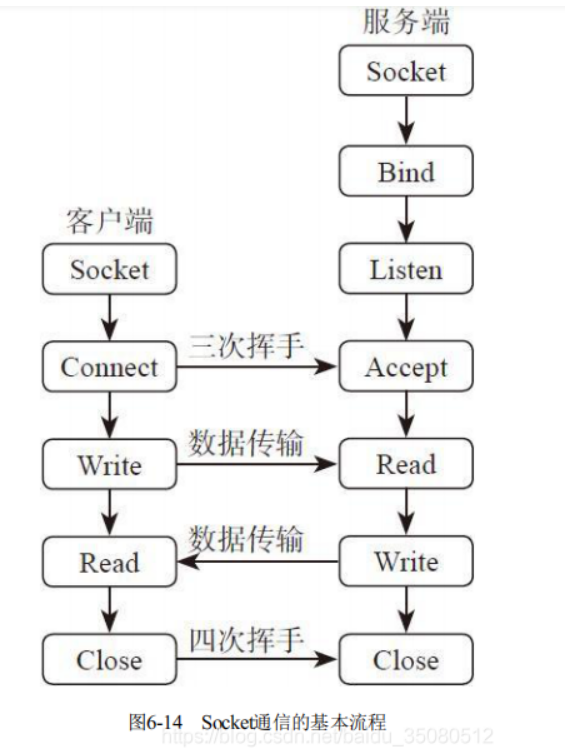
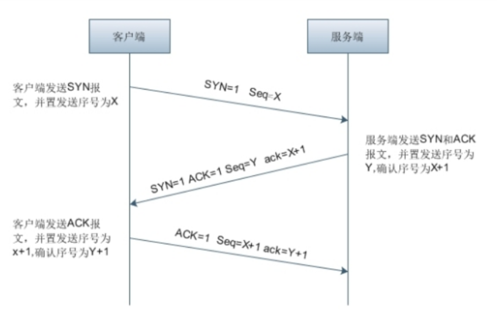
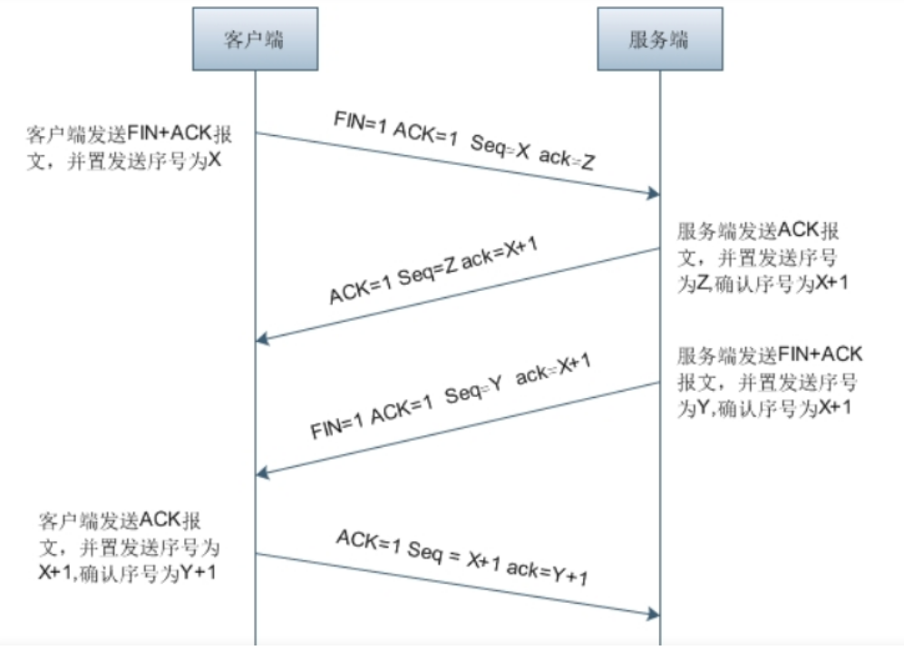

# 飞思Unity

2023年5月24日，山佩歌津，QQ：2426966358

# 2023年5月24日

# 脚本基础和父子关系

## 脚本基础

- 代码名字和类的名字必须一致，不一致将无法挂载代码
- 两种添加代码的形式，第一种直接拖拽到游戏物体上，第二种就是通过add compontent搜索添加
- 一个项目中，至少有一个场景
  - ​	游戏物体：GameObject,指的就是场景中的游戏对象，hierarchy面板上所有的可见或不可见的游戏物体


## 父子关系

- 父子级关系：当一个游戏物体拖到另一个游戏物体的下面，这两个物体就组成了父子关系
  特点：
  1. 父物体发生变化的时候，子物体会跟随一起变化，因为子物体的位置，旋转，缩放都是相对于父物体的，但是子物体发生变化时，父物体不受影响
  2. 一个父物体可以有多个子物体，但是一个子物体只能有一个父物体，满足树状结构，最上层的叫做根节点

## 查找游戏对象

无父子关系的查找

- GameObject.Find("查找游戏物体的名字")
- 优点：
  1. 当hierarchy面板上有多个相同名字时，查找到是最后创建的游戏物体
  2. 尽量填写完整的查找路径，可以减少查找范围，减少查找时间，递归查找
- 缺点：
  1. 无法查找隐藏对象，隐藏对象包括查找路径上的任何一个节点的隐藏
  2. 当路径或者结构发生变化时，需要重新定位查找路径
- GameObject.FindGameObjectWithTag（“标签名字”）:通过标签查找

有父子关系查找

是必须挂载在要查找的父节点上,路径必须完整，是可以查找到隐藏游戏物体的。

- transform.Find("游戏物体的名字")
- 在hierarchy上渲染的顺序，越在下面越后渲染，显示在越前面
- SetAsFirstSibling:设置该物体为父物体下第一个子物体
- SetAsLasttSibling：设置该物体为父物体下最后一个子物体
- SetSiblingIndex：设置该物体为父物体下第index个子物体 其中index从0开始

# 代码

```C#
public class Test : MonoBehaviour
{

    // Use this for initialization
    void Start()
    {
        //Debug.Log(GameObject.Find("Cube/Sphere").transform.position);
        //Debug.Log(GameObject.FindGameObjectWithTag("sphere").transform.position);
       // Debug.Log(transform.Find("Quad/Sphere").position);
        //Debug.Log(transform.Find("../..").name);//查找父节点
        //Debug.Log(transform.root.name);//查找根节点
        //Debug.Log(transform.parent.parent.GetComponent<BoxCollider>().size);//获取某个游戏物体上的组件，通过GetComponent获取，除了Transform组件不需要获取，其他所有组件的操作都需要先获取到对应的组件
        //Debug.Log(transform.parent.parent.GetComponent<Transform>().position);

        //将sphere设置为quad的子节点
        GameObject sphere = GameObject.Find("Sphere");
        GameObject quad = transform.Find("Quad").gameObject;//脚本挂载在cube上
       // GameObject quad = GameObject.Find("Cube/Quad");//脚本挂载在其他物体上（camera）
        //sphere.transform.parent = quad.transform;
        //sphere.transform.SetParent(quad.transform);
        sphere.transform.parent = transform;
        //sphere.transform.SetAsFirstSibling();
        sphere.transform.SetSiblingIndex(2);
    }

    // Update is called once per frame
    void Update()
    {

    }
}
```

# 2023年5月25日

# 脚本基础

- Unity中所有要挂载到游戏对象上的脚本必须继承MonoBehavior(直接继承和间接继承)
- 凡是继承了MonoBehavior的类是不能new对象的，只有不继承monobehavior才能用new实例化

继承链：MonoBehavior->behavior->component->object

# Unity基础类

- 宏观控制类
  1. 应用程序类：Application
  2. 输入类：Input
  3. 图形类：GUI,UGUI
  4. 物理引擎类：Physics
  5. 资源类：Resources
  6. 时间类：Time
- 游戏对象类
  - GameObject
- 组件类
  - Component
- 资源管理类
  - Resources

# 九大生命周期函数

- 名称                       触发时机                    用途

 * Awake                    脚本实例被创建时调用          用于游戏对象初始化
 * OnEnable                 当对象变为激活状态时调用       -
 * Start                    在update第一次调用前执行      用于游戏对象初始化
 * FixedUpdate              每隔固定物理时间间隔调用0.02  用于物理状态更新
 * Update                   每一帧调用                    用于更新游戏场景状态
 * LateUpdate               每一帧调用，是在update之后    用于更新游戏场景状态，摄像机跟随
 * OnGUI                    渲染和处理GUI事件              -
 * OnDisable                当对象变为不激活状态时调用     -
 * OnDestroy                当对象变被销毁时调用           -

当有多个脚本挂载在同一个游戏物体上时，后挂载的先执行。

无论多个脚本的执行顺序如何，一定是所有脚本的awake函数一定会比所有的start函数先执行完。其他生命周期函数也是类似的。

自定义脚本执行顺序

excution order:值越小越先执行，值越大越后执行

预制体：预先制作好的游戏物体

# 代码

```C#
public class ScriptsTest : MonoBehaviour
{
    //public GameObject spherePrefab;
    private GameObject spherePrefab;
    void Awake()
    {
        //GameObject sphere = GameObject.Instantiate(spherePrefab);//实例化游戏物体
        //GameObject sphere = GameObject.Instantiate(spherePrefab, transform);//实例化游戏物体并设置父节点
        //GameObject sphere = GameObject.Instantiate(spherePrefab, transform.position, transform.rotation);//实例化游戏物体并设置位置和旋转
       // sphere.transform.parent = transform;

        //通过Resources类进行加载 ，文件夹的名字必须为Resources  缺点：打包的时候，保存在resources文件夹中的所有数据将被打进游戏包中
        spherePrefab = Resources.Load<GameObject>("Prefab/Sphere");
        GameObject.Instantiate(spherePrefab, transform);
    }
    void OnEnable()
    {
        Debug.Log("OnEnable");

    }
    // Use this for initialization
    void Start()
    {
        Debug.Log("Start");

    }
    void FixedUpdate()
    {
        Debug.Log("FixedUpdate");

    }
    // Update is called once per frame
    void Update()
    {
        Debug.Log("Update");

    }
    void LateUpdate()
    {
        Debug.Log("LateUpdate");

    }
    void OnGUI()
    {
        Debug.Log("OnGUI");

    }
    void OnDisable()
    {
        Debug.Log("OnDisable");

    }
    void OnDestroy()
    {
        Debug.Log("OnDestroy");

    }
}
```

代码名字和类的名字必须一致，不一致将无法挂载代码

两种添加代码的形式，第一种直接拖拽到游戏物体上，第二种就是通过add compontent搜索添加。

一个项目中，至少有一个场景

# 坐标、坐标系转换

每一个游戏物体都有他的世界坐标和本地坐标，当没有父子关系时，本地坐标和世界坐标相等

当有父子关系时，本地坐标和世界坐标不同

计算子物体的世界坐标=父物体的世界坐标+子物体的本地坐标 

屏幕坐标 主要是用于鼠标交互
以屏幕左下角为原点建立的一个二维坐标系，屏幕左下角为(0,0),右上角（screen.width,screen.height）

视口坐标：以摄像机屏幕左下角为原点建立的一个二维坐标系，左下角为（0,0），右上角（1,1）

## 坐标系转换

- 屏幕坐标转世界坐标 
  Camera.main==Gamobject.FindGameObjectWithTag("MainCamera")
  Vector3 Camera.main.ScreenToWorldPoint(new Vector3(screenPosX,screenPosY,zInfo))
- 世界坐标转屏幕坐标
  Vector3 Camera.main.WorldToScreenPoint(new Vector3(worldPosX,worldPosY,worldPosZ))
- 世界坐标转视口坐标
  Vector3 Camera.main.WorldToViewportPoint(new Vector3(worldPosX,worldPosY,worldPosZ))
- 视口坐标转世界坐标
  Vector3 Camera.main.ViewportToWorldPoint(new Vector3(viewportPosX,viewportPosY,ZInfo))
- 视口坐标转屏幕坐标
  Vector3 Camera.main.ViewportToScreenPoint(new Vector3(viewportPosX,viewportPosY,ZInfo))
- 屏幕坐标转视口坐标
  Vector3 Camera.main.ScreenToViewportPoint(new Vector3(screenPosX,screenPosY,zInfo))

# 组件基础

组件：把所有需要提供给游戏对象的基础功能都独立成单独的模块，一个具体的游戏对象可以将它所需要的功能模块组合到一起

GameObject:作为一个Component容器存在,没有其他的功能

所有的功能都是通过组合Component实现的，脚本本身也是一个Component,在物理层面上是并行关系，但是实际中是有逻辑先后关系

## 基本组件

1. 引擎的基础组件
   物理引擎组件，声音组件，渲染组件等，这些组件实现了所有引擎所提供的基础功能
2. 模块功能组件
   通过脚本实现的一些相对独立的通用的模块功能组件
3. 高层胶水代码组件
   将引擎基础组件和模块功能组件组合到一起实现最终的游戏功能

组件组成游戏对象的部分，决定这游戏对象的功能，每一种组件都代表对象有一种功能

### Transform组件:

任何一个GameObject都有Transform组件，该组件决定了物体的位置，旋转，缩放

旋转：欧拉角 四元数  矩阵

### audioSource组件

- AudioSource:音频组件
- AudioClip:声音片段，可对其直接赋值声音文件
- Output：音源输出
- Mute：是否静音
- Bypass Effects:音源滤波开关，是否打开音频特效
- Bypass Listener Effe:监听滤波开关 
- Bypass Reverb Zone:回音混淆开关，当勾选时，不执行回音混淆
- Play On Awake:开机自动播放
- Loop:循环播放
- Priority:播放优先级
- Volume:音量大小,范围0到1。
- Pitch:播放速度，范围-3到3。
- Stereo Pan:声道占比
- Spatial Blend:空间混合
- Reverb Zone Mix:回音混合
- 3D Soungd Settings：3d声音设置，一般是不用

## rigidbody组件 刚体

- Mass：质量。数值越大物体下落越快

- Drag：阻力，数值越大物体反向加速度越大

- Angular Drag：角阻力，数值越大自身旋转的速度减慢的越快

- Use Gravity：是否使用重力

- Is Kenematic：是否受物理的影响

- Interpolate：设置图像差值

  1. 默认为none，由于图形更新比物理更新要快，可能会导致物体跳跃式前进。
  2. Interpolate模式：物体会根据上一帧物体的位置进行平滑运动。
  3. Extrapolate模式：物体会根据下一帧物体的位置进行平滑运动

- Collision Detection：碰撞检测
  对于高速运动的物体来说，当Collision Detection为默认的Discrete时，有可能存在一种情况：前一帧时，物体在碰撞器的一边，下一帧时，物体也已经穿越了碰撞器达到了另一边，以致于检测不到碰撞。这时，我们就需要连续碰撞检测。

  1. Discrete：非连续型检测模式（默认）

  2. Continuous：连续检测。
     更加精细的碰撞检测，但是很耗资源；在这种状态下，当这个刚体与其他普通刚体碰撞时，仍将使Discrete的碰撞检测，但是与没有刚体的Mesh Collider碰撞时就会连续检测了。

  3. Continuous Dynamic：连续动态检测。
     对没有刚体的Mesh Collider或是对处在Continuous或是Continuous Dynamic状态下的刚体使用连续碰撞检测，对其他的刚体使用普通的Discrete检测。

     Continuous和Continuous Dynamic的区别在于对Continuous使用何种检测 ,Continuous使用Discrete,而Continuous Dynamic使用Continuous。但它们对物理性能都有很大影响。

  4. 刚体和刚体之间的连续碰撞检测，刚体的碰撞器必须是BoxCollider或SphereCollider或CapusleCollider.

  5. 刚体和非刚体(静态碰撞器)之间的连续碰撞检测，刚体的碰撞器必须是BoxCollider或SphereCollider或CapusleCollider，非刚体的碰撞器必须是Mesh

- Constraints：冻结，停止某个轴向感应物理引擎的效果

  1. Freeze Position:冻结x轴方向，y轴方向，z轴方向
  2. Freeze Rotation:冻结x轴旋转，y轴旋转，z轴旋转

## Collider组件

- Mesh Collider参数
- Convex：凸起，勾选后，与其它基本碰撞体发生碰撞
  1. Inflate Mesh：网格膨胀，它有效地扩展了源数据的边缘宽度和斜切锋利的边缘，使所得网格适合物理更好，将此设置为true可以降低碰撞网格的精度
  2. Skin Width：皮肤厚度，一个合理的设定是使该值等于半径（Radius）的10%
- Is Trigger：触发器
- Material：材质，引用何种物理材质决定了和其他对象如何作用
- Mesh：网格，获取对象的网格并将其作为碰撞体

## Capsule Collider参数

- Edit Collider：点击之后可编辑碰撞范围
- Is Trigger：触发器
- Material：材质
- Center：碰撞体在对象局部坐标空间中的位置
- Radius：碰撞体局部坐标宽度的半径
- Height：碰撞体的总高度
- Direction：对象局部坐标空间中胶囊纵向方向的轴

## Camera参数

- Clear Flags:背景显示内容。
  1. SkyBox: 默认是天空盒子,这个在设置中是可以修改的，lighting/Scene/skybox
  2. Solid Color：纯色，选择此选项显示background颜色
  3. Depth Only：仅深度，用于游戏对象不希望被裁减的情况
  4. Don't Clear:不清除，不清除任何颜色或深度缓存，其结果是，每一帧渲染的结果叠加在下一帧之上,一般与自定义的shader使用
- Background:背景显示颜色。没有天空盒子将显示这个颜色。
- Culling Mask:用于选择是否显示某些层，默认是Everything
- Projection:摄像机的类型（投射方式）。
  1. Perspective：透视，摄像机将用透视的方式来渲染游戏对象
  2. Orthographic：正交，摄像机将用无透视的方式来渲染游戏对象
  3. Size：大小，用于控制正交模式摄像机的视口大小 
- Field Of View：视野范围，用于控制摄像机的视角宽度以及纵向的角度尺寸
- Clipping Planes:剪裁平面。摄像机的渲染范围，Near为最近的点，Far为   最远的点
- Viewport Rect:视图矩形。用四个数值来控制摄像机的视图绘制在屏幕的位置和大小，使用的是屏幕坐标系，数值在0~1之间。坐标系原点在左下角。
- Depth:深度。用于控制摄像机的渲染顺序，较大值的摄像机将被渲染在较小值的摄像机之上
- Rendering Path:渲染路径。用于指定摄像机的渲染方法。
  1. Use Graphics Settings:选择图形设置中的方法
  2. Forward:快速渲染，传统的渲染路径，它支持每个像素的光照及平行光（directional light）的实时阴影
  3. Deferred:延迟渲染，会准确如实地渲染光照和阴影。如果有许多实时光照，最适合它，需要一定程度的硬件支持，不支持移动设备
  4. Legacy Vertex Lit:顶点光照，摄像机将对所有的游戏对象座位顶点光照对象来渲染
  5. Legacy Deferred(light prepass):具有最低照明保真度和不支持实时阴影的渲染路径。它是前向渲染路径的子集。
     在使用正投影时不支持延迟渲染。如果相机的投影模式被设置为正交，则这些值被重写，并且相机将总是使用快速渲染。
- Target Texture:目标纹理,用于将摄像机视图输出并渲染到屏幕。
- Occlusion Culling:遮挡剔除
- HDR:高动态光照渲染，用于启用摄像机的高动态范围渲染功能，因为人眼对的范围的光照强度更为敏感，所有用高动态范围渲染能让场景变得更为真实，光照的变化不会显得太突兀。
- Target Display:目标显示

## Directional light参数

- Type：光源类型，可选择不同光源
- Baking：用于烘焙模式的，在Lighting面板下点击Bake进行烘焙光照贴图时，生成对应的反射贴图
- Color：光照的颜色
- Intensity：光照强度
- Bounce Intensity：放射光的光照强度
- Shadow Type：光源投射的阴影类型
- Cookie：一个遮罩，使光线在不同的地方有不同的亮度。如果灯光是聚光灯或方向光,这必须是一个2D纹理。如果灯光是一个点光源，它必须是一个立方图（Cubemap）
- Cookie Size：缩放Cookie投影。只用于方向光。
- Draw Halo：是否在点光源中使用白雾效果
- Flare：设置光源粒子效果
- Render Mode：光源渲染模式
- Culling Mask：通过层可设置某些地图层不受光照影响

## Point light参数

点光源，和平行光没有太大的区别，唯一的就是多了一个Range参数，这个表示的是点光源照射的范围

## Spot Light参数

聚光灯，和平行光没有太大的区别，唯一的就是多了一个Range参数和Spot Angle，这个表示的是手电筒照射的范围,后者表示手电筒照射的角度

## Area Light参数

区域光，和平行光没有太大的区别，唯一的就是多了一个Height参数和Width,表示区域的高度和大小

# Layer

层级只有32个，不能随意添加

# 代码

```C#
public class Test : MonoBehaviour
{

    // Use this for initialization
    void Start()
    {
        //Debug.Log(GameObject.Find("Cube/Sphere").transform.position);
        //Debug.Log(GameObject.FindGameObjectWithTag("sphere").transform.position);
       // Debug.Log(transform.Find("Quad/Sphere").position);
        //Debug.Log(transform.Find("../..").name);//查找父节点
        //Debug.Log(transform.root.name);//查找根节点
        //Debug.Log(transform.parent.parent.GetComponent<BoxCollider>().size);//获取某个游戏物体上的组件，通过GetComponent获取，除了Transform组件不需要获取，其他所有组件的操作都需要先获取到对应的组件
        //Debug.Log(transform.parent.parent.GetComponent<Transform>().position);

        //将sphere设置为quad的子节点
        //GameObject sphere = GameObject.Find("Sphere");
        //GameObject quad = transform.Find("Quad").gameObject;//脚本挂载在cube上
       // GameObject quad = GameObject.Find("Cube/Quad");//脚本挂载在其他物体上（camera）
        //sphere.transform.parent = quad.transform;
        //sphere.transform.SetParent(quad.transform);
        //sphere.transform.parent = transform;
        //sphere.transform.SetAsFirstSibling();
        //sphere.transform.SetSiblingIndex(2);

        //物体的世界坐标和本地坐标
        //Debug.Log(transform.position);
        //Debug.Log(transform.localPosition);
        
        //x轴的正方向（1,0,0）
        //Debug.Log(Vector3.right);
        //Debug.Log(new Vector3(1, 0, 0));
        ////x轴的负方向（-1,0,0）
        //Debug.Log(Vector3.left);
        //Debug.Log(new Vector3(-1, 0, 0));
        ////y轴的正方向（1,0,0）
        //Debug.Log(Vector3.up);
        //Debug.Log(new Vector3(0, 1, 0));
        ////y轴的负方向（1,0,0）
        //Debug.Log(Vector3.down);
        //Debug.Log(new Vector3(0, -1, 0));
        ////z轴的正方向（0,0,1）
        //Debug.Log(Vector3.forward);
        //Debug.Log(new Vector3(0, 0, 1));
        ////z轴的负方向（0,0,-1）
        //Debug.Log(Vector3.back);
        //Debug.Log(new Vector3(0, 0, -1));
        ////坐标原点
        //Debug.Log(Vector3.zero);
        ////单位坐标
        //Debug.Log(Vector3.one);

        //Debug.Log(transform.position);
        //Debug.Log(transform.localScale);
        //Debug.Log(transform.rotation);//四元数
        //Debug.Log(transform.localEulerAngles);
    }

    // Update is called once per frame
    void Update()
    {

    }
}
```

# 2023年6月1

# 摄像机模拟第一人称和第三人称

```C#
using System.Collections;
using System.Collections.Generic;
using UnityEngine;

/*
 * 第一人称摄像机
 * 
 * 第三人称摄像机
 * 
 * 线性差值 Lerp(a,b,t)//从a变化到b按照t的比例进行 最终结果=((b-a)*t)+a
 * 
 * 作业：
 * 1.第三人跟随视角采用插值实现
 * 2.实现两点之间的巡逻 间隔3秒后往返
 * 
 */
public class CameraTest : MonoBehaviour
{

    private float mouseSpeed = 5;
    private Vector3 rot;
    public GameObject player;

    private Vector3 offsetPosition;

    //实现渐变效果
    public Color colorStart = Color.red;
    public Color colorEnd = Color.blue;
    private float time = 1f;
    private Renderer render;

    // Use this for initialization
    void Start()
    {
        render = this.GetComponent<Renderer>();
        //transform.LookAt(player.transform);//看下某个点
        //offsetPosition = transform.position - player.transform.position;//摄像机坐标-人物的坐标，得到两者之间的差值
    }

    // Update is called once per frame
    void Update()
    {
        //lerp
        Debug.Log(Time.time);
        float lerp = Mathf.PingPong(Time.time, time) / time;
        render.material.color = Color.Lerp(colorStart, colorEnd, lerp);
        //Debug.Log(Mathf.Lerp(0.0f, 100.0f, 0.1f));

        //控制第一人称摄像机的视野变换
        //float mouseX = Input.GetAxis("Mouse X") * mouseSpeed;
        //float mouseY = Input.GetAxis("Mouse Y") * mouseSpeed;
        //rot.x -= mouseY;
        //rot.y += mouseX;
        //rot.z = 0;
        //transform.eulerAngles =rot;
        //player.transform.eulerAngles = new Vector3(0, rot.y, 0);

        //第三人称自由视角
        if (Input.GetMouseButton(1))
        {
            float mouseX = Input.GetAxis("Mouse X") * mouseSpeed;
            float mouseY = Input.GetAxis("Mouse Y") * mouseSpeed;
            rot.x -= mouseY;
            rot.y += mouseX;
            rot.z = 0;
            //transform.eulerAngles = rot;
            transform.rotation = Quaternion.Euler(rot.x, rot.y, rot.z);//将欧拉角转换为四元数
        }
        transform.Translate(Vector3.forward * Input.GetAxis("Mouse ScrollWheel") * 50 * Time.deltaTime);
    }
    void LateUpdate()
    {
        //第三人跟随视角
        //transform.position = player.transform.position + offsetPosition;
    }
}

```

# Input输入相关

输入设备有： \*键盘，鼠标，触摸，游戏摇杆

## Input类

常用字段

- name:轴的名称，用于游戏加载界面和脚本中
- descriptive name:描述名称，轴的正向按键的详细描述
- descriptive negative name:轴的反向按键的详细描述
- negative button:该按钮用于在负方向移动轴
- positive button:该按钮用于在正方向移动轴
- alt negative button:备用按钮，用于在负方向移动轴
- alt positive button:备用按钮，用于在正方向移动轴
- gravity:输入复位的速度
- dead:模拟死区大小，任何小于该值的输入值（不论正负值）都会被视为0，通常用于摇杆
- sensitivity:灵敏度，该值越大响应时间越快
- snap:捕获，当获取到相反信号时，轴的数值为立即置为0
- invert:反向，可以让正向按钮发送负值，负向按钮发送正值
- type:控制轴的输入设备类型

输入检查函数

- GetKey:获取键盘指定按键是否按下（只要按下就是true，抬起才为false）持续性的动作
- GetKeyDown:获取键盘指定按键是否按下（按下的一瞬间为true）
- GetKeyUp:获取键盘指定按键是否抬起（抬起的一瞬间为true）
- anyKey:获取键盘上任意按键是否按下（只要按下就是true，抬起才为false）
- anyKeyDown:获取键盘上任意按键是否按下（按下的一瞬间为true）

移动平台输入

- multiTouchEnabled:是否启用多点触摸
- simulateMouseWithTouches:是否启用仿真鼠标的操作
- touchCount:在当前帧中触摸的数量
- touches:在上一帧中触摸点的信息
- touchSupported:当前设备是否支持触摸
- GetTouch:根据触摸点的索引获取触摸点的信息
- TouchPhase:触摸点的状态信息

鼠标相关

0:鼠标左键  1:鼠标右键  2：鼠标中键

- GetMouseButton：获取鼠标指定键是否按下（只要按下就是为true,抬起才为false）
- GetMouseButtonDown:获取鼠标指定键是否按下（只有按下的一瞬间为true）
- GetMouseButtonUp:获取鼠标指定键是否抬起（只有抬起的一瞬间为true）
- mousePosition：获取鼠标的位置
- mouseScollDelta：获取鼠标滚轮

轴输入检测

- GetButton("按键的名称"):获取键盘指定按键是否按下（只要按下就是true，抬起才为false）
- GetButtonDown:获取键盘指定按键是否按下（按下的一瞬间为true）
- GetButtonUp:获取键盘指定按键是否抬起（抬起的一瞬间为true）
- GetAxis:获取键盘的输入，返回的是float类型，做平滑移动的效果
- GetAxisRaw:-1,0,1，通常用于变化即时性要求非常的情况

# 20223年6月8日

# 射线检测

射线：射线是3D世界中一个点向一个方向发射一条无终点的先，在发射的轨迹中与其他物体发生碰撞时，将停止发射

Ray：射线类

Ray  Camera.main.ScreenPointToRay(Vector3 pos):返回一条射线Ray， 从摄像机的近口点到屏幕上指定的点

Ray  Camera.main.ViewportPointToRay(Vector3 pos):返回一条射线Ray, 从摄像机的近口点到视口指定的一个点

RaycastHit:射线投射信息类

用途：碰撞检测（射击类游戏中子弹是否打中敌人），角色的移动，判断是否触碰到3d世界中的游戏物体,鼠标拣选

只要发出的射线与带有碰撞盒的物体，都会发生碰撞并且可以返回各种信息，比如碰撞物体的位置，名字，坐标等，自定义射线发出的距离，影响的图层

# 材质、贴图、纹理

纹理，贴图，材质

材质包含贴图，贴图包含纹理

纹理本质就是一张图

纹理(texture)：是unity最基础的图片形式

贴图（map）:就是把纹理通过uv坐标映射到3d物体表面，贴图具有uv坐标属性，而纹理是没有

材质（material）:将输入的贴图或颜色，加上对应的shader,以及shader所指定的参数设置等，将这些合并在一起就是一个材质，然后将这个材质放到渲染器中进行渲染，如果多个模型引用同一个材质球，如果其中一个材质球发生变化，那么引用这个材质球的所有模型都将发生变化

# 代码

```C#
public class RayTest : MonoBehaviour
{
    private float moveSpeed = 0;
    private RaycastHit hitInfo;
    private Vector3 endPoint;
    // Use this for initialization
    void Start()
    {

    }

    // Update is called once per frame
    void Update()
    {
        //Ray ray = Camera.main.ScreenPointToRay(Input.mousePosition);
        //Debug.DrawRay(ray.origin, ray.direction * 10000f, Color.red);
        //RaycastHit[] hit = Physics.RaycastAll(ray, Mathf.Infinity, 1 << LayerMask.NameToLayer("player"));//0:不使用该层，1：使用该层 LayerMask:32个层 
        //if (hit.Length>0)
        //{
        //    for (int i = 0; i < hit.Length; i++)
        //    {
        //        Debug.Log("检测到物体：" + hit[i].collider.name);
        //    }
        //}
        //RaycastHit hitInfo;
        //bool isCollider = Physics.Raycast(ray,out hitInfo);
        //if (isCollider)
        //{
        //    Debug.Log("发生碰撞:" + hitInfo.distance + "    " + hitInfo.point + "    " + hitInfo.collider.name);
        //}

        //相交球  拾取物体
        //Collider[] col = Physics.OverlapSphere(transform.position, 3, 1 << LayerMask.NameToLayer("player"));
        //if (col.Length > 0)
        //{
        //    foreach (Collider item in col)
        //    {
        //        Debug.Log("检测到的物体：" + item.name);
        //    }
        //}

        //鼠标拣选
        //if (Input.GetMouseButtonDown(0))
        //{
        //    Ray ray = Camera.main.ScreenPointToRay(Input.mousePosition);
        //    RaycastHit hitInfo;
        //    if (Physics.Raycast(ray,out hitInfo))
        //    {
        //        Debug.DrawRay(ray.origin, hitInfo.point, Color.red);
        //        Debug.Log("坐标：" + hitInfo.transform.position);
        //        Debug.Log("点：" + hitInfo.point);
        //        Debug.Log("碰撞盒：" + hitInfo.collider);
        //        Debug.Log("法线：" + hitInfo.normal);
        //        Debug.Log("纹理坐标：" + hitInfo.textureCoord);

        //    }
        //}
        //点击cube，在该位置生成一个sphere
        //if (Input.GetMouseButtonDown(0))
        //{
        //    Ray ray = Camera.main.ScreenPointToRay(Input.mousePosition);
        //    RaycastHit hitInfo;
        //    if (Physics.Raycast(ray, out hitInfo))
        //    {
        //        if (hitInfo.collider.name=="Cube")
        //        {
        //          GameObject go=  GameObject.Instantiate(Resources.Load<GameObject>("Prefab/Image"));
        //          go.transform.position = new Vector3(2, 2, 2);
        //        }
        //    }
        //}

        //点击地面，控制人物移动
        if (Input.GetMouseButtonDown(0))
        {
            Ray ray = Camera.main.ScreenPointToRay(Input.mousePosition);

            if (Physics.Raycast(ray, out hitInfo))
            {
                if (hitInfo.collider.name == "Plane")
                {
                    endPoint = new Vector3(hitInfo.point.x, transform.position.y, hitInfo.point.z);
                    transform.LookAt(endPoint);
                    moveSpeed = 5;
                }
            }
        }
        if (Vector3.Distance(transform.position, hitInfo.point) < 1f)
        {
            moveSpeed = 0;
        }
        transform.Translate(transform.forward * moveSpeed * Time.deltaTime, Space.World);
    }
}
```


# 2023年7月3日

# Animation和Animator

animation:如果只是控制一个动画的播放我们采用animation组件

animator:如果是很多动画之间相互转换时则使用animator组件

两者的区别：animator组件有一个动画控制器（俗称动画状态机），用它来控制动画切换非常方便但是占用内存比aniamtion大

## animation:

animation clip:动画片段，存储的基于关键帧的动画，

animation:当游戏运行时需要进行自动播放时的默认动画

animations:存储所有的动画片段，是可以从脚本访问的一系列动画

play automatically:游戏运行时，是否自动播放动画

animate physics:动画是否参与物理交互

culling type:剔除类型（确定不播放动画的时间）

1. always animate:始终播放动画
2. based on renderers:基于默认动画进行剔除

## animator:

controller:动画状态控制机

avatar:模型

apply root motion:应用动画本身还是从脚本控制角色位置

update mode:动画更新的模式

normal:正常模式

animate physics:动画是否参与物理交互

unscaled time:不受时间缩放影响

帧事件：通过animator窗口add event添加

帧动画：通过拖入多个帧形成动画

## 代码

```C#
public class AnimationTest : MonoBehaviour
{
	//Animator和Animatoion组件
    private Animation animation;
    private Animator animator;
    //精灵渲染器组件
    private SpriteRenderer sr;
    public Sprite[] sprites;
    private float time;
    private int index;
    // Use this for initialization
    void Start()
    {
        //获取组件
        //animation = this.GetComponent<Animation>();
        //animator = this.GetComponent<Animator>();
        sr = this.GetComponent<SpriteRenderer>();
    }

    // Update is called once per frame
    void Update()
    {
        //AnimatorAPI
        //if (Input.GetKeyDown(KeyCode.A))
        //{
        //    animation.Play("MoveAni");
        //}
        //else if (Input.GetKeyDown(KeyCode.Q))
        //{
        //    animation.Play("ScaleAni");
        //}
        //else if (Input.GetKeyDown(KeyCode.W))
        //{
        //    animation.Stop("MoveAni");
        //}
        //if (Input.GetKeyDown(KeyCode.A))
        //{
        //    animator.SetTrigger("value4");
        //}
        //else if (Input.GetKeyDown(KeyCode.W))
        //{
        //    animator.SetFloat("value", 1);

        //}
        time += Time.deltaTime;
        //for (int i = 0; i < sprites.Length; i++)
        {
            if (time > 0.1f)
            {
                sr.sprite = sprites[index];
                time = 0;
                index++;
                if (index>=sprites.Length)
                {
                    index = 0;
                }
            }
        }
    }
    //动画参数传递时，三者只能传一个
    //animator组件与脚本是挂载在同一个游戏物体上的
    //object是可以指定预制体的
    public void TestAni(string str, float a, int b)
    {
        Debug.Log("帧事件" + str + a + b);
    }
}
```

# 协程

## 什么是协程？

协程：在主程序运行的时候，开启另外一段逻辑来协助当前程序的执行

Unity协程是一个能够暂停程序执行，暂停后立即返回主函数，继续执行主函数的剩余部分，直到中断指令完成后，从中断指令的下一行继续执行协程剩余的函数，函数体全部执行完，协程结束，由于中断指令的存在，使得可以将一个函数分割到多个帧里面去执行。

## 启动关闭协程

### 启动协程API

第一种形式：

- `StartCoroutine(MethodName());`
- `StartCoroutine(MethodName(参数列表));`

第二种形式：

- `StartCoroutine("MethodName");`
- `StartCoroutine("MethodName",参数列表);`

### 关闭协程

- `StopAllCoroutines():关闭所有的协程`
- `StopCoroutine(IEnumerator);`
- `StopCoroutine("MethodName");`

## 协程对于生命周期函数，各个协程返回值的含义

### 协程对于生命周期函数

Awake->FixedUpdate->yield WaitForFixedUpdate->Update->Yield null->yield WaitForSeconds->Yield WWW->yield StartCoroutine->yield waitforendofframe

### 不同的yield return返回值含义

- Yield null:协程在下一帧所有脚本的update执行完后再继续执行
- yield WaitForSeconds：协程在延迟指定时间，且当前帧所有脚本的update全部执行结束后才执行
- Yield WWW:协程在www下载资源完成后再继续执行
- yield StartCoroutine：协程在指定协程执行结束后再继续执行
- waitforendofframe：在当前帧执行结束后且所有脚本的update执行完后再继续执行
- WaitForSecondsRealtime与WaitForSeconds类似，但是不受时间缩放影响

### 协程执行顺序：

开始协程-》执行协程-》遇到中断指令，中断协程-》返回上层函数继续执行上层函数的下一行代码-》中断指令结束，继续执行中断指令后的代码-》协程结束

# 碰撞检测相关

碰撞器是触发器的载体，触发器是碰撞器的属性

碰撞的必要条件：双方带有collider，其中运动的一方带有刚体
触发的必要条件：双方带有collider，其中一方需将istrigger勾选，其中运动的一方带有刚体

## 碰撞触发三阶段的生命周期函数

碰撞

- OnCollisionEnter(Collision col):当进入碰撞器时
- OnCollisionStay(Collision col):当持续碰撞时
- OnCollisionExit(Collision col):当离开碰撞器时

触发

- OnTriggerEnter(Collider col):当进入触发器时
- OnTriggerStay(Collider col):当持续触发时
- OnTriggerExit(Collider col):当离开触发器时

## 代码

```C#
public class IenumeratorTest : MonoBehaviour
{

    private SpriteRenderer sppriteRender;
    public Sprite[] sprites;
    private int index;
    private bool canExcute = true;
    // Use this for initialization
    void Start()
    {
       // sppriteRender = this.GetComponent<SpriteRenderer>();
        //StartCoroutine(PlayAni());
       // StartCoroutine("TestIenumerator");
    }

    IEnumerator PlayAni()
    {
        while (true)
        {
            sppriteRender.sprite = sprites[index];
            index++;
            yield return new WaitForSeconds(0.01f);
            if (index >= sprites.Length)
            {
                index = 0;
            }
        }
    }

    void FixedUpdate()
    {
        if (canExcute)
        {
            Debug.Log("fixedupdate");
        }
    }
    IEnumerator TestIenumerator()
    {
        yield return new WaitForFixedUpdate();
        Debug.Log(string.Format("===>{0} time:{1}", 1, Time.time));
        yield return new WaitForFixedUpdate();
        Debug.Log(string.Format("===>{0} time:{1}", 2, Time.time));
    }

    // Update is called once per frame
    void Update()
    {

    }
    void OnCollisionEnter(Collision col)
    {
        Debug.Log("当进入碰撞器");
    }
    void OnCollisionStay(Collision col)
    {
        Debug.Log("当持续碰撞器");
    }
    void OnCollisionExit(Collision col)
    {
        Debug.Log("当离开碰撞器");
    }
    void OnTriggerEnter(Collider col)
    {
        Debug.Log("当进入触发器：" + col.name);
    }
    void OnTriggerStay(Collider col)
    {
        Debug.Log("当持续触发器：" + col.name);
    }
    void OnTriggerExit(Collider col)
    {
        Debug.Log("当离开触发器：" + col.name);
    }
}
```

## 作业

1.使用animator和animation制作动画

2.使用协程输出10组计数，每组5次，每次1秒

# 2023年7月4日

# UGUI-Canvas

负责将UI组件显示在屏幕上，canvas的尺寸就是在屏幕上显示的尺寸

# canvas组件

### render mode:渲染模式

1.screen space-overlay：在场景使用2D画布渲染，2d UI  始终显示在屏幕的前方，摄像机与UI之间没有距离

pixel perfect:ui是否在没有反锯齿的情况下进行精确渲染，勾选后使图像边缘变得更平滑

sort order:画布在排序层中的顺序，当存在多个画布时，值大的会覆盖值小的。

target display:显示目标

2.screen space-camera：使用画布上配置的摄像机进行渲染，ui与摄像机有一定的距离，可以在之间放一些游戏物体或者动画效果

render camera:指定渲染画布的摄像机

plane distance:ui放置在摄像机前面的距离

sorting layer :画布在排序层中的顺序

order in layer:数值越大，画布越靠前

additional shader channel:附加着色通道

# canvas scaler

调整画布中ui元素缩放的比例，达到UI自适应的效果

## ui scale mode:处理ui适配的方式

1. constant pixel size:固定像素大小，无论屏幕分辨率尺寸大小怎么改变，像素都保持不变，只能通过scale factor进行调节
   - scale factor:画布中的ui元素的缩放比例
   - reference pixel per unit:将精灵中的像素设置覆盖ui中的单元
2. scale with screen size:与屏幕尺寸大小保持一致
   - reference resolution:参考分辨率，即当前游戏窗口的分辨率，通常设置需要运行的游戏分辨率
3. screen match mode:如果当前分辨率宽高比不符合参考分辨率时，则用于缩放画布区域的模式
4. match width or height:该模式下，如果当前分辨率比例符合参考分辨率时，无论match值是多少，画布的宽高比都不缩放
   如果match设置为1时，则画布的高度不变，宽度自动缩小，如果match设置为0时，则画布的宽度不变，高度自动缩小
   - expand:水平或垂直展开画布区域，即宽高比不变，画布始终在屏幕中，以屏幕中的高度或宽度的最小值为准，对画布进行自适应
   - shrink:水平或垂直剪裁画布区域，即宽高比不变，画布始终在屏幕中，以屏幕中的宽度或高度的最大值为准，对画布进行自适应
   - constant physics size:使用常量物理尺寸模式，ui元素的位置和大小以物理单位为准，保持物理不变，只看分辨率
5. physics unit:指定位置和大小的物理单位
6. 图像分辨率：每英寸的像素数，以ppi为单位，每一个方向上的总像素量
7. 输出分辨率：描述设备输出图像时每英寸可以产生的点数，以dpi为单位

# graphic raycaster:射线检测组件

其作用是用于获取用于选中的控件，当禁用这个组件时，用户就无法对控件进行操作

ignore reversed graphics:是否忽略控件的正面和反面方向都接收射线检测

blcoking object:屏蔽指定类型的对象不参与射线检测

blocking mask:屏幕对象中指定的层不参与摄像检测

event system:用于负责处理输入，射线检测，以及事件发送，作为整个ugui的事件系统，一个场景只允许一个eventsystem，否则会失效

anchor:锚点 保证在不同分辨下的ui元素保持相同的布局格式

锚框型锚点：保证子物体的尺寸根据锚点设置可以在不同分辨率下跟随父物体尺寸变化，即尺寸自适应，用于不需要考虑拉伸UI元素的，譬如背景图

聚点型锚点：保证子物体在不同分辨率下在父物体下的位置都一致，即位置自适应，适用于需要考虑拉伸并且需要位置固定的元素

# 简单的对象池

```C#
using System.Collections;
using System.Collections.Generic;
using UnityEngine;

//作业：打箱子用对象池实现
public enum BulletType
{
    one,two
}
public class BulletPool : MonoBehaviour
{
    private Dictionary<BulletType, List<GameObject>> bulletDic = new Dictionary<BulletType, List<GameObject>>();
    private List<GameObject> bulletList = new List<GameObject>();
    private int poolCount = 30;
    public GameObject bulletPrefab;
    // Use this for initialization
    void Start()
    {
        InitPool();
    }
    void InitPool()
    {
        for (int i = 0; i < poolCount; i++)
        {
            GameObject go = GameObject.Instantiate(bulletPrefab);
            bulletList.Add(go);
            go.SetActive(false);
        }
    }
    public GameObject GetBullet()
    {
        for (int i = 0; i < bulletList.Count; i++)
        {
            if (!bulletList[i].activeInHierarchy)
            {
                bulletList[i].SetActive(true);
                return bulletList[i];
            }
        }
        //扩容
        GameObject go = GameObject.Instantiate(bulletPrefab);
        bulletList.Add(go);
        return go;
    }
}
```

# Text

轴点（pivot）：为UI元素的参照坐标系的原点

Inspector面板

- text:静态文本即要输入的内容
- font:字体
- font style:字形
- font size:字体大小
- line spaceing:行距
- rich text:富文本 使用不同格式实现不同效果
- alignment:对齐方式
- align by geometry:几何对齐
- horizontal overflow:水平溢出
  1. wrap:文本将自动换行，当达到水平边界
  2. overflow:文本可以超出水平边界，继续显示
- vertical overflow:垂直溢出
  1. truncate:文本不显示超出垂直边界的部分
  2. overflow:文本可以超出垂直边界继续显示
- best fit:最佳适应
- color:文本颜色
- material:渲染文本材质
- raycast target:是否作为射线投射目标，关闭之后忽略ugui的射线检测

# Image

用于显示图片资源的， 1.显示纯色 2.指定图片源，用于图片显示 格式：sprite

- source image:图像源
- color：图片叠加的颜色
- material:图片叠加的材质
- raycast target:是否作为射线投射目标，关闭之后忽略ugui的射线检测
- image type:图片类型
  1. simple:简单模式，图片整张全显示，不裁切，不叠加，根据边框大小进行拉伸
     preserve aspect:针对simple模式，勾选后，无论图片的外形是放大还是缩小，他都会保持初始的长宽比例
  2. sliced:九宫切图模式，对图片进行横向或纵向拉伸，不会拉伸图片的边框效果
  3. tiled:平铺，平铺中间的区域
  4. filled:填充，根据填充方式，填充起点，填充比例决定图片显示哪一部分
     - filled method:填充方式：水平，垂直填充，90度圆，180度圆，360度圆
     - fill origin：填充起点
     - fill amount:填充比例
     - clockwise:是否顺时针填充
- set native size:图形框的尺寸大小设置为我原始像素的尺寸

# RawImage

- rawimage:用来显示非交互的图形组件，一般用于图标
- texture:指定要显示的图片
- color:颜色
- material:材质
- raycast target:是否可以被射线检测到
- UV Rext:用于控制图片按uv坐标显示图片
  - x,y控制uv的左右和上下偏移
  - w,h控制uv的重复次数

rawImage与image区别

1. image是用来交互的组件，rawImage用来显示，不与其他物体产生交互
2. image的图片格式为sprite(2d and ui)，rawImage是任意纹理类型，一般用于图标或者背景图
3. 小地图，头像框

# 作业

1. 打箱子用对象池实现
2. 用text显示时间

# 2023年7月5日

# button组件

ui与用户交互的控件

## 面板参数

- interactable:点击是否有效
- tramsition:状态切换模式
  1. color tint:颜色切换模式
  2. sprite swap:图片切换模式
  3. animation:动画切换模式
- navigation:导航
  1. none:关闭导航
  2. horizontal:水平方向导航到上/下一个控件
  3. vertical:垂直方向导航到上/下一个控件
  4. explicit:指定各方向键所导航到的控件
- visualize:用于在scene模式下显示导航线
- on click:点击事件

# toggle组件

## 面板属性

- isOn:用来控制toggle开关的状态
- graphic:用来控制toggle开关图片的显示/隐藏
- group:用来表示toggle所属开关组
- onValueChange:值改变的时候调用

# dropdown组件

## 面板属性

- template:模板
- caption text:标题文本
- item text:每个子项目的文本
- value:默认是0，当下拉菜单弹出时，第一项默认被勾选
  值是从0开始，当选择了其中一项，再次选择相同项，是不会调用任何函数

# 代码

```C#
public class ButtonTest : MonoBehaviour {

    private Button btn;
    private Toggle toggle;
    private Dropdown dp;

	// Use this for initialization
	void Start () {
        //btn = GameObject.Find("Canvas/Button").GetComponent<Button>();
        //btn.onClick.AddListener(delegate() {
        //    OnClickButton("abc");
        //});

        //toggle = this.GetComponent<Toggle>();
        //toggle.onValueChanged.AddListener(OnValueChanaged);
        dp = GameObject.Find("Canvas/Dropdown").GetComponent<Dropdown>();
        dp.onValueChanged.AddListener(OnDropDownValueChanged);
	}

    private void OnDropDownValueChanged(int arg0)
    {
        switch (arg0)
        {
            case 0:
                Debug.Log("排序数量");
                break;
            case 1:
                Debug.Log("排序强化程度");
                break;
            default:
                break;
        }
    }
	
	// Update is called once per frame
	void Update () {
		
	}
    public void OnClickButton()
    {
        Debug.Log("按钮按下");
    }
    public void OnClickButton(string str)
    {
        Debug.Log("按钮按下"+str);
    }
    public void OnValueChanaged(bool isOn)
    {
        Debug.Log(isOn);
    }
}
```

# inputfield组件

用来管理输入的组件

## 面板属性

- Placeholder：用来提示用户输入的文本框
- text component:用来输入的文本框
- text:文本内容
- character limit:字符限制，可以限制最大字符数的值
- content type:内容类型
  1. standard:标准，可以输入任何字符
  2. auto corrected:自动更正，可以自动更正用户的输入
  3. integer number:整数，只允许输入整数
  4. decimal number:十进制数，仅允许输入数字和小数点后一位
  5. alphanumberic:字母数字，允许字母和数字，无法输入符号
  6. name:名称（支持中文）自动将每个单词的首字母大写
  7. email address:电子邮件地址，允许输入最多包含一个@符号的字母数字字符串
  8. password:密码，用*表示输入的字符串，从而隐藏输入内容
  9. pin:用*号表示输入的字符，只允许输入整数
  10. custom:自定义，允许定义行类型，输入类型，键盘类型和字符验证
- lineType:行类型
  1. single line:单行，只允许文本在一行上
  2. multi line submit:多行自动换行，允许文本使用多行，但是只能在写满后才能换行
  3. multi line newline:多行回车新建行，用户可以随时通过按enter键进行换行输入
- caret blink rate:输入框上的光标的闪烁频率
- caret width:光标的宽度
- custom caret color:光标的颜色
- selection color:选中文本的背景颜色
- hide mobile input:隐藏移动输入内容，仅ios起作用
- read only:只读

# slider:滑动条

一般用来制作血条和进度条

## 面板属性

- fill rect:填充物
- handle rect:滑动手柄
- direction:填充方向
- min value:最小值
- max value:最大值
- whole number:是否为整数
- value:填充的值

> 做血条，经验条，进度条时需要把interctable的勾给取消掉

# scroll bar:滑动条

## 面板属性

- handle rect:用来拖动滑块的图片
- direction:拖动方向
- value:滑块所在位置的值，取值单位0~1
- size:滑块的大小
- number of steps:步长数

# scroll view:滑动列表

- content:需要滚动的内容，其中所有的子物体，都会显示在滚动区域中
- horizontal:是否启动水平滚动
- vertical:是否启动垂直滚动
- movement type:滑动框的运动类型
  1. unrestricted:不受限
  2. elastic:弹性 ，elasticity:弹性模式中的反弹量
  3. clamped:夹紧
- inertia:惯性，拖动结束后会根据惯性继续移动，未设置时会在拖动时移动
- decelertaion rate:减速率，决定停止移动的速度，当为0时立即停止运动，当为1时永不停止
- scroll sensitivity:灵敏度，滚轮时灵敏程度
- viewport:视口，是content父节点
- horizontal scrollbar:底部的水平滚动条
- visibility:能见度，如果显示的内容没有超出viewport的话，就自动隐藏
- spacing:滚动条与视口之间的空间
- vertical scrollbar:竖直滚动条

# 代码

```C#
public class InputFiledTest : MonoBehaviour {

    private InputField inputField;
    private Slider slider;
    private Text countDownText;
    private Scrollbar scrollbar;
    private ScrollRect scrollrect;
	// Use this for initialization
	void Start () {
        //inputField = this.GetComponent<InputField>();
        //inputField.onValueChanged.AddListener(OnInputFieldValueChanged);
        //inputField.onEndEdit.AddListener(OnInputFieldEndEdit);

        //slider = this.GetComponent<Slider>();
        //countDownText = GameObject.Find("Canvas/Text").GetComponent<Text>();
        //slider.onValueChanged.AddListener(OnSliderValueChanged);
        //slider.value = 0;
        //countDownText.text = "0%";
        //scrollbar = this.GetComponent<Scrollbar>();
        //scrollbar.onValueChanged.AddListener(OnScrollbar);
        scrollrect = this.GetComponent<ScrollRect>();
        scrollrect.onValueChanged.AddListener(OnScrollRect);
	}

    private void OnScrollRect(Vector2 arg0)
    {
        Debug.Log("x=" + arg0.x + ",y=" + arg0.y);
    }

    private void OnScrollbar(float arg0)
    {
        Debug.Log(arg0);
    }

    private void OnSliderValueChanged(float arg0)
    {
        Debug.Log(arg0);
    }

    private void OnInputFieldEndEdit(string arg0)
    {
        Debug.Log("OnInputFieldEndEdit:" + arg0);
    }

    private void OnInputFieldValueChanged(string arg0)
    {
        Debug.Log("OnInputFieldValueChanged:" + arg0);
    }
	
	// Update is called once per frame
	void Update () {
        //if (slider.value<100)
        //{
        //    slider.value += Time.deltaTime;
        //    countDownText.text = slider.value.ToString("f1")+"%";
        //}
	}
}
```

# 作业

1. 实现技能CD
2. 实现账号密码匹配后等进度条跑完后进行场景跳转 SceneManagement.LoadScene
3. scrollview实现动态列表生成

#  2023年7月6日

# Navmesh agent

- speed:导航移动速度
- angular speed:转弯速度
- acceleration:加速度
- stopping distance:停止距离，离目的地多远时停下来
- auto braking:自动停止
- radius:控制代理器的半径
- height：控制代理器的高度
- quality：避障质量
- priority:优先级
- auto mesh links off mesh:用于连接不相交区域的导航网格
-  auto repath:自动更新路径
- area mask:区域遮挡

# 2023年7月10日

# JsonUtility

> JsonUtlity是Unity自带的用于解析Json的公共类
>
> 它可以：
>
> 1. 将内存中对象序列化为Json格式的字符串
> 2. 将Json字符反序列化为类对象

使用JsonUtility可以将对象序列化为json文件，将json文件反序列化为对象。

- 序列化使用 `JsonUtility.ToJson(obj)` 方法
- 反序列化使用 `JsonUtility.FromJson<Type>(string)`方法

# 关于序列化的特性和接口

## 特性

- `Serializable`：一般作用于类，将本类标记为可序列化的。
- `NonSerialized`：一般作用于字段，将字段标记为不可序列化的。
- `HideInInspector `: 将原本显示在Inspector窗口上的序列化值隐藏起来。

## 接口

### ISerializationCallbackReceiver

类继承本接口，Unity将调用接口中的函数。

- `public void OnAfterDeserialize()`：反序列化话调用这个方法
- `public void OnBeforeSerialize()`：序列化前调用这个方法

> 注意：需要引用命名空间，UnityEngine

# 2023年7月11日

# UI基础框架

# UIPanelType

使用枚举，定义所有面板的类型

```C#
public enum UIPanelType
{
    Bag,
    System,
    MainMenu,
    Skill,
    Shop,
    Task,
    ItemMessage,
    ReWard
}
```

# UIPanelInfo，UIPanelTypeJson

## UIPanelInfo

可序列化自定义类，用于存储单条面板信息。

继承的接口：`ISerializationCallbackReceiver`，为了将string类型转换为UIPanelType

- `public UIPanelType panelType`：不序列化的字段，存储真正的面板类型
- `public string panelTypeString`：面板类型字符串，需要转换
- `public string path`：面板预制体路径
- `public void OnAfterDeserialize()`：实现接口的函数，在反序列化后调用。这里用作反序列话之后将string类型的panelTypeString转换为UIPanelType类型的panelType。
- `public void OnBeforeSerialize`：实现接口的函数，在序列化前调用。

## UIPanelTypeJson

可序列化面板类型列表类，存储所以面板信息。

```C#
[Serializable]
public class UIPanelInfo : ISerializationCallbackReceiver
{
    //[NonSerialized]
    public UIPanelType panelType;
    public string panelTypeString;
    public string path;


    //反序列化后调用这个方法
    public void OnAfterDeserialize()
    {
        panelType = (UIPanelType)System.Enum.Parse(typeof(UIPanelType), panelTypeString);
    }
    //序列化前调用这个方法
    public void OnBeforeSerialize()
    {

    }
}

[Serializable]
public class UIPanelTypeJson
{
    public List<UIPanelInfo> infoList;
}
```

# BasePanel

面板基类，定义所有面板类的基本函数

- `protected CanvasGroup canvasGroup;`：画布组组件，用于控制整体的alpha透明度、可选状态、射线检测目标。
- `public virtual void OnEnter()`：当启用面板需要调用的函数。
- `public virtual void OnPause()`：当暂停面板需要调用的函数。
- `public virtual void OnResume()`：当恢复面板需要调用的函数。
- `public virtual void OnExit()`：当关闭面板需要调用的函数。

```C#
using System.Collections;
using System.Collections.Generic;
using UnityEngine;

public class BasePanel : MonoBehaviour {

    protected CanvasGroup canvasGroup;
    
	public virtual void OnEnter()
    {
        if (canvasGroup==null)
        {
            canvasGroup = this.GetComponent<CanvasGroup>();
        }
    }
    public virtual void OnPause()
    {

    }
    public virtual void OnResume()
    {

    }
    public virtual void OnExit()
    {

    }
}
```

# UIManager

一个单例类，通过统一的UIManager，将面板与外部的交互解耦，使得面板的使用和获取只需要通过UIManager，无需将面板类直接与其他类关联。

- `private static UIManager instance;`：单例字段
- `public static UIManager Instance`：单例属性
- `private Transform canvasTransform;`：由于UI需要显示于Canvas，所以需要保存Canvas的引用
- `private Transform CanvasTransform`：获取Canvas引用的属性
- `private Dictionary<UIPanelType, string> panelPathDic;`：根据类型存储面板的预制体路径
- `private Dictionary<UIPanelType, BasePanel> panelDic;`：根据类型存储面板的BasePanel组件实体，以备之后使用。
- `private Stack<BasePanel> panelStack;`：栈存储当前所有面板
- `private UIManager()`：构造函数，初始化预制体路径。
- `void ParseUIPanelTypeJson()`：Json读取函数，初始化预制体路径。
- `private BasePanel GetPanel(UIPanelType panelType)`：根据类型获取面板，如果不存在就实例化。
- `void AddComponetScript(UIPanelType panelType, GameObject instancePanel)`：根据面板类型，对于实体面板对象，如果没有添加面板脚本，则添加。
- `private T GetAndAddGetComponent<T>(GameObject obj) where T : Component`：给GameObject添加脚本（不重复）
- `public void PushPanel(UIPanelType panelType)`：将面板入栈，之前的顶面板设为Pause状态
- `public void PopPanel()`：将面板出栈，接下来的顶面板设为Resume状态。

```C#
public class UIManager
{
    private static UIManager instance;
    public static UIManager Instance
    {
        get
        {
            if (instance == null)
            {
                instance = new UIManager();
            }
            return instance;
        }
    }
    private Transform canvasTransform;
    private Transform CanvasTransform
    {
        get
        {
            if (canvasTransform == null)
            {
                canvasTransform = GameObject.Instantiate(Resources.Load<GameObject>("UIPanelPrefab/Canvas")).transform;
            }
            return canvasTransform;
        }
    }
    private Dictionary<UIPanelType, string> panelPathDic;//存储所有面板的预制体的路径
    private Dictionary<UIPanelType, BasePanel> panelDic;//存储所有实例化面板身上的basepanel组件
    private Stack<BasePanel> panelStack;
    private UIManager()
    {
        ParseUIPanelTypeJson();
    }
    void ParseUIPanelTypeJson()
    {
        panelPathDic = new Dictionary<UIPanelType, string>();
        TextAsset ta = Resources.Load<TextAsset>("TextInfo/UIPanelType");
        UIPanelTypeJson jsonObject = JsonUtility.FromJson<UIPanelTypeJson>(ta.text);
        foreach (UIPanelInfo item in jsonObject.infoList)
        {
            //Debug.Log(item.panelType + item.path);
            panelPathDic.Add(item.panelType, item.path);
        }
    }
    private BasePanel GetPanel(UIPanelType panelType)
    {
        if (panelDic == null)
        {
            panelDic = new Dictionary<UIPanelType, BasePanel>();
        }
        BasePanel panel;
        panelDic.TryGetValue(panelType, out panel);
        if (panel == null)
        {
            string path;
            panelPathDic.TryGetValue(panelType, out path);
            if (path != null)
            {
                GameObject instancePanel = GameObject.Instantiate(Resources.Load<GameObject>(path));
                AddComponetScript(panelType, instancePanel);
                instancePanel.transform.SetParent(CanvasTransform, false);
                panelDic.Add(panelType, instancePanel.GetComponent<BasePanel>());
                instancePanel.AddComponent<CanvasGroup>();
                return instancePanel.GetComponent<BasePanel>();
            }
        }
        return panel;
    }
    void AddComponetScript(UIPanelType panelType, GameObject instancePanel)
    {
        //给任意类型挂载脚本
        string str = System.Enum.GetName(panelType.GetType(), panelType);
        string scriptName = str + "Panel";
        Type scriptType = Type.GetType(scriptName);
        if (!instancePanel.GetComponent(scriptType))
        {
            instancePanel.AddComponent(scriptType);
        }

        //switch (panelType)
        //{
        //    case UIPanelType.Bag:
        //        break;
        //    case UIPanelType.System:
        //        instancePanel.AddComponent<SystemPanel>();
        //        break;
        //    case UIPanelType.MainMenu:
        //        break;
        //    case UIPanelType.Skill:
        //        break;
        //    case UIPanelType.Shop:
        //        break;
        //    case UIPanelType.Task:
        //        break;
        //    case UIPanelType.ItemMessage:
        //        break;
        //    default:
        //        break;
        //}
    }
    //泛型编程
    private T GetAndAddGetComponent<T>(GameObject obj) where T : Component
    {
        if (!obj.GetComponent<T>())
        {
            obj.AddComponent<T>();
        }
        return obj.GetComponent<T>();
    }

    //把某个界面入栈
    public void PushPanel(UIPanelType panelType)
    {
        if (panelStack == null)
        {
            panelStack = new Stack<BasePanel>();
        }
        if (panelStack.Count > 0)
        {
            BasePanel topPanel = panelStack.Peek();
            topPanel.OnPause();
        }
        BasePanel panel = GetPanel(panelType);
        panel.OnEnter();
        panelStack.Push(panel);
    }
    //将界面出栈
    public void PopPanel()
    {
        if (panelStack == null || panelStack.Count <= 0)
        {
            return;
        }
        BasePanel topPanel = panelStack.Pop();
        topPanel.OnExit();
        if (panelStack.Count <= 0)
        {
            return;
        }
        BasePanel newTopPanel = panelStack.Peek();
        newTopPanel.OnResume();
    }
    public void Test()
    {
        GetPanel(UIPanelType.MainMenu);
        GetPanel(UIPanelType.System);
        GetPanel(UIPanelType.Task);
        GetPanel(UIPanelType.Bag);
        GetPanel(UIPanelType.ReWard);
    }
}
```

# 2023年7月12日

# 网络基本知识

- socket:套接字，用于描述ip地址和端口，是通信链的一个句柄（两个程序通信用的）
- 强联网：服务端可以向客户端主动下发数据
- 弱联网：客户端向服务端请求数据  http
- ip地址：在互联网的地址
- 端口：每种服务都会有一个socket，并绑定一个端口，不同的端口对应于不同的应用程序，在网络协议中通过使用端口识别主机上不同的进程

# Socket连接建立的过程

> [Socket连接的流程_kuertian的博客-CSDN博客](https://blog.csdn.net/baidu_35080512/article/details/88535226)

| client  |    Server     |
| :-----: | :-----------: |
| socket  |    socket     |
|         | bind ip，port |
|         |    listen     |
| connect |    accept     |
|  send   |    receive    |
| receive |     send      |
|  close  |     close     |



流程：

1. 开启一个连接之前，需要先完成Socket和Bind两个步骤。Socket是新建一个套接字，Bind指定套接字的IP和端口（客户端在调用Connect时会由系统分配端口，因此可以省去Bind）。
2. 服务端通过Listen开启监听，等待客户端接入。
3. 客户端通过Connect连接服务器，服务端通过Accept接收客户端连接。在connect-accept过程中，操作系统将会进行三次握手。
4. 客户端和服务端通过write和read发送和接收数据，操作系统将会完成TCP数据的确认、重发等步骤。
5. 通过close关闭连接，操作系统会进行四次挥手。

# 进程，线程，协程

> [干货 | 进程、线程、协程 10 张图讲明白了！ - 知乎 (zhihu.com)](https://zhuanlan.zhihu.com/p/337978321)

进程：是具有一定的独立功能的程序，是系统进行资源分配和调度的一个基本单位

线程：线程是进程的一个实体，是CPU调度和分配的最小单位，比进程更小的能独立运行的基本单位，但是线程没有自己的独立的系统资源

协程：在主程序运行的时候，开启另外一段逻辑来协助当前程序的执行

Unity协程是一个能够暂停程序执行，暂停后立即返回主函数，继续执行主函数的剩余部分，直到中断指令完成后，从中断指令的下一行继续执行协程剩余的函数，函数体全部执行完，协程结束，由于中断指令的存在，使得可以将一个函数分割到多个帧里面去执行。

## 他们之间的关系？

1. 一个线程只能属于一个进程，一个进程可以有多个线程，但至少有一个线程
2. 资源是分配给进程的，同一进程的所有线程共享该进程的所有资源
3. 不同进程的线程之间利用消息机制进行通信
4. 线程是进程内一个执行单元，也是进程内可调度的实体，进程是拥有资源的基本单位

# 协议

# TCP与UDP

1. TCP的可靠性比udp强
2. tcp的传输速度不如udp
3. udp不保证传输

## tcp的三次握手和四次挥手

## 三次挥手



1. 首先 Client 端发送连接请求报文。
2. Server 段接收链接后回复ACK 报文，并为这次连接分配资源。
3. Client 端接收到 ACK 报文后也向 Server 段发生 ACK 报文，并分配资源，这样 TCP 连接就建立了。

## 四次握手



1. Client 发送一个 FIN，用来关闭 Client 到 Server 的数据传送， Client 进行 FIN_WAIT_1 状态。
2. Server 收到FIN 后，发送一个 ACK 到 Client，Server 进入CLOSE_WAIT 状态，Client收到ACK，进入FIN_WAIT_2 状态。
3. Server 发送一个 FIN，用来关闭 Server 到Client 的数据传送，Server 进入 LAST_ACK 状态。
4. Client 收到 FIN 后，Client 进入 TIM_WAIT 状态，发送 ACK 给Server，Server 进入 CLOSED 状态，TIME-WAIT一般为2个MSL（报文最长寿命），如果在这个时间段内没有收到服务端的超时重发，说明客户端发过去的ACK服务端收到了并且已经关闭连接，客户端才进入CLOSED状态。完成四次握手。

# Socket的类型

1. 同步socket
2. 异步socket
3. 多路复用(select) socket
4. SocketAsyncEventArgs

# 2023年7月13日

# 公钥，密钥

第一次客户端请求连接，使用公钥加密，请求密钥。

之后消息都使用密钥加密。

# 消息、分包、粘包

分包：一条数据过大的时候，一次性发不过去，底层会把数据分成几个包发送

粘包：一个数据过小的时候，把好几条信息合成一个消息包发送

消息：包头（包名长度+包内容长度）+包名+包内容

# 2023年8月10日

# DrawCall的概念

> 唐老狮

字面理解，`DrawCall` 就是`绘制呼叫`的意思
表示 CPU（中央处理器）通知GPU（图形处理器-显卡）

DrawCall 概念，就是CPU(处理器)准备好渲染数据（顶点，纹理，法线，Shader等等）后
告知GPU(图形处理器-显卡)，开始渲染（将命令放入命令缓冲区）的命令。
简单来说：一次DrawCall就是 CPU准备好渲染数据通知 GPU渲染的这个过程。

如果游戏中DrawCall数量较高会影响CPU的效率，最直接的感受就是游戏会卡顿

举例说明：以拷贝文件来进行类比
假设我们创建10000个小文件，每个文件大小为1kb，然后把这些文件拷贝到另一个文件夹中
你会发现，即使这些文件加起来不超过10MB，但是拷贝花费的时间是很长的
如果我们单独创建1个10MB的文件拷贝到另一个文件夹，基本可以瞬间拷贝完毕

为什么会这样呢？
因为每一个文件赋值动作都需要很多额外的操作，比如分配内存，创建数据等等
这些操作就会带来一些额外的性能开销
简单理解：文件越多额外开销就越大

渲染过程和上面的例子很类似，每次DrawCall，CPU都需要准备很多数据发送给GPU
那么如果DrawCall越多那么额外开销就越大，其实GPU的渲染效率是很强大的，往往影响渲染效率的
都是因为CPU提交命令的速度
如果DrawCall 太多CPU就会把大量时间花在提交DrawCall上 造成CPU过载，游戏卡顿

# Profiler窗口

> [Profiler 窗口 - Unity 手册](https://docs.unity.cn/cn/2020.3/Manual/ProfilerWindow.html)

# 包体大小优化

1. 图片尽量用.jpg格式，压缩率比较高
2. 声音，ogg
3. 字体
4. 模型
5. resources

# DrawCall

> [Unity DrawCall详解_以梦为马,不负韶华的博客-CSDN博客](https://blog.csdn.net/yu1368072332/article/details/85676537)

cpu对图形绘制接口的调用，即cpu通过调用图形库（opengl/directX）接口，命令GPU进行渲染操作

dc次数越大，游戏性能损耗越大

# DC造成性能问题是CPU还是GPU？

CPU  

每一次绘制，CPU都要调用DC，而在调用DC前，CPU还要做很多准备工作：检测渲染状态，提交渲染所需要的数据，提交渲染所需要的状态等，而GPU本身就具有强大的计算能力，可以很快的处理完渲染任务

当dc过多时，cpu会有很多额外开销，cpu本身负载，数据数理，而gpu闲置

造成性能瓶颈的原因：大量时间都消耗在dc准备工作上，尽量把小的dc合并到一个大的dc中，批处理

# CPU与GPU之间是如何工作的？

并行工作  渲染流水线

dc优化：减少dc调用

# 资源优化标准

资源管道：原始文件通过内容管道会变成一个被unity所高效使用的中间文件

 * Mesh
 * 动态模型：面片数<300 材质数<3  骨骼数<50
 * 静态模型：顶点数<500
 * audio
 * 长时间声音：bgm,mp3 压缩
 * 短时间声音：音效 wav 非压缩  ogg
 * texture
 * 长宽<=1024  正方形
 * shader
 * 减少复杂的数学运算
 * 减少dicard操作

# 动态批处理：

批处理的目的：为了减少dc

> [Unity DrawCall详解_以梦为马,不负韶华的博客-CSDN博客](https://blog.csdn.net/yu1368072332/article/details/85676537)

动态批处理：

 * 原理：每一帧把可以进行批处理的模型网格进行合并，再把合并后的数据传递给GPU，然后使用同一个材质进行渲染
 * unity自动完成

限制：

 * 同材质球，同贴图，同shader,网格顶点格式保持一致
 * 顶点属性要小于900
 * 多pass的shader会中断批处理

在游戏运行时发生，并且进行动态批处理的物体是可以移动的

# 静态批处理：

 * 原理：只在运行开始阶段，把需要进行静态批处理的模型合并到一个新的网格中，在游戏运行时，物体是不能被移动
 * 优点：只需要进行一次合并操作
 * 缺点：需要占用更多的内存来存储合并后几何结构

# GPU Instanceing

使用该技术的话，可以使用少量绘制调用一次，绘制同一个网格的多个副本

降低每个场景使用绘制调用的数量，可以提高项目的渲染性能

限制条件：

 1. unity会自动选取要实例化的网格渲染组件和graphics drawmesh调用，不支持skinnedmeshrenderer
 2. unity仅在单个GPU实例化绘制调用中批量处理共享相同网格和相同材质的游戏对象，使用少量网格和材质可以提高实例化效率

# UI批处理一些建议

 1. 将更新频率不同的UI放在不同的canvas上
 2. 相同canvas中的ui元素的z值要相同，这样才不会打断批处理
 3. 相同canvas中的ui元素要使用相同的材质和纹理，材质或者着色器可以有动态变化（UI特效），这样不会影响批处理
 4. 相同的canvas中的ui元素要使用相同的裁剪矩阵
 5. 尽可能的降低帧率，因为ui一般不需要刷新的很频繁

# 资源优化

 1. 模型优化：在于减少模型的面片数，网格的顶点数
 2. 贴图优化：把某些贴图进行合并，合并成一张大的贴图

减少冗余的资源和重复资源

 1. resources目录下的文件不管是否被引用，都会被打进包里去
 2. 不同目录下的相同资源文件，如果都被引用，那么都会被打进资源包中，造成冗余

# CPU和GPU优化点

CPU：代码优化，游戏逻辑，DC

GPU：渲染优化，特效显示

# U3D的渲染管线流程	

本地坐标-》世界坐标-》视图坐标-》背面拣选-》光照-》裁剪-》投影-》视口变换-》光栅化 

# 多层次细节技术 LOD技术  模型

LOD技术  模型

- 优点：离的物体近，显示的高精度模型，离的远，显示的是低精度模型
- 缺点：增加了内存

# 多级贴图技术 MipMap技术  贴图

优点：贴图会根据摄像机的距离，使用不同精度的贴图

缺点：会占用内存，多八张贴图

# 纹理资源的优化

1. 纹理大小
2. 压缩格式
3. 导入设置

 * 降低最大分辨率
 * 采用二次幂压缩格式
 * 取消勾选read/write enabled
 * 禁用多余mipmap

# 遮挡剔除技术 OcclusionCulling

只渲染在视野范围内的游戏物体，不在视野范围内的游戏物体不会被渲染

缺点：物体发生变化时，需要重新进行烘焙

# 光照贴图技术 Lightmapping

提前将光照渲染的效果计算出来，做成一个贴图，在游戏运行时，就不需要再进行光照计算，这样可以节约性能

缺点：光照发生变化时，需要重新进行烘焙

# Mesh合并

meshfilter:模型的外观（骨骼）

meshrenderer:模型的整体渲染（皮肤）

```C#
void MeshCombine()
{
    MeshFilter[] filters = this.GetComponentsInChildren<MeshFilter>();
    CombineInstance[] combines = new CombineInstance[filters.Length];
    for (int i = 0; i < filters.Length; i++)
    {
        combines[i].mesh = filters[i].sharedMesh;
        combines[i].transform = filters[i].transform.localToWorldMatrix;
    }
    Mesh mesh = new Mesh();
    mesh.CombineMeshes(combines);
    this.GetComponent<MeshFilter>().sharedMesh = mesh;
}
```

# CPU优化

 1. DrawCall
 2. 物理组件 meshcollider
    1. 减少射线数量
    2. 射线层级过滤
    3. 空间划分
 3. GC
 4. 代码质量

# 优化总结

## 总结

 1. 包体优化
 2. 骨骼动画
 3. LOD的优化
 4. 模型细节增强
 5. dc的优化
 6. 物理引擎优化
 7. shader优化
 8. 代码优化

## 包体大小

- 图片尽可能使用jpg，压缩率高
- 声音文件可以通过降低码率，采样率，多声道变单声道等方式降低体积大小  ogg
- 字体文件
- 3D模型文件体积
- 不需要用到的资源不要打包进包体，尤其resources，StreamingAsset文件夹下的资源
- 减少代码体积
- 可以把包体资源部署到服务端

## 内存性能优化

 1. 内存大小与数据量是成正比
 2. 资源所占内存是比较大
 3. 减少GC
 4. 尽量少做io操作

## 渲染优化

 1. 通过细节增强技术（法线贴图，高度贴图）来降低模型精度，让低模+细节增强技术实现高模的效果
 2. 减少模型片面数
 3. 使用贴图做物体阴影，代替实时阴影
 4. shader优化，空间换时间，阴影计算优化
 5. 尽可能同一批物体采用同材质，同贴图，同shader

## 物理引擎优化

1. 减少刚体的数量
2. 使用性能高的物理碰撞检测器 
3. 根据需求可以实现对应的物理效果

## CPU优化

 1. 选取合理的数据结构
 2. 对象池
 3. 分帧运算
 4. 算法
 5. 避免在update中getcomponent和find

## gpu优化

lod，mipmap，光照贴图，批处理，简化shader，压缩格式，模型面片数

## 网络

数据流量优化

## 降低DrawCall次数的意义

1. 避免cpu反复多次提交数据给gpu从而产生的开销
2. 每次提交尽可能多的物体，最大限度发挥gpu的性能，提升gpu的吞吐量
