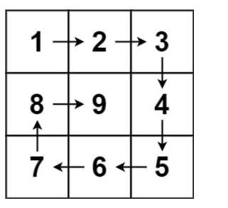

# Cpp训练赛第四周 题解

# A	总成绩和平均分计算

如题，模拟输出即可

> 注意使用printf输出和cout输出的区别
>
> 不会用流操作算子的看这里[C++ cout格式化输出（输出格式）完全攻略 (biancheng.net)](http://c.biancheng.net/view/275.html)

```Cpp
#include <iostream>
#include <iomanip>

using namespace std;

void Solution() {
    double sum = 0;
    for (int i = 0; i < 3; ++i) {
        double temp = 0;
        cin >> temp;
        sum += temp;
    }
//     printf("%.2f %.2f", sum, sum / 3);	C语言方式
    cout << setprecision(2) << setiosflags(ios::fixed);
    cout << sum << " " << sum / 3 << endl;
}

int main() {
    Solution();
    return 0;
}
```

# B	求逆序数

如题，要求求先出现的数的后面，还有几个数比他小，如果有这样一个数对，++ret，所以直接双重循环模拟计数即可。

```Cpp
#include <iostream>

using namespace std;

void Solution() {
	int n = 0;
	cin >> n;
	int* nums = new int[n];
	for (int i = 0; i < n; ++i) {
		cin >> nums[i];
	}
	int ret = 0;
	for (int i = 0; i < n - 1; ++i) {
		for (int j = i + 1; j < n; ++j) {
			if (nums[i] > nums[j]) {
				++ret;
			}
		}
	}
	cout << ret << endl;

}

int main() {
	Solution();
}
```

# C	数字三角形

如题，需要输出数字三角形，直接模拟输出即可

> 注意：题目要求使用%4d输出，所以使用printf

```Cpp
#include <iostream>

using namespace std;

void Solution() {
    int n = 0;
    cin >> n;
    int curNum = 1;
    for (int i = 1; i <= n; ++i) {
        for (int j = 1; j <= i; ++j) {
            printf("%4d", curNum);
            ++curNum;
        }
        cout << endl;
    }
}

int main() {
    Solution();
    return 0;
}
```

# D	[NOIP2013]记数问题

如题，要求求x(1 <= x <= 9)在1 ~ n的数字中出现了几次，由于x在10以内，所以可以直接分解1 ~ n中的每个数字每位数，判断是否相等并计数即可。

```Cpp
#include <stdio.h>
#include <iostream>

using namespace std;

void Solution() {
    long long n = 0;
    int x = 0;
    cin >> n >> x;
    long long ret = 0;
    for (int i = 1; i <= n; ++i) {
        int temp = i;
        //分解每一位数
        while (temp) {
            if (temp % 10 == x) {
                ++ret;
            }
            temp /= 10;
        }
    }
    cout << ret << endl;
}

int main() {
    Solution();
    return 0;
}
```

# E	白兔的分身术

要求求一个数p和它的指数k，p^k等于n，使得p+k最大。

所以有ans = p + k = p + log*p*(n)；

因为p增加值永远比 log*p*(n)增加值带来的收益大，所以，应该使得p很大；

显然，只有当p = n， k = 1时，p + k永远是最大的。

所以直接输出n + 1即可

> 注意：应该使用long long， 因为数据范围较大

```Cpp
#include <iostream>

using namespace std;

void Solution() {
	long long n = 0;
	cin >> n;
	cout << n + 1 << endl;
}

int main() {
	Solution();
}
```

# F	回型矩阵

如题，需要模拟回形矩阵，想一想，回形矩阵是如何画一条线连接起来的



如图所示，连接顺序为从左到右，从上到下，从右到左，从下到上。

从左到右更新最上层，从上到下更新最右层，从右到左更新最下层，从下到上更新最左层

所以，我们就模拟这个过程，设定四个边界top，bottom，left，right；

再用一个curNum记录当前到哪一个数，每记录一个，++curNum。

显然，初始时，top = 0，bottom = n - 1, left = 0, right = n - 1。

首先，从左到右，此时，当前坐标为matrix\[top\]\[i\]，i的初始值为left，所以从左到右更新它：

```cpp
for (int i = left; i <= right; ++i) {
    matrix[top][i] = curNum;
    ++curNum;
}
++top;
```

赋值完之后，显然，最上层已经更新完了，所以，需要到下一层，即++top;


再是从上到下，此时，当前坐标为matrix\[i\]\[right\]，i的初始值为top，所以从上到下更新它：

```Cpp
for (int i = top; i <= bottom; ++i) {
	matrix[i][right] = curNum;
    ++curNum;
}
--right;
```

赋值完之后，显然，最右层已经更新完了，所以，需要到左一层，即--right;


再是从右到左，此时，当前坐标为matrix\[bottom\]\[i\]，i的初始值为right，所以从右到左更新它：

```Cpp
for (int i = right; i >= left; --i) {
    matrix[bottom][i] = curNum;
    ++curNum;
}
--bottom;
```

赋值完之后，显然，最下层已经更新完了，所以，需要到上一层，即--bottom;


再是从下到上，此时，当前坐标为matrix\[i\]\[left\]，i的初始值为bottom，所以从下到上更新它：

```Cpp
for (int i = bottom; i >= top; --i) {
    matrix[i][left] = curNum;
    ++curNum;
}
++left;
```

赋值完之后，显然，最左层已经更新完了，所以，需要到右一层，即++left;

所以完整代码如下

```Cpp
#include <iostream>

using namespace std;

void Solution() {
    int n = 0;
    cin >> n;
    
    //矩阵
    int** matrix = new int* [n];
    for (int i = 0; i < n; ++i) {
        matrix[i] = new int[n];
    }
    
    //四个边界
    int left = 0;
    int right = n - 1;
    int bottom = n - 1;
    int top = 0;
    
    //当前数字从1开始
    int curNum = 1;
    //1 到 n * n
    while (curNum <= n * n) {
        //从左到右
        for (int i = left; i <= right; ++i) {
            matrix[top][i] = curNum;
            ++curNum;
        }
        ++top;
        
        //从上到下
        for (int i = top; i <= bottom; ++i) {
            matrix[i][right] = curNum;
            ++curNum;
        }
        --right;
        
        //从右到左
        for (int i = right; i >= left; --i) {
            matrix[bottom][i] = curNum;
            ++curNum;
        }
        --bottom;
        
        //从下到上
        for (int i = bottom; i >= top; --i) {
            matrix[i][left] = curNum;
            ++curNum;
        }
        ++left;
    }
    
    //输出
    for (int i = 0; i < n; ++i) {
        for (int j = 0; j < n; ++j) {
            cout << matrix[i][j] << " ";
        }
        cout << endl;
        delete[] matrix[i];
    }
    delete[] matrix;
    matrix = nullptr;
}

int main() {
    Solution();
}
```

